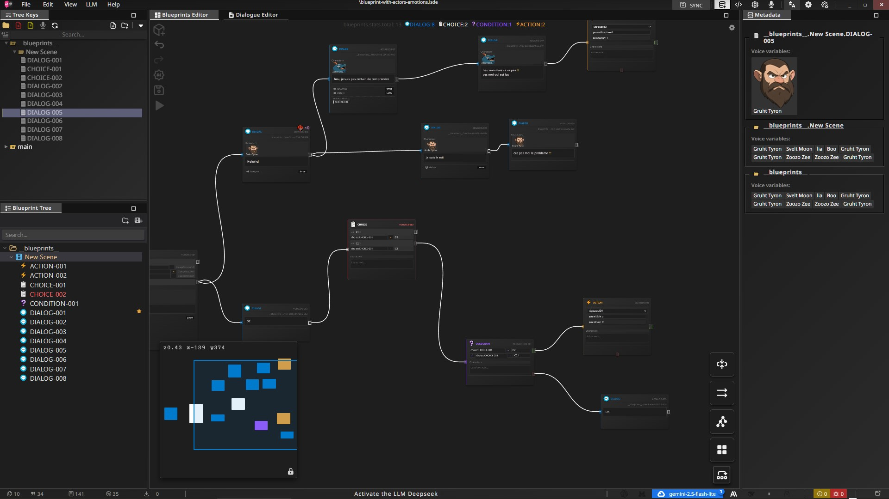

# LSDE Dialog Engine

Multi-runtime dialogue engine for [LepaSoft Dialogue Editor](https://lepasoft.com).

LSDE exports dialogue graphs (scenes, blocks, dictionaries, functions, cards) that game developers consume in their engines. This repository contains the runtime implementations that traverse and execute these dialogue graphs.

**Engine 2.x reads the `lsde-blueprints` format, written by LSDE 2.x.** Projects still on LSDE 1.6 stay on engine 0.3.x — the two formats share no field, so there is no dual reader.

## Runtimes

<table><tr>
<td></td>
<td></td>
</tr><tr>
<td></td>
<td></td>
</tr></table>

| Runtime                         | Language   | Target                   | Tests   |
| ------------------------------- | ---------- | ------------------------ | ------- |
| [lsde-ts](lsde-ts/)             | TypeScript | Reference implementation | 393/393 |
| [lsde-csharp](lsde-csharp/)     | C#         | Unity, .NET              | 115/115 |
| [lsde-cpp](lsde-cpp/)           | C++        | Unreal, custom engines   | 52/52   |
| [lsde-gdscript](lsde-gdscript/) | GDScript   | Godot 4                  | 115/115 |
| [lsde-rust](lsde-rust/)         | Rust       | Native                   | planned |
| [lsde-lua](lsde-lua/)           | Lua        | Defold, LOVE             | planned |
| [lsde-python](lsde-python/)     | Python     | Tooling, prototyping     | planned |

## Principles

- **Graph dispatcher, nothing else** — no rendering, no timers, no IO, no game loop
- **Callback-driven** — the engine never advances automatically; the developer calls `next()`, `resolve()`, or `selectChoice()`
- **Native properties are data** — `delay`, `timeout`, `debug` etc. are handed to your handler untouched; you decide what they mean. Two exceptions the engine does act on: `isAsync` spawns a parallel track, `waitForBlocks` parks one
- **Structure, never text** — the engine hands you the raw string and never reads inside it. Markers like `{{@a1}}` are your game's, in your keys
- **Two-tier handlers** — Global (Tier 1) and per-scene (Tier 2) with clear priority resolution

## Documentation

- <a href="https://jonlepage.github.io/LS-Dialog-Editor-Engine/" target="_blank">API Reference & Guides</a> — Full documentation

## Ports are names

A wire leaves a block by a named port, never by a position: `out`, `then`, `catch`, `default`, an
option id (`C1`), a condition case (`K1`), or the card id of an actor. Port resolution is the one
algorithm that must behave identically in all four runtimes — a divergence there does not crash, it
sends a player down a branch the writer never drew.

`tests/*.json` is the shared contract that keeps them honest: the same input, the same expected
output, run by all four.

## Screenshot LSDE v1.6 > — Blueprint Editor

## License

Proprietary — distributed under the LSDE license. See [LICENSE](LICENSE).
