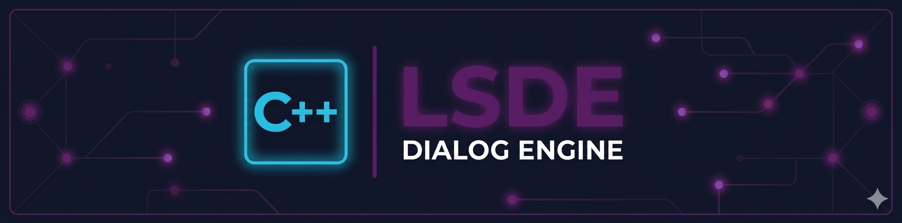

# LSDE Dialog Engine

Multi-runtime dialogue engine for [LepaSoft Dialogue Editor](https://lepasoft.com).

LSDE exports dialogue graphs (scenes, blocks, connections, dictionaries, signatures) that game developers consume in their engines. This repository contains the runtime implementations that traverse and execute these dialogue graphs.

## Runtimes

<table><tr>
<td></td>
<td></td>
</tr><tr>
<td></td>
<td></td>
</tr></table>

| Runtime                         | Language   | Target                   | Tests   |
| ------------------------------- | ---------- | ------------------------ | ------- |
| [lsde-ts](lsde-ts/)             | TypeScript | Reference implementation | 216/216 |
| [lsde-csharp](lsde-csharp/)     | C#         | Unity, .NET              | 42/42   |
| [lsde-cpp](lsde-cpp/)           | C++        | Unreal, custom engines   | 40/42   |
| [lsde-gdscript](lsde-gdscript/) | GDScript   | Godot 4                  | 42/42   |
| [lsde-rust](lsde-rust/)         | Rust       | Native                   | planned |
| [lsde-lua](lsde-lua/)           | Lua        | Defold, LOVE             | planned |
| [lsde-python](lsde-python/)     | Python     | Tooling, prototyping     | planned |

## Principles

- **Graph dispatcher, nothing else** — no rendering, no timers, no IO, no game loop
- **Callback-driven** — the engine never advances automatically; the developer calls `next()`, `resolve()`, or `selectChoice()`
- **NativeProperties are data** — `delay`, `timeout`, `isAsync` etc. are passed to handlers as raw data; the developer decides what to do with them
- **Two-tier handlers** — Global (Tier 1) and per-scene (Tier 2) with clear priority resolution

## Documentation

- [PLAN.md](PLAN.md) — Complete specification (source of truth)
- [concept/](concept/) — Non-functional prototype illustrating the design
- [blueprints/](blueprints/) — Test data, types, and schemas exported from LSDE

## License

Proprietary — distributed under the LSDE license. See [LICENSE](LICENSE).
