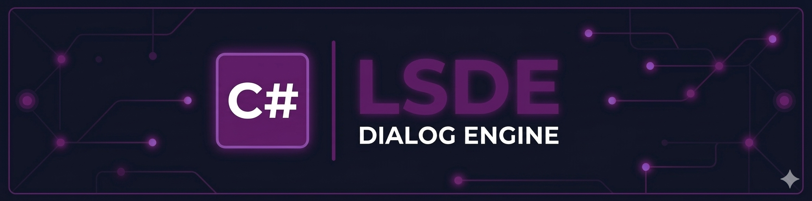

# LSDE Dialog Engine — C#

> C# runtime for Unity (2021+) and .NET Standard 2.1. Zero external dependencies.

Port of the TypeScript reference implementation. Validated against the same 42 cross-language JSON test specifications. The engine is a pure .NET Standard 2.1 library with no NuGet dependencies — drop it into Unity or any .NET project.

---

## Quick Start

### Unity

Copy the `src/LsdeDialogEngine/` folder into your Unity project's `Assets/Plugins/` directory. No package manager needed.

### .NET

```bash
cd lsde-csharp
dotnet build
```

```csharp
using LsdeDialogEngine;

var engine = new DialogueEngine();
var report = engine.Init(new InitOptions { Data = blueprint });

engine.SetLocale("en");
engine.SetStateBridge(new MyStateBridge());

engine.OnDialog(args => {
    var text = args.Block.DialogueText?["en"] ?? "";
    Debug.Log($"{args.Context.Character?.Name}: {text}");
    args.Next();
    return null; // or return a cleanup Action
});

engine.OnChoice(args => {
    // Show choices, then:
    args.Context.SelectChoice(args.Context.Choices[0].Uuid);
    args.Next();
    return null;
});

var handle = engine.Scene("scene-uuid");
handle.Start();
```

### StateBridge

Implement `IStateBridge` to connect the engine to your game state:

```csharp
public class MyStateBridge : IStateBridge
{
    public bool EvaluateCondition(ExportCondition condition) => true;
    public void ExecuteAction(ExportAction action, ActionSignature? sig) { }
    public object ResolveDictionary(string group, string key) => "";
}
```

---

## Scripts

| Command | Description |
|---------|-------------|
| `npm run build` | Build the solution |
| `npm run test` | Run 42 cross-language tests (xUnit) |
| `npm run playground` | Run playground against a real blueprint |
| `npm run clean` | Clean build artifacts |

---

## Project Structure

```
src/LsdeDialogEngine/       # Engine library (netstandard2.1, zero dependencies)
├── Types.cs                 # All types, interfaces, delegates
├── DialogueEngine.cs        # Public facade
├── SceneHandle.cs           # Traversal loop + AsyncTrack
├── HandlerRegistry.cs       # Two-tier handler resolution
├── PortResolver.cs          # Output port routing
├── BlockContext.cs           # Context factories
├── ConditionEvaluator.cs    # AND/OR chain evaluation
├── Graph.cs                 # Scene + Blueprint indexing
├── Validator.cs             # Blueprint validation
└── Utils.cs                 # Type checks, helpers

tests/LsdeDialogEngine.Tests/  # xUnit test runner
samples/MiniRuntime/            # Console playground
```

---

## API Overview

| Method | Description |
|--------|-------------|
| `engine.Init(options)` | Validate + build graph. Returns `DiagnosticReport`. |
| `engine.SetLocale(locale)` | Set active locale. |
| `engine.SetStateBridge(bridge)` | Connect to game state (`IStateBridge`). |
| `engine.OnDialog(handler)` | Register DIALOG handler. |
| `engine.OnChoice(handler)` | Register CHOICE handler (visibility pre-filtered). |
| `engine.OnCondition(handler)` | Register CONDITION handler. Auto-evals if absent. |
| `engine.OnAction(handler)` | Register ACTION handler. Auto-executes if absent. |
| `engine.Scene(sceneId)` | Create scene handle. Call `handle.Start()` to begin. |
| `handle.OnBlock(uuid, handler)` | Override handler for a specific block. |
| `handle.GetVisitedBlocks()` | All visited block UUIDs. |

Handlers return `Action?` — a cleanup callback invoked when leaving the block, or `null`.

---

## Cross-Language Conformance

42 shared JSON tests across all runtimes: **42/42 passing**.

See [PLAN.md](../PLAN.md) for the complete specification.

---

## License

Proprietary — distributed under the LSDE license.
