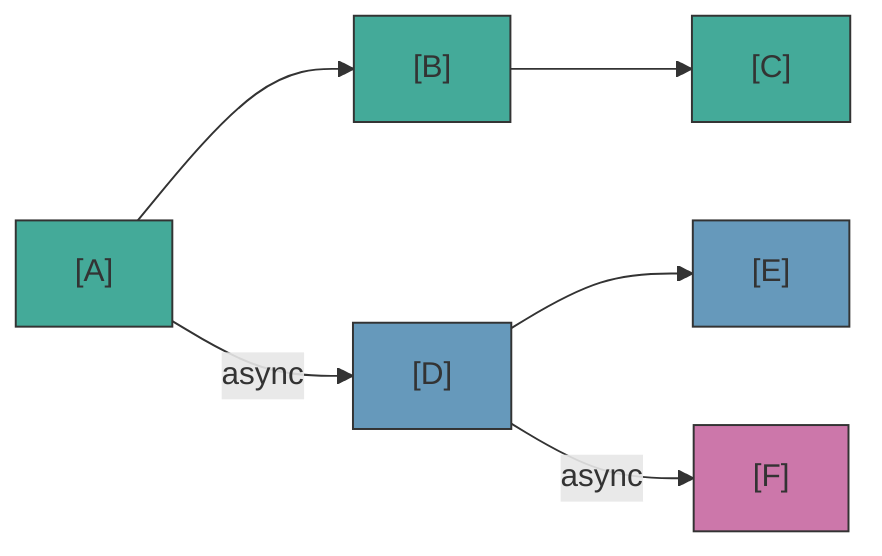

# Async Tracks

Quand un block a `nativeProperties.isAsync = true`, le engine crée un **track parallèle** qui run indépendamment du flow principal.

## Comment les tracks sont créés

Pendant la résolution des ports, si plusieurs connections sortantes existent :
- La **première connection non-async** devient la continuation du flow courant
- Les **autres connections** (vers des blocks avec `isAsync`) deviennent des tracks parallèles

Ceci s'applique au main track **et** aux async tracks — un async track peut spawner des sub-tracks depuis ses propres connections async, créant une hiérarchie d'exécution parallèle.

## Cycle de vie des tracks

- `onBeforeBlock` est callé pour **tous les blocks** (main et async tracks)
- Les async tracks séparent les connections sortantes en main vs async, comme le main track
- Les tracks sont automatiquement cancelled quand la scene finit ou que `cancel()` est callé
- Quand un track finit naturellement (plus de connections), ses sub-tracks **continuent de vivre** indépendamment
- Quand un track est explicitement cancelled (`cancel()`), l'annulation **cascade** vers tous les tracks enfants

## waitForBlocks — Synchronisation de tracks

Utilisez `nativeProperties.waitForBlocks` pour synchroniser les tracks parallèles. Il accepte un array de block UUIDs qui doivent être visités avant que le block puisse progresser :

- **Sur le block de départ** : Le track entier attend avant même de commencer l'exécution. `onBeforeBlock` n'est pas callé tant que tous les blocks requis ne sont pas visités.
- **Sur tout autre block** : Quand le handler call `next()`, l'avancement est différé jusqu'à ce que la condition soit remplie.

La séquence d'exécution complète avec `delay` et `waitForBlocks` :

```
spawn → waitForBlocks gate → onBeforeBlock (delay) → handler → next()
```

## waitInput — Flag d'input joueur

`nativeProperties.waitInput` est un **flag passif** — le engine l'expose mais ne l'interprète pas. Votre handler de jeu le lit pour décider s'il faut attendre un input explicite du joueur.

## API TrackInfo — Observabilité

Utilisez `scene.getTrackInfos()` pour inspecter les async tracks en cours. Retourne un snapshot readonly de l'état de chaque track :

```ts
const tracks = scene.getTrackInfos();
for (const track of tracks) {
  console.log(`Track ${track.id} (parent: ${track.parentTrackId}) at block ${track.currentBlockUuid}`);
}
```

Chaque `TrackInfo` contient : `id`, `parentTrackId`, `startBlockUuid`, `currentBlockUuid`, `running`.

## Ce qui fonctionne dans les async tracks (et ce qui fonctionne pas)

Les async tracks sont parfaits pour des choses qui se passent *en parallèle* de la conversation principale — effets ambient, animations parallèles, réactions de compagnons. Mais il y a des limites.

**DO — contenu parallèle :**
| Cas d'utilisation | Pourquoi ça marche |
|---|---|
| Dialogue ambient de NPC ("barks") | Blocks dialog sur un async track — les NPCs commentent, réagissent ou bavardent pendant que la conversation principale continue |
| Réactions de personnages synchronisées | Utilisez `waitForBlocks` pour trigger une réaction quand un block spécifique est atteint |
| Jouer des sons ambient ou de la musique | Block action, pas d'interaction joueur nécessaire |
| Trigger des mouvements de caméra | Block action, run en parallèle |
| Effets avec timing précis | Combinez `waitForBlocks` + `delay` pour un timing précis |

**DON'T — interaction joueur ou branching de game logic :**
| Cas d'utilisation | Pourquoi ça casse |
|---|---|
| Block CHOICE dans un async track | Le joueur est déjà en interaction avec le main track — qui répond au choice async? |
| Changements critiques de game state | Si le async track est cancelled (la scene finit), l'action ne s'exécute jamais |

::: warning Choices dans les async tracks
Un block CHOICE dans un async track implique que le joueur devrait faire une sélection pendant qu'il est déjà engagé avec le dialogue principal. Le seul scénario valide c'est un "choix" piloté par l'IA (ex. un compagnon NPC auto-sélectionne basé sur sa personnalité). Si un async track hit un block CHOICE sans scene-level handler qui auto-sélectionne, le flow va stall ou finir en silence.
:::

## Plusieurs scenes en parallèle

Le engine supporte le fait de runner plusieurs scenes en même temps. Chaque `SceneHandle` a son propre state, ses blocks visités et ses async tracks. Les handlers globaux (Tier 1) sont partagés — utilise l'argument `scene` pour savoir quelle scene appelle :

::: code-group
```ts [TypeScript]
engine.onDialog(({ scene, block, context, next }) => {
  if (scene === mainDialogue) showMainUI(block);
  else if (scene === tutorialOverlay) showTutorialBubble(block);
  next();
});

const mainDialogue = engine.scene('main-quest');
const tutorialOverlay = engine.scene('tutorial-hints');
mainDialogue.start();
tutorialOverlay.start();
```
```csharp [C#]
engine.OnDialog(args => {
    if (args.Scene == mainDialogue) ShowMainUI(args.Block);
    else if (args.Scene == tutorialOverlay) ShowTutorialBubble(args.Block);
    args.Next();
    return null;
});

var mainDialogue = engine.Scene("main-quest");
var tutorialOverlay = engine.Scene("tutorial-hints");
mainDialogue.Start();
tutorialOverlay.Start();
```
```cpp [C++]
engine.onDialog([&](auto* scene, auto* block, auto*, auto next) -> CleanupFn {
    if (scene == mainDialogue) showMainUI(block);
    else if (scene == tutorialOverlay) showTutorialBubble(block);
    next();
    return {};
});

auto mainDialogue = engine.scene("main-quest");
auto tutorialOverlay = engine.scene("tutorial-hints");
mainDialogue->start();
tutorialOverlay->start();
```
```gdscript [GDScript]
engine.on_dialog(func(args):
    if args["scene"] == main_dialogue: show_main_ui(args["block"])
    elif args["scene"] == tutorial_overlay: show_tutorial_bubble(args["block"])
    args["next"].call()
    return Callable()
)

var main_dialogue = engine.scene("main-quest")
var tutorial_overlay = engine.scene("tutorial-hints")
main_dialogue.start()
tutorial_overlay.start()
```
:::

::: tip Routing par scene
Avec plusieurs scenes concurrentes, il est préférable d'enregistrer des handlers scene-level (Tier 2) sur chaque handle au lieu de router dans le handler global. Meilleure séparation, pas de chaînes `if/else`.
:::

## Visual Reference



- Main track: A &rarr; B &rarr; C
- Track 1 (parallel): D &rarr; E
- Track 2 (sub-track of D): F
- Scene cancel &rarr; all tracks cancelled
- Track D ends naturally &rarr; F continues
