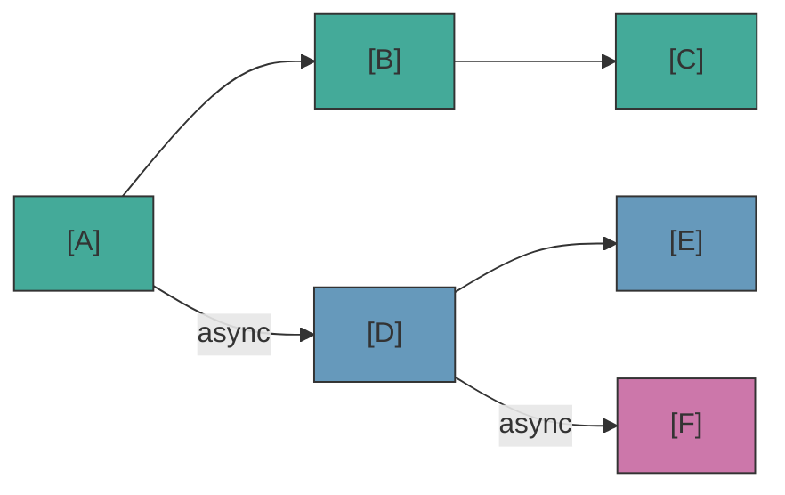

# Async Tracks

Quand un block a `nativeProperties.isAsync = true`, le engine crée un **track parallèle** qui s'exécute indépendamment du flow principal.

## Comment les tracks sont créés

Pendant la résolution des ports, si plusieurs connections sortantes existent :
- La **première connection non-async** devient la continuation du flow courant
- Les **autres connections** (vers des blocks avec `isAsync`) deviennent des tracks parallèles

Ceci s'applique au main track **et** aux async tracks — un async track peut créer des sub-tracks depuis ses propres connections async, formant une hiérarchie d'exécution parallèle.

## Cycle de vie des tracks

- `onBeforeBlock` est appelé pour **tous les blocks** (main et async tracks)
- Les async tracks séparent les connections sortantes en main vs async, comme le main track
- Les tracks sont automatiquement annulés quand la scène se termine ou que `cancel()` est appelé
- Quand un track se termine naturellement (plus de connections), ses sub-tracks **continuent de vivre** indépendamment
- Quand un track est explicitement annulé (`cancel()`), l'annulation **cascade** vers tous les tracks enfants

## waitForBlocks — Synchronisation de tracks

Utilisez `nativeProperties.waitForBlocks` pour synchroniser les tracks parallèles. Il accepte un array de block UUIDs qui doivent être visités avant que le block puisse progresser :

- **Sur le block de départ** : Le track entier attend avant même de commencer l'exécution. `onBeforeBlock` n'est pas appelé tant que tous les blocks requis ne sont pas visités.
- **Sur tout autre block** : Quand le handler appelle `next()`, l'avancement est différé jusqu'à ce que la condition soit remplie.

La séquence d'exécution complète avec `delay` et `waitForBlocks` :

```
spawn → waitForBlocks gate → onBeforeBlock (delay) → handler → next()
```

## waitInput — Flag d'input joueur

`nativeProperties.waitInput` est un **flag passif** — le engine l'expose mais ne l'interprète pas. Votre handler de jeu le lit pour décider s'il faut attendre un input explicite du joueur.

## API TrackInfo — Observabilité

Utilisez `scene.getTrackInfos()` pour inspecter les async tracks en cours. Retourne un snapshot readonly de l'état de chaque track :

```ts
const tracks = scene.getTrackInfos();
for (const track of tracks) {
  console.log(`Track ${track.id} (parent: ${track.parentTrackId}) at block ${track.currentBlockUuid}`);
}
```

Chaque `TrackInfo` contient : `id`, `parentTrackId`, `startBlockUuid`, `currentBlockUuid`, `running`.

## Ce qui fonctionne dans les async tracks (et ce qui ne fonctionne pas)

Les async tracks sont conçus pour du contenu qui se déroule *en parallèle* de la conversation principale — effets ambient, animations parallèles, réactions de compagnons. Mais il y a des limites.

**Contenu parallèle — cas d'usage valides :**
| Cas d'utilisation | Pourquoi ça fonctionne |
|---|---|
| Dialogue ambient de NPC ("barks") | Blocks dialog sur un async track — les NPCs commentent ou réagissent pendant que la conversation principale continue |
| Réactions de personnages synchronisées | Utilisez `waitForBlocks` pour déclencher une réaction quand un block spécifique est atteint |
| Jouer des sons ambient ou de la musique | Block action, pas d'interaction joueur nécessaire |
| Mouvements de caméra parallèles | Block action, s'exécute en parallèle |
| Effets avec timing précis | Combinez `waitForBlocks` + `delay` pour un timing précis |

**Interaction joueur ou branching — à éviter :**
| Cas d'utilisation | Pourquoi c'est problématique |
|---|---|
| Block CHOICE dans un async track | Le joueur est déjà en interaction avec le main track — qui répond au choice async? |
| Changements critiques de game state | Si le async track est annulé (la scène se termine), l'action ne s'exécute jamais |

::: warning Choices dans les async tracks
Un block CHOICE dans un async track implique que le joueur devrait faire une sélection pendant qu'il est déjà engagé avec le dialogue principal. Le seul scénario valide c'est un "choix" piloté par l'IA (ex. un compagnon NPC auto-sélectionne basé sur sa personnalité). Si un async track atteint un block CHOICE sans scene-level handler qui auto-sélectionne, le flow va se bloquer silencieusement.
:::

## Plusieurs scènes en parallèle

Le engine supporte l'exécution de plusieurs scènes en même temps. Chaque `SceneHandle` a son propre state, ses blocks visités et ses async tracks. Les handlers globaux (Tier 1) sont partagés — utilisez l'argument `scene` pour identifier quelle scène appelle :

<!--@include: ../../_shared/async-dialog-track.md-->

::: tip Routing par scène
Avec plusieurs scènes concurrentes, il est préférable d'enregistrer des handlers scene-level (Tier 2) sur chaque handle au lieu de router dans le handler global. Meilleure séparation, pas de chaînes `if/else`.
:::

## Visual Reference



- Main track: A → B → C
- Track 1 (parallèle): D → E
- Track 2 (sub-track de D): F
- Scene cancel → tous les tracks annulés
- Track D se termine naturellement → F continue
