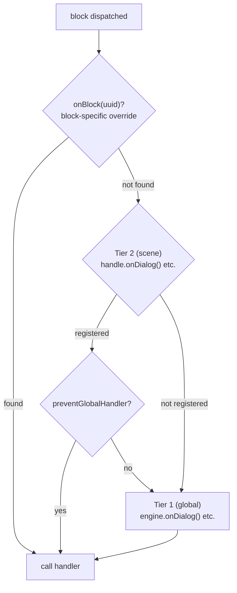

# Handlers

## Handlers

Les handlers sont le pont entre le engine et votre jeu. Ils fonctionnent comme des observateurs — vous abonnez une fonction, et le engine l'exécute quand l'événement correspondant se produit. C'est à travers eux que vous déclenchez les bons comportements dans votre moteur : afficher du texte, jouer une animation, évaluer un état, etc.

Le engine expose les handlers suivants :

| Handler | Niveau | Description |
|---------|--------|-------------|
| [`onDialog`](/api-ref/classes/DialogueEngine#ondialog) | global / scene | Block dialog — afficher du texte |
| [`onChoice`](/api-ref/classes/DialogueEngine#onchoice) | global / scene | Block choice — présenter des choix |
| [`onCondition`](/api-ref/classes/DialogueEngine#oncondition) | global / scene | Block condition — évaluer et brancher |
| [`onAction`](/api-ref/classes/DialogueEngine#onaction) | global / scene | Block action — déclencher des effets |
| [`onResolveCharacter`](/api-ref/classes/DialogueEngine#onresolvecharacter) | global / scene | Résoudre quel personnage parle |
| [`onBeforeBlock`](/api-ref/classes/DialogueEngine#onbeforeblock) | global | Avant chaque block (delay, animations d'entrée…) |
| [`onValidateNextBlock`](/api-ref/classes/DialogueEngine#onvalidatenextblock) | global | Valider avant de progresser vers un block |
| [`onInvalidateBlock`](/api-ref/classes/DialogueEngine#oninvalidateblock) | global | Réagir quand la validation échoue |
| [`onSceneEnter`](/api-ref/classes/DialogueEngine#onsceneenter) | global / scene | Une scène démarre |
| [`onSceneExit`](/api-ref/classes/DialogueEngine#onsceneexit) | global / scene | Une scène se termine |
| [`onBlock`](/api-ref/interfaces/SceneHandle#onblock) | scene | Override un block spécifique par UUID |
| [`setChoiceFilter`](/api-ref/classes/DialogueEngine#setchoicefilter) | global | Évaluateur de visibilité des choix |

Les 4 premiers (`onDialog`, `onChoice`, `onCondition`, `onAction`) sont **required** — le engine valide leur présence à l'appel de `start()` et throw une erreur descriptive si un manque.

<!--@include: ../../_shared/handler-basic.md-->

## Two-Tier Handler System

Le engine résout les handlers sur deux niveaux :

- **Global handlers** — enregistrés sur le engine, ils définissent le comportement par défaut de chaque scène. Ils suffisent dans la majorité des cas.
- **Scene handlers** — enregistrés sur un [`SceneHandle`](/api-ref/interfaces/SceneHandle) spécifique, ils permettent de court-circuiter ou d'étendre le comportement par défaut quand une scène nécessite un rendu ou un contrôle différent. C'est rare, mais disponible.

Quand un block est dispatché, le engine résout le handler dans cet ordre :
1. `handle.onBlock(uuid)` — override spécifique à un block
2. `handle.onDialog()` / `handle.onChoice()` / ... — handler de type au niveau scène
3. `engine.onDialog()` / `engine.onChoice()` / ... — handler global

Quand les deux niveaux sont présents, les deux s'exécutent en séquence — scène d'abord, puis global — sauf si le scene handler appelle `context.preventGlobalHandler()` pour supprimer le passage global.

<!--@include: ../../_shared/handler-tier1.md-->

## Character Resolution

Le système de résolution de personnage est optionnel. En enregistrant un callback `onResolveCharacter`, le engine l'invoque avant chaque block qui contient des personnages dans ses `metadata.characters`. Le callback reçoit la liste des personnages assignés au block et retourne celui qui doit être actif — ou `undefined` si aucun n'est disponible. Le personnage résolu est ensuite accessible via `context.character` dans tous les handlers.

C'est le point d'intégration idéal pour interroger l'état de votre jeu : vérifier si un personnage est présent dans la scène, en vie, dans le champ de la caméra, etc. Retourner `undefined` ouvre la porte à plusieurs stratégies : sauter le block via [`skipIfMissingActor`](/api-ref/interfaces/NativeProperties#skipifmissingactor), annuler la scène via `handle.cancel()`, ou gérer le cas directement dans le handler.

<!--@include: ../../_shared/handler-character.md-->

## Historique des choix

Le engine track chaque choix que le joueur fait pendant une scene. Cet historique est utilisé en interne pour l'évaluation des conditions `choice:`, et est aussi disponible pour le code appelant :

<!--@include: ../../_shared/handler-on-exit.md-->

## Block Override

Un `SceneHandle` peut aussi override un block spécifique par UUID :

<!--@include: ../../_shared/handler-block-override.md-->

## Visual Reference

### Two-Tier Handler Dispatch

