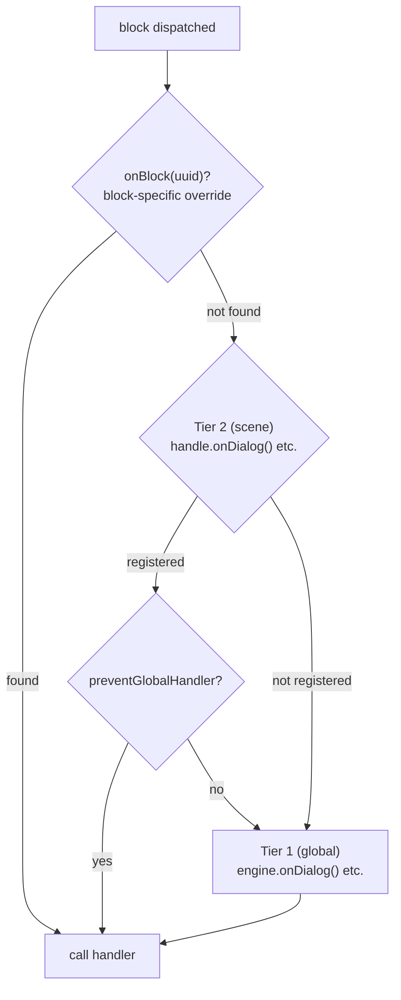

# Handlers

## Handlers required

Le engine est une machine de traversée de graphe — il walk les nodes et les dispatch au code des handlers. Les 4 handlers de contenu sont required parce que sans eux le engine n'a aucun output :

- `onDialog` — Réagir au texte de dialogue
- `onChoice` — Présenter des choix au joueur
- `onCondition` — Évaluer des conditions pour brancher le flow
- `onAction` — Exécuter des effets côté jeu

À l'appel de `handle.start()`, le engine valide que les 4 sont enregistrés (soit au niveau du engine ou de la scene). S'il en manque, il throw une erreur descriptive qui liste les handlers manquants.

<!--@include: ../../_shared/handler-basic.md-->

## Système de handlers two-tier

Le engine utilise un système de handlers à deux niveaux :

1. **Tier 1 — Global (engine-level)** : enregistré sur `DialogueEngine` via `onDialog()`, `onChoice()`, etc.
2. **Tier 2 — Scene-level** : enregistré sur un `SceneHandle` via `handle.onDialog()`, etc.

Quand un block est dispatché :
1. Le scene handler (Tier 2) est callé en premier, s'il existe.
2. Le global handler (Tier 1) est ensuite callé, **sauf si** le scene handler a callé `context.preventGlobalHandler()`.

<!--@include: ../../_shared/handler-tier1.md-->

::: info Priorité des handlers
Quand un block est dispatché, le engine résout le handler dans cet ordre de priorité :
1. `handle.onBlock(uuid)` — override spécifique à un block par UUID
2. `handle.onDialog()` / `handle.onChoice()` / ... — override de type pour la scene
3. `engine.onDialog()` / `engine.onChoice()` / ... — handler global

Si un scene handler (Tier 2) existe, le global handler (Tier 1) est aussi callé **après**, sauf si `context.preventGlobalHandler()` a été callé.
:::

## Résolution de personnage

Le engine résout un personnage pour chaque block qui a `metadata.characters`. Le défaut retourne le premier personnage de la liste.

<!--@include: ../../_shared/handler-character.md-->

Le personnage résolu est disponible via `context.character` dans tous les block handlers, et via `nextContext.character` / `fromContext.character` dans [`onValidateNextBlock`](lifecycle#onvalidatenextblock).

## Historique des choix

Le engine track chaque choix que le joueur fait pendant une scene. Cet historique est utilisé en interne pour l'évaluation des conditions `choice:`, et est aussi disponible pour le code appelant :

<!--@include: ../../_shared/handler-on-exit.md-->

## Block Override

Un `SceneHandle` peut aussi override un block spécifique par UUID :

<!--@include: ../../_shared/handler-block-override.md-->

## Visual Reference

### Two-Tier Handler Dispatch

