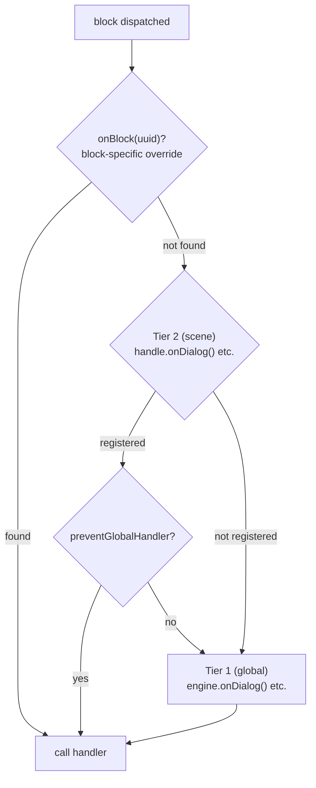

# Handlers

## Handlers required

Le engine est une machine de traversée de graphe — il walk les nodes et les dispatch au code des handlers. Les 4 handlers de contenu sont required parce que sans eux le engine n'a aucun output :

- `onDialog` — Réagir au texte de dialogue
- `onChoice` — Présenter des choix au joueur
- `onCondition` — Évaluer des conditions pour brancher le flow
- `onAction` — Exécuter des effets côté jeu

À l'appel de `handle.start()`, le engine valide que les 4 sont enregistrés (soit au niveau du engine ou de la scene). S'il en manque, il throw une erreur descriptive qui liste les handlers manquants.

::: code-group
```ts [TypeScript]
engine.onDialog(handler);
engine.onChoice(handler);
engine.onCondition(handler);
engine.onAction(handler);

const handle = engine.scene(sceneId);
handle.start(); // ✓ All 4 registered — scene starts
```
```csharp [C#]
engine.OnDialog(handler);
engine.OnChoice(handler);
engine.OnCondition(handler);
engine.OnAction(handler);

var handle = engine.Scene(sceneId);
handle.Start(); // ✓ All 4 registered — scene starts
```
```cpp [C++]
engine.onDialog(handler);
engine.onChoice(handler);
engine.onCondition(handler);
engine.onAction(handler);

auto handle = engine.scene(sceneId);
handle->start(); // ✓ All 4 registered — scene starts
```
```gdscript [GDScript]
engine.on_dialog(handler)
engine.on_choice(handler)
engine.on_condition(handler)
engine.on_action(handler)

var handle = engine.scene(scene_id)
handle.start() # ✓ All 4 registered — scene starts
```
:::

## Système de handlers two-tier

Le engine utilise un système de handlers à deux niveaux :

1. **Tier 1 — Global (engine-level)** : enregistré sur `DialogueEngine` via `onDialog()`, `onChoice()`, etc.
2. **Tier 2 — Scene-level** : enregistré sur un `SceneHandle` via `handle.onDialog()`, etc.

Quand un block est dispatché :
1. Le scene handler (Tier 2) est callé en premier, s'il existe.
2. Le global handler (Tier 1) est ensuite callé, **sauf si** le scene handler a callé `context.preventGlobalHandler()`.

::: code-group
```ts [TypeScript]
// Tier 1 — global
engine.onDialog(({ block, context, next }) => {
  console.log('Global dialog handler');
  next();
});

// Tier 2 — scene-specific
const handle = engine.scene(sceneId);
handle.onDialog(({ block, context, next }) => {
  console.log('Scene-specific dialog handler');
  context.preventGlobalHandler();
  next();
});
handle.start();
```
```csharp [C#]
// Tier 1 — global
engine.OnDialog(args => {
    Console.WriteLine("Global dialog handler");
    args.Next();
    return null;
});

// Tier 2 — scene-specific
var handle = engine.Scene(sceneId);
handle.OnDialog(args => {
    Console.WriteLine("Scene-specific dialog handler");
    args.Context.PreventGlobalHandler();
    args.Next();
    return null;
});
handle.Start();
```
```cpp [C++]
// Tier 1 — global
engine.onDialog([](auto*, auto* block, auto* ctx, auto next) -> CleanupFn {
    std::cout << "Global dialog handler\n";
    next();
    return {};
});

// Tier 2 — scene-specific
auto handle = engine.scene(sceneId);
handle->onDialog([](auto*, auto* block, auto* ctx, auto next) -> CleanupFn {
    std::cout << "Scene-specific dialog handler\n";
    ctx->preventGlobalHandler();
    next();
    return {};
});
handle->start();
```
```gdscript [GDScript]
# Tier 1 — global
engine.on_dialog(func(args):
    print("Global dialog handler")
    args["next"].call()
    return Callable()
)

# Tier 2 — scene-specific
var handle = engine.scene(scene_id)
handle.on_dialog(func(args):
    print("Scene-specific dialog handler")
    args["context"].prevent_global_handler()
    args["next"].call()
    return Callable()
)
handle.start()
```
:::

::: info Priorité des handlers
Quand un block est dispatché, le engine résout le handler dans cet ordre de priorité :
1. `handle.onBlock(uuid)` — override spécifique à un block par UUID
2. `handle.onDialog()` / `handle.onChoice()` / ... — override de type pour la scene
3. `engine.onDialog()` / `engine.onChoice()` / ... — handler global

Si un scene handler (Tier 2) existe, le global handler (Tier 1) est aussi callé **après**, sauf si `context.preventGlobalHandler()` a été callé.
:::

## Résolution de personnage

Le engine résout un personnage pour chaque block qui a `metadata.characters`. Le défaut retourne le premier personnage de la liste.

::: code-group
```ts [TypeScript]
// Engine-level — applies to all scenes
engine.onResolveCharacter((characters) => {
  return party.getActiveLeader(characters);
});

// Scene-level override
const handle = engine.scene(sceneId);
handle.onResolveCharacter((characters) => {
  return battle.getActiveUnit(characters);
});
```
```csharp [C#]
engine.OnResolveCharacter(chars => party.GetActiveLeader(chars));

var handle = engine.Scene(sceneId);
handle.OnResolveCharacter(chars => battle.GetActiveUnit(chars));
```
```cpp [C++]
engine.onResolveCharacter([](const auto& chars) {
    return party.getActiveLeader(chars);
});

auto handle = engine.scene(sceneId);
handle->onResolveCharacter([](const auto& chars) {
    return battle.getActiveUnit(chars);
});
```
```gdscript [GDScript]
engine.on_resolve_character(func(chars):
    return party.get_active_leader(chars)
)

var handle = engine.scene(scene_id)
handle.on_resolve_character(func(chars):
    return battle.get_active_unit(chars)
)
```
:::

Le personnage résolu est disponible via `context.character` dans tous les block handlers, et via `nextContext.character` / `fromContext.character` dans [`onValidateNextBlock`](lifecycle#onvalidatenextblock).

## Historique des choix

Le engine track chaque choix que le joueur fait pendant une scene. Cet historique est utilisé en interne pour l'évaluation des conditions `choice:`, et est aussi disponible pour le code appelant :

::: code-group
```ts [TypeScript]
handle.onExit(({ scene }) => {
  const history = scene.getChoiceHistory();       // Map of blockUuid → [choiceUuid, ...]
  const picks = scene.getChoice('block-uuid-123'); // string[] | undefined
});
```
```csharp [C#]
handle.OnExit(args => {
    var history = args.Scene.GetChoiceHistory();
    var picks = args.Scene.GetChoice("block-uuid-123"); // List<string>?
});
```
```cpp [C++]
handle->onExit([](auto* scene, auto*) {
    auto history = scene->getChoiceHistory();
    auto picks = scene->getChoice("block-uuid-123"); // std::vector<std::string>*
});
```
```gdscript [GDScript]
handle.on_exit(func(args):
    var history = args["scene"].get_choice_history()
    var picks = args["scene"].get_choice("block-uuid-123") # Array or null
)
```
:::

## Block Override

Un `SceneHandle` peut aussi override un block spécifique par UUID :

::: code-group
```ts [TypeScript]
const handle = engine.scene(sceneId);
handle.onBlock('block-uuid-123', ({ block, context, next }) => {
  next();
});
```
```csharp [C#]
var handle = engine.Scene(sceneId);
handle.OnBlock("block-uuid-123", args => {
    args.Next();
    return null;
});
```
```cpp [C++]
auto handle = engine.scene(sceneId);
handle->onBlock("block-uuid-123", [](auto*, auto*, auto*, auto next) -> CleanupFn {
    next();
    return {};
});
```
```gdscript [GDScript]
var handle = engine.scene(scene_id)
handle.on_block("block-uuid-123", func(args):
    args["next"].call()
    return Callable()
)
```
:::

## Visual Reference

### Two-Tier Handler Dispatch


