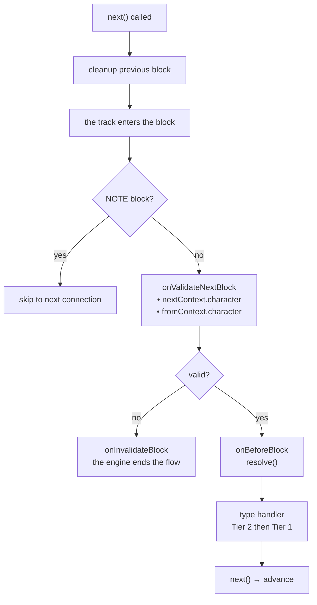
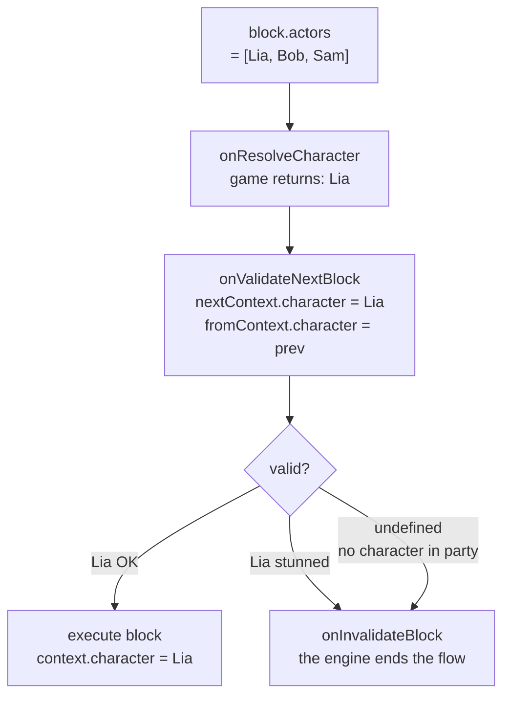

# Lifecycle & Validation

## Ordre d'exécution pour chaque block

1. **Cleanup du block précédent** — La fonction de cleanup retournée par le handler du block *précédent* s'exécute au moment de la transition (quand `next()` est appelé)
2. `onValidateNextBlock` — Validation avant exécution
3. `onBeforeBlock` — Pré-traitement (doit appeler `resolve()` pour continuer)
4. Handler de type (Tier 2 puis Tier 1)

## Events de scène

<!--@include: ../../_shared/lifecycle-scene-events.md-->

## onValidateNextBlock

Intercepte chaque transition de block pour validation. Le handler reçoit le **personnage résolu** du prochain block (`nextContext`) et du block précédent (`fromContext`) :

<!--@include: ../../_shared/lifecycle-validate.md-->

### Character Gating

Utilisez `nextContext.character` pour contrôler quels blocks peuvent s'exécuter selon l'état du jeu :

<!--@include: ../../_shared/lifecycle-validate-stunned.md-->

Utilisez `fromContext.character` pour valider les transitions entre personnages (ex: relations, cooldowns). `fromContext` est `null` pour le premier block d'une scène.

## onBeforeBlock

Appelé avant chaque block. **`resolve()` doit être appelé** pour continuer :

<!--@include: ../../_shared/lifecycle-before-block.md-->

## Fonctions de cleanup

Un handler peut retourner une fonction de cleanup, appelée quand le block est quitté :

<!--@include: ../../_shared/lifecycle-cleanup.md-->

## Error Boundaries

**Rien n'est avalé.** Si un handler throw, le engine ferme d'abord la scène, puis re-throw l'erreur
à celui qui a appelé `start()` ou `next()`.

C'est l'ordre qui rend la chose utilisable. Au moment où l'erreur atteint votre code :

- les fonctions de cleanup ont tourné
- les tracks async sont annulés
- `onSceneExit` a été appelé

Le dialogue s'est arrêté **proprement**, et c'est vous qui décidez de la suite — continuer sans lui,
afficher un écran, ou laisser planter. Mettez votre propre `try/catch` autour de `start()` ou
`next()`.

Une exception levée par une **fonction de cleanup** vous parvient de la même façon.

::: tip Pourquoi cela a changé
La v1 avalait silencieusement l'exception d'un handler — sans même la loguer — pendant qu'une
exception venant du cleanup retourné par ce même handler, elle, atteignait l'appelant. Une seule
faute, deux comportements opposés, et le silencieux a caché de vrais bugs aussi longtemps qu'un
projet a tourné.

GDScript, qui n'a pas de `try/catch` dans le langage, faisait déjà ce qu'il fallait. Personne ne
l'avait remarqué.
:::

## cancel()

Appeler `scene.cancel()` déclenche cette séquence :

1. Tous les **async tracks** sont annulés
2. La **fonction de cleanup** du block courant est exécutée
3. Le handler `onSceneExit` est appelé
4. La scène est marquée comme terminée

<!--@include: ../../_shared/lifecycle-invalidate.md-->

## NativeProperties

Propriétés d'exécution qui contrôlent comment un block est dispatché par le engine :

| Champ | Type | Description |
|-------|------|-------------|
| `isAsync` | `boolean?` | Exécuter sur un track async parallèle |
| `delay` | `number?` | **MILLISECONDES** avant que le block joue. Appliqué par `onBeforeBlock`, jamais par le engine |
| `timeout` | `number?` | **MILLISECONDES**. Passé tel quel — le engine n'impose rien |
| `portPerCharacter` | `boolean?` | Un port de sortie par personnage dans metadata |
| `skipIfMissingActor` | `boolean?` | Sauter le block si l'acteur référencé est absent |
| `debug` | `boolean?` | Flag de debug pour l'éditeur |
| `waitForBlocks` | `string[]?` | Ids de blocks **de cette scène**. Le block est retenu **avant d'être dispatché** tant qu'ils ne sont pas tous **terminés** |
| `waitInput` | `boolean?` | Flag passif pour contrôle explicite de l'input joueur |

## Référence visuelle

### Flow d'exécution des blocks

### Flow de Character Gating

