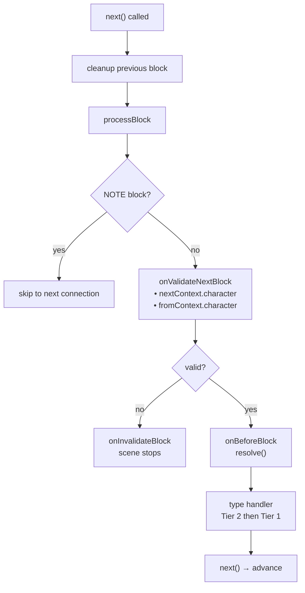
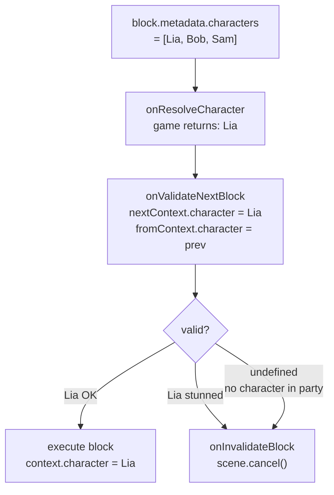

# Lifecycle & Validation

## Lifecycle complet

### Ordre d'exécution pour chaque block

1. **Cleanup du block précédent** — La fonction de cleanup retournée par le handler du block *précédent* s'exécute au moment de la transition (quand `next()` est appelé)
2. `onValidateNextBlock` — Validation avant exécution
3. `onBeforeBlock` — Pré-traitement (doit appeler `resolve()` pour continuer)
4. Handler de type (Tier 2 puis Tier 1)

### Events de scène

<!--@include: ../../_shared/lifecycle-scene-events.md-->

## onValidateNextBlock

Intercepte chaque transition de block pour validation. Le handler reçoit le **personnage résolu** du prochain block (`nextContext`) et du block précédent (`fromContext`) :

<!--@include: ../../_shared/lifecycle-validate.md-->

### Character Gating

Utilisez `nextContext.character` pour contrôler quels blocks peuvent s'exécuter selon l'état du jeu :

<!--@include: ../../_shared/lifecycle-validate-stunned.md-->

Utilisez `fromContext.character` pour valider les transitions entre personnages (ex: relations, cooldowns). `fromContext` est `null` pour le premier block d'une scène.

## onBeforeBlock

Appelé avant chaque block. **`resolve()` doit être appelé** pour continuer :

<!--@include: ../../_shared/lifecycle-before-block.md-->

## Fonctions de cleanup

Un handler peut retourner une fonction de cleanup, appelée quand le block est quitté :

<!--@include: ../../_shared/lifecycle-cleanup.md-->

## Error Boundaries

Chaque appel de handler est encapsulé dans un try/catch. Si un handler throw :

- L'erreur est **silencieuse** — elle n'est pas loguée ni re-throw. Si votre scène se termine de façon inattendue, vérifiez vos handlers.
- Pour le main track : la scène se termine proprement
- Pour les async tracks : seul le track affecté est terminé — les autres tracks et le flow principal continuent

C'est compatible cross-language (try/catch en TS, C#, C++, GDScript).

## cancel()

Appeler `scene.cancel()` déclenche cette séquence :

1. Tous les **async tracks** sont annulés
2. La **fonction de cleanup** du block courant est exécutée
3. Le handler `onSceneExit` est appelé
4. La scène est marquée comme terminée

<!--@include: ../../_shared/lifecycle-invalidate.md-->

## NativeProperties

Propriétés d'exécution qui contrôlent comment un block est dispatché par le engine :

| Champ | Type | Description |
|-------|------|-------------|
| `isAsync` | `boolean?` | Exécuter sur un track async parallèle |
| `delay` | `number?` | Délai avant exécution (consommé par `onBeforeBlock`) |
| `timeout` | `number?` | Timeout d'exécution |
| `portPerCharacter` | `boolean?` | Un port de sortie par personnage dans metadata |
| `skipIfMissingActor` | `boolean?` | Sauter le block si l'acteur référencé est absent |
| `debug` | `boolean?` | Flag de debug pour l'éditeur |
| `waitForBlocks` | `string[]?` | UUIDs de blocks qui doivent avoir été visités avant que ce block puisse progresser |
| `waitInput` | `boolean?` | Flag passif pour contrôle explicite de l'input joueur |

## Visual Reference

### Block Execution Flow

### Character Gating Flow

