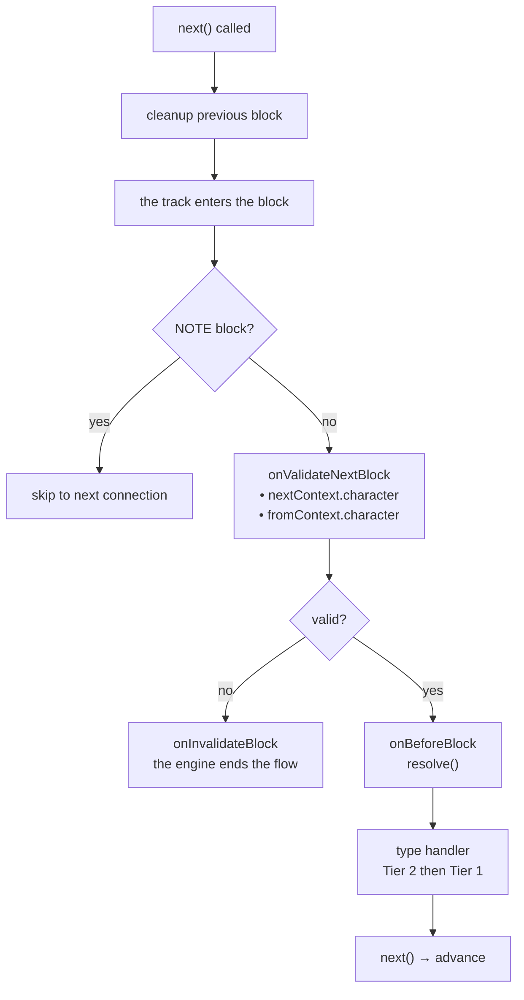
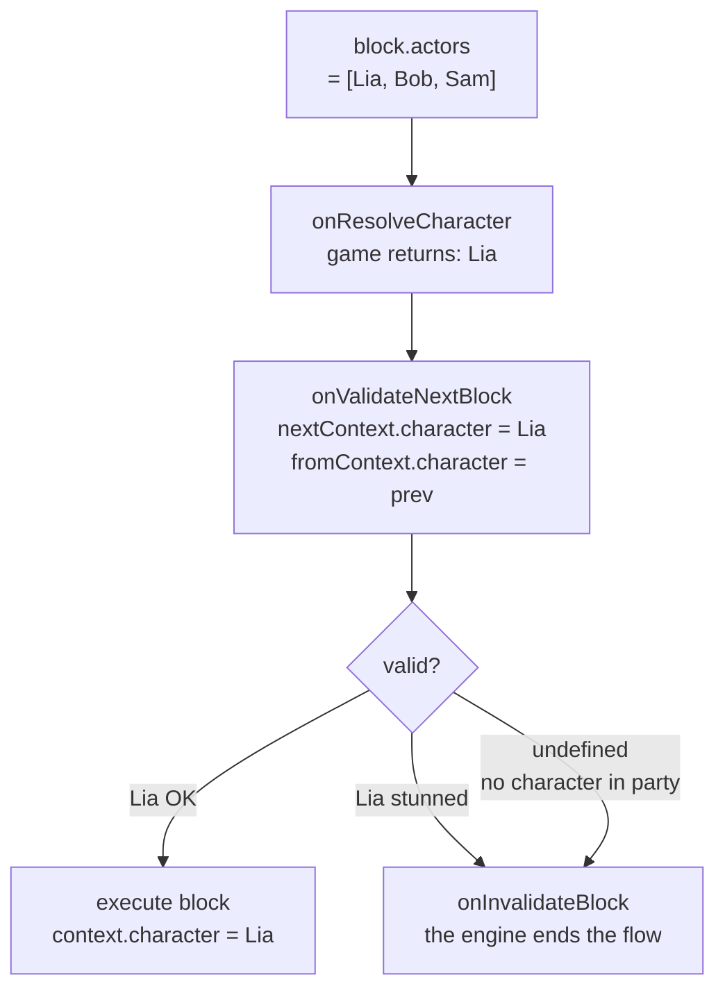

# Lifecycle & Validation

## Ordre d'exécution pour chaque block

1. **Cleanup du block précédent** — La fonction de cleanup retournée par le handler du block *précédent* s'exécute au moment de la transition (quand `next()` est appelé)
2. `onValidateNextBlock` — Validation avant exécution
3. `onBeforeBlock` — Pré-traitement (doit appeler `resolve()` pour continuer)
4. Handler de type (Tier 2 puis Tier 1)

## Events de scène

<!--@include: ../../_shared/lifecycle-scene-events.md-->

## onValidateNextBlock

Intercepte chaque transition de block pour validation. Le handler reçoit le **personnage résolu** du prochain block (`nextContext`) et du block précédent (`fromContext`) :

<!--@include: ../../_shared/lifecycle-validate.md-->

### Character Gating

Utilisez `nextContext.character` pour contrôler quels blocks peuvent s'exécuter selon l'état du jeu :

<!--@include: ../../_shared/lifecycle-validate-stunned.md-->

Utilisez `fromContext.character` pour valider les transitions entre personnages (ex: relations, cooldowns). `fromContext` est `null` pour le premier block d'une scène.

## onBeforeBlock

Appelé avant chaque block. **`resolve()` doit être appelé** pour continuer :

<!--@include: ../../_shared/lifecycle-before-block.md-->

Un `resolve()` appelé **pendant que `onBeforeBlock` s'exécute encore** prend effet à son retour —
exactement comme `next()` appelé dans un handler. Le handler de type est dispatché une fois votre
callback terminé : une ligne écrite après `resolve()` s'exécute donc **avant** le block, pas après.

## Fonctions de cleanup

Un handler peut retourner une fonction de cleanup, appelée quand le block est quitté :

<!--@include: ../../_shared/lifecycle-cleanup.md-->

## Error Boundaries

**Rien n'est avalé.** Si votre code throw pendant que le engine parcourt le graphe — un handler de
type, une fonction de cleanup, `onValidateNextBlock`, `onInvalidateBlock`, `onBeforeBlock`,
`onResolveCondition`, `onResolveCharacter` ou `onSceneEnter` — le engine ferme d'abord **toute la
scène**, puis re-throw l'erreur à celui qui a appelé `start()`, `next()` ou `resolve()`.

C'est vrai sur **chaque track**. Un handler qui throw sur une branche `isAsync` ferme la scène, pas
seulement sa branche.

C'est l'ordre qui rend la chose utilisable. Au moment où l'erreur atteint votre code :

- les fonctions de cleanup ont tourné
- les tracks async sont annulés
- `onSceneExit` a été appelé, avec `reason: 'faulted'`

Le dialogue s'est arrêté **proprement**, et c'est vous qui décidez de la suite — continuer sans lui,
afficher un écran, ou laisser planter. Mettez votre propre `try/catch` autour de `start()`, `next()`
ou `resolve()`.

Une exception levée par `onSceneExit` lui-même vous parvient de la même façon, et la scène est
libérée malgré tout : `engine.isRunning()` ne la compte plus.

::: warning GDScript
GDScript n'a pas d'exceptions. Une erreur de script dans un handler part dans le log de Godot et
l'appel retourne `null` : le block attend simplement un `next()` qui ne viendra jamais. Rien ne ferme
la scène à votre place.
:::

::: tip Pourquoi cela a changé
La v1 avalait silencieusement l'exception d'un handler — sans même la loguer — pendant qu'une
exception venant du cleanup retourné par ce même handler, elle, atteignait l'appelant. Une seule
faute, deux comportements opposés, et le silencieux a caché de vrais bugs aussi longtemps qu'un
projet a tourné.

La 2.0.0 l'avait corrigé pour le handler de type seulement. Une validation, un `onBeforeBlock` ou un
resolver qui throw — ou un handler sur un track parallèle — laissait encore la scène ouverte sans
rien pour la faire avancer, et un jeu qui attendait la fin du dialogue attendait pour toujours.
:::

## Pourquoi une scène s'est terminée

`onSceneExit` reçoit la raison dans `context.reason` :

| `reason` | Quand |
|---|---|
| `completed` | Le flux n'a plus de graphe |
| `cancelled` | `scene.cancel()` ou `engine.stop()` |
| `invalidated` | `onValidateNextBlock` a refusé le block où entrait le dernier track vivant |
| `faulted` | Votre code a throw pendant le parcours — voir [Error Boundaries](#error-boundaries) |
| `deadlocked` | Tous les tracks restants sont parqués sur un `waitForBlocks` que rien ne peut terminer. `context.waitingFor` nomme ces blocks |

`onSceneEnter` ne reçoit pas de raison.

**Un interblocage ferme la scène.** Un block qui attend un block qu'aucun track ne terminera jamais —
par exemple un block d'une branche que le flux n'a pas prise — gardait la scène ouverte pour de bon,
sans `onSceneExit`. La scène se ferme maintenant en `deadlocked` dès que le dernier track capable
d'avancer s'arrête, et `waitingFor` vous dit quelle jointure est mal câblée.

## Un seul thread

Le engine n'est pas thread-safe. Appelez `next()`, `resolve()` et `cancel()` depuis le thread qui a
**démarré** la scène — dans Unity, le thread principal ; dans Unreal, le game thread.

En C# et en C++, un appel venant d'un autre thread est **refusé** par une exception qui nomme les deux
threads, et il ne change rien : le même `next()` fonctionne encore une fois appelé depuis le bon
thread. Dans Unity, revenez sur le thread principal avant d'appeler le engine
(`await UniTask.SwitchToMainThread()`, ou mettez l'appel en file pour le thread principal).

## cancel()

Appeler `scene.cancel()` déclenche cette séquence :

1. Tous les **async tracks** sont annulés
2. La **fonction de cleanup** du block courant est exécutée
3. Le handler `onSceneExit` est appelé, avec `reason: 'cancelled'`
4. La scène est marquée comme terminée

Un cleanup qui appelle `scene.cancel()` ou `engine.stop()` pendant que la scène se ferme déjà est
ignoré : `onSceneExit` n'est appelé qu'une fois.

<!--@include: ../../_shared/lifecycle-invalidate.md-->

## NativeProperties

Propriétés d'exécution qui contrôlent comment un block est dispatché par le engine :

| Champ | Type | Description |
|-------|------|-------------|
| `isAsync` | `boolean?` | Exécuter sur un track async parallèle |
| `delay` | `number?` | **MILLISECONDES** avant que le block joue. Appliqué par `onBeforeBlock`, jamais par le engine |
| `timeout` | `number?` | **MILLISECONDES** pendant lesquelles le block RESTE après que sa réplique a été dite, puis il repart de lui-même — une auto-avance pour les blocks. **Prime sur `waitInput`**. Passé tel quel ; le engine n'impose rien |
| `portPerCharacter` | `boolean?` | Un port de sortie par personnage dans metadata |
| `skipIfMissingActor` | `boolean?` | Sauter le block si l'acteur référencé est absent |
| `debug` | `boolean?` | Flag de debug pour l'éditeur |
| `waitForBlocks` | `string[]?` | Ids de blocks **de cette scène**. Le block est retenu **avant d'être dispatché** tant qu'ils ne sont pas tous **terminés**. Si rien ne peut jamais les terminer, la scène se ferme en `deadlocked` |
| `waitInput` | `boolean?` | Flag passif pour contrôle explicite de l'input joueur |

## Référence visuelle

### Flow d'exécution des blocks

### Flow de Character Gating

