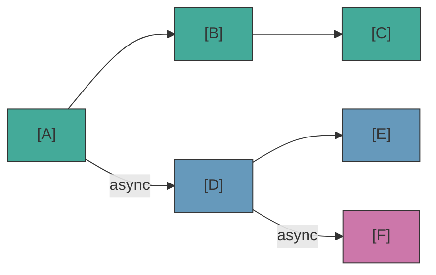

# Async Tracks

When a block has `props.isAsync = true`, the engine creates a **parallel track** that runs independently of the main flow.

## How Tracks are Created

During port resolution, if multiple outgoing connections exist:
- The **first non-async connection** becomes the continuation of the current flow
- The **other connections** (to blocks with `isAsync`) become new parallel tracks

This applies to both the main track **and** async tracks — an async track can spawn sub-tracks from its own outgoing async connections, creating a hierarchy of parallel execution.

## Track Lifecycle

- `onBeforeBlock` is called for **all blocks** (main and async tracks) — see [Lifecycle](./lifecycle) for `resolve()` details
- Async tracks separate outgoing connections into main vs async, just like the main track
- Tracks are automatically cancelled when the scene ends or `cancel()` is called
- When a track finishes naturally (no more connections), its sub-tracks **continue to live** independently
- When a track is explicitly cancelled (`cancel()`), the cancellation **cascades** to all child tracks

## waitForBlocks — waiting for another track

`props.waitForBlocks` holds a block until the blocks it names have been visited. It is the join half of the fork `isAsync` opens: a branch runs in parallel, and a block downstream waits for it to have got somewhere before it plays.

**It holds the block BEFORE the block is dispatched.** No handler is called, so your game never learns the block exists until the wait lifts — nothing of it can reach the screen early. That is the engine's decision and not a rendering choice you could make differently: `waitForBlocks` is a native property, the designer ticks it in LSDE, and the engine owes them the behaviour.

The rule is the same on **every** track, the one the player is watching included.

- The ids name blocks **of this scene**. A wire has never crossed a scene boundary.
- **All** of them must have been visited, not just one.
- Visiting a block releases everything waiting on it, in turn.
- A block that is never visited parks its track for good. `init()` reports `UNKNOWN_WAIT_BLOCK` when an id is not a block of the scene at all.

The sequence for a block carrying both `waitForBlocks` and `delay`:

```
waitForBlocks gate → onBeforeBlock (delay) → handler → next()
```

## waitInput — Player Input Flag

`props.waitInput` is a **passive flag** — the engine exposes it but does not interpret it. Your game handler reads it to decide whether to wait for explicit player input (e.g., a second controller, a custom event, or an NPC auto-selection).

## TrackInfo API — Observability

Use `scene.getTrackInfos()` to inspect running async tracks. Returns a read-only snapshot of each track's state:

::: code-group
```ts [TypeScript]
const tracks = scene.getTrackInfos();
for (const track of tracks) {
  console.log(`Track ${track.id} (parent: ${track.parentTrackId}) at block ${track.currentBlockId}`);
}
```
```csharp [C#]
var tracks = scene.GetTrackInfos();
foreach (var track in tracks)
{
    Console.WriteLine($"Track {track.Id} (parent: {track.ParentTrackId}) at block {track.CurrentBlockId}");
}
```
```cpp [C++]
auto tracks = scene->getTrackInfos();
for (const auto& track : tracks) {
    std::cout << "Track " << track.id
              << " (parent: " << track.parentTrackId << ")"
              << " at block " << track.currentBlockId << "\n";
}
```
```gdscript [GDScript]
var tracks = scene.get_track_infos()
for track in tracks:
    print("Track %d (parent: %s) at block %s" % [
        track["id"], str(track["parentTrackId"]), track["currentBlockId"]])
```
:::

Each `TrackInfo` contains: `id`, `parentTrackId`, `startBlockId`, `currentBlockId`, `running`. Use this for debug overlays, play-mode renderers, or validation.

## What Works in Async Tracks (and What Doesn't)

Async tracks are great for things that happen *alongside* the main conversation — ambient effects, parallel animations, companion reactions. But they have limits.

**DO — parallel content:**
| Use case | Why it works |
|---|---|
| NPC ambient dialogue ("barks") | Dialog blocks on an async track — NPCs comment, react, or banter while the main conversation continues |
| Character reactions synced to events | Use `waitForBlocks` to trigger a reaction when a specific block is reached |
| Play ambient sounds or music | Action block, no player interaction needed |
| Trigger camera movements | Action block, runs in parallel |
| Delayed effects | Combine `waitForBlocks` + `delay` for precise timing |

**DON'T — player interaction or game logic branching:**
| Use case | Why it breaks |
|---|---|
| CHOICE block in async track | The player is already interacting with the main track — who answers the async choice? |
| Critical game state changes | If the async track is cancelled (scene ends), the action never executes |

::: warning Choices in async tracks
A CHOICE block in an async track implies the player should make a selection while already engaged with the main dialogue. The most common scenario is an AI-driven "choice" (e.g., a companion NPC auto-selects based on personality). If an async track hits a CHOICE block without a scene-level handler that auto-selects, the flow will stall or end silently.
:::

## Multiple Scenes in Parallel

The engine supports running multiple scenes simultaneously. Each `SceneHandle` has its own state, visited blocks, and async tracks. Global handlers (Tier 1) are shared — use the `scene` argument to know which scene is calling:

<!--@include: ../_shared/async-dialog-track.md-->

::: tip Routing by scene
For many concurrent scenes, consider registering scene-level (Tier 2) handlers on each handle instead of routing in the global handler. Cleaner separation, no `if/else` chains.
:::

## Visual Reference



- Main track: A &rarr; B &rarr; C
- Track 1 (parallel): D &rarr; E
- Track 2 (sub-track of D): F
- Scene cancel &rarr; all tracks cancelled
- Track D ends naturally &rarr; F continues
