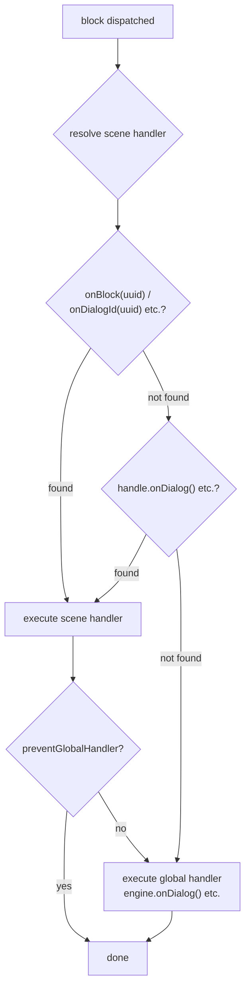

# Handlers

## Handlers

Handlers are the bridge between the engine and your game. They work like observers — you subscribe a function, and the engine calls it when the matching event occurs. This is how you trigger the right behaviors in your game engine: display text, play an animation, evaluate state, etc.

The engine exposes the following handlers:

| Handler | Level | Description |
|---------|-------|-------------|
| [`onDialog`](/api-ref/classes/DialogueEngine#ondialog) | global / scene | Dialog block — display text |
| [`onChoice`](/api-ref/classes/DialogueEngine#onchoice) | global / scene | Choice block — present choices |
| [`onCondition`](/api-ref/classes/DialogueEngine#oncondition) | global / scene | Condition block — evaluate and branch |
| [`onAction`](/api-ref/classes/DialogueEngine#onaction) | global / scene | Action block — trigger side effects |
| [`onResolveCharacter`](/api-ref/classes/DialogueEngine#onresolvecharacter) | global / scene | Resolve which character is speaking |
| [`onBeforeBlock`](/api-ref/classes/DialogueEngine#onbeforeblock) | global | Before every block (delay, entry animations…) |
| [`onValidateNextBlock`](/api-ref/classes/DialogueEngine#onvalidatenextblock) | global | Validate before progressing to a block |
| [`onInvalidateBlock`](/api-ref/classes/DialogueEngine#oninvalidateblock) | global | React when validation fails |
| [`onSceneEnter`](/api-ref/classes/DialogueEngine#onsceneenter) | global / scene | A scene starts |
| [`onSceneExit`](/api-ref/classes/DialogueEngine#onsceneexit) | global / scene | A scene ends |
| [`onBlock`](/api-ref/interfaces/SceneHandle#onblock) | scene | Override a specific block by UUID |
| [`onDialogId`](/api-ref/interfaces/SceneHandle#ondialogid) | scene | Override a specific DIALOG block by UUID (type-safe) |
| [`onChoiceId`](/api-ref/interfaces/SceneHandle#onchoiceid) | scene | Override a specific CHOICE block by UUID (type-safe) |
| [`onConditionId`](/api-ref/interfaces/SceneHandle#onconditionid) | scene | Override a specific CONDITION block by UUID (type-safe) |
| [`onActionId`](/api-ref/interfaces/SceneHandle#onactionid) | scene | Override a specific ACTION block by UUID (type-safe) |
| [`onResolveCondition`](/api-ref/classes/DialogueEngine#onresolvecondition) | global | Unified condition resolver (choice visibility + condition pre-evaluation) |
| ~~[`setChoiceFilter`](/api-ref/classes/DialogueEngine#setchoicefilter)~~ | global | _Deprecated — use `onResolveCondition` instead_ |

`onDialog`, `onChoice`, and `onAction` are **required** — the engine validates their presence when `start()` is called and throws a descriptive error if any are missing. `onCondition` is **optional** when `onResolveCondition` is installed — the engine auto-routes from pre-evaluated condition groups.

<!--@include: ../_shared/handler-basic.md-->

## Two-Tier Handler System

The engine resolves handlers in two tiers:

- **Global handlers** — registered on the engine, they define the default behavior for every scene. They are typically all you need.
- **Scene handlers** — registered on a specific [`SceneHandle`](/api-ref/interfaces/SceneHandle), they let you override or extend the default behavior when a scene requires a different rendering or control flow. This is rare, but available.

When a block is dispatched, the engine resolves the handler in this order:
1. `handle.onBlock(uuid)` or `handle.onDialogId(uuid)` / `handle.onActionId(uuid)` / ... — block-specific override
2. `handle.onDialog()` / `handle.onChoice()` / ... — scene-level type handler
3. `engine.onDialog()` / `engine.onChoice()` / ... — global handler

When both tiers are present, both run in sequence — scene first, then global — unless the scene handler calls `context.preventGlobalHandler()` to suppress the global pass.

<!--@include: ../_shared/handler-tier1.md-->

## Character Resolution

Character resolution is optional. By registering an `onResolveCharacter` callback, the engine invokes it before every block that has characters in its `metadata.characters`. The callback receives the list of characters assigned to the block and returns the one that should be active — or `undefined` if none is available. The resolved character is then accessible via `context.character` in all handlers.

This is the ideal integration point to query your game state: check if a character is present in the scene, alive, in camera range, etc. Returning `undefined` opens the door to several strategies: skip the block via [`skipIfMissingActor`](/api-ref/interfaces/NativeProperties#skipifmissingactor), cancel the scene via `handle.cancel()`, or handle the case directly in the handler.

<!--@include: ../_shared/handler-character.md-->

## Scene Lifecycle

The `onSceneEnter` and `onSceneExit` callbacks let you react to a scene starting and ending — enable cinema mode, freeze NPCs, prepare the UI, clean up resources, etc. They are available at global level (on the engine) and at scene level (via `handle.onEnter()` / `handle.onExit()`). The scene handler replaces the global one if defined.

<!--@include: ../_shared/handler-lifecycle.md-->

## Block Override

`onBlock(uuid)` lets you target a specific block by its identifier and assign it a dedicated handler. This is a rare use case — generic handlers cover the vast majority of needs — but for very specific scenarios where an individual block requires distinct behavior, it is available.

<!--@include: ../_shared/handler-block-override.md-->

## Type-Safe Block Override

`onDialogId(uuid)`, `onChoiceId(uuid)`, `onConditionId(uuid)`, and `onActionId(uuid)` are type-safe alternatives to `onBlock(uuid)`. They work exactly the same way — same priority, same `preventGlobalHandler` support — but the handler receives the specialized block type and context instead of the generic union.

Use these when you know the block type at registration time and want full autocompletion on `block` and `context`.

<!--@include: ../_shared/handler-block-override-typed.md-->

## Visual Reference

### Two-Tier Handler Dispatch

