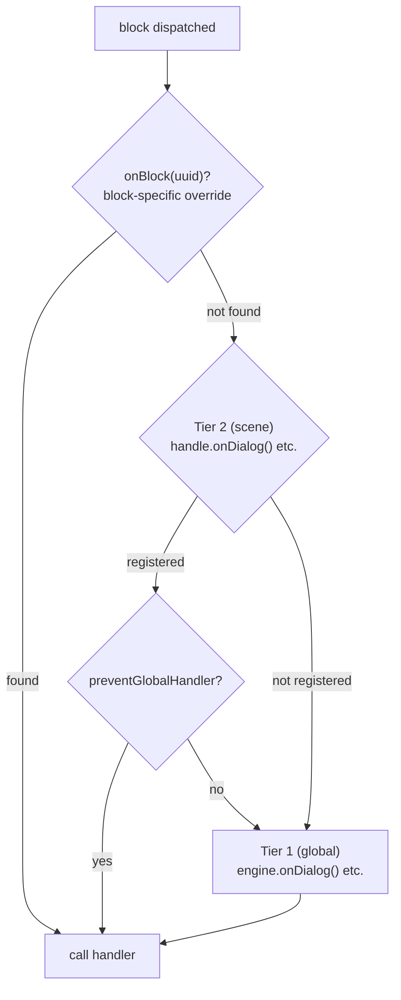

# Handlers

## Required Handlers

The engine is a graph traversal machine — it walks nodes and dispatches them to handler code. The 4 content handlers are required because without them the engine has no output:

- `onDialog` — React to dialogue text
- `onChoice` — Present choices to the player
- `onCondition` — Evaluate conditions to branch the flow
- `onAction` — Execute game-side effects

When `handle.start()` is called, the engine validates that all 4 are registered (either at engine level or scene level). If any are missing, it throws a descriptive error listing the missing handlers.

<!--@include: ../_shared/handler-basic.md-->

## Two-Tier Handler System

The engine uses a two-level handler system:

1. **Tier 1 — Global (engine-level)**: registered on `DialogueEngine` via `onDialog()`, `onChoice()`, etc.
2. **Tier 2 — Scene-level**: registered on a `SceneHandle` via `handle.onDialog()`, etc.

When a block is dispatched:
1. The scene handler (Tier 2) is called first, if it exists.
2. The global handler (Tier 1) is then called, **unless** the scene handler called `context.preventGlobalHandler()`.

<!--@include: ../_shared/handler-tier1.md-->

::: info Handler Priority
When a block is dispatched, the engine resolves the handler in this priority order:
1. `handle.onBlock(uuid)` — block-specific override by UUID
2. `handle.onDialog()` / `handle.onChoice()` / ... — type override for the scene
3. `engine.onDialog()` / `engine.onChoice()` / ... — global handler

If a scene handler (Tier 2) exists, the global handler (Tier 1) is also called **after**, unless `context.preventGlobalHandler()` was called.
:::

## Character Resolution

The engine resolves a character for every block that has `metadata.characters`. The default returns the first character in the list.

<!--@include: ../_shared/handler-character.md-->

The resolved character is available as `context.character` in all block handlers, and as `nextContext.character` / `fromContext.character` in [`onValidateNextBlock`](lifecycle#onvalidatenextblock).

## Choice History

The engine tracks every choice the player makes during a scene. This history is used internally for `choice:` condition evaluation, and is also available to handler code:

<!--@include: ../_shared/handler-on-exit.md-->

## Block Override

A `SceneHandle` can also override a specific block by UUID:

<!--@include: ../_shared/handler-block-override.md-->

## Visual Reference

### Two-Tier Handler Dispatch

