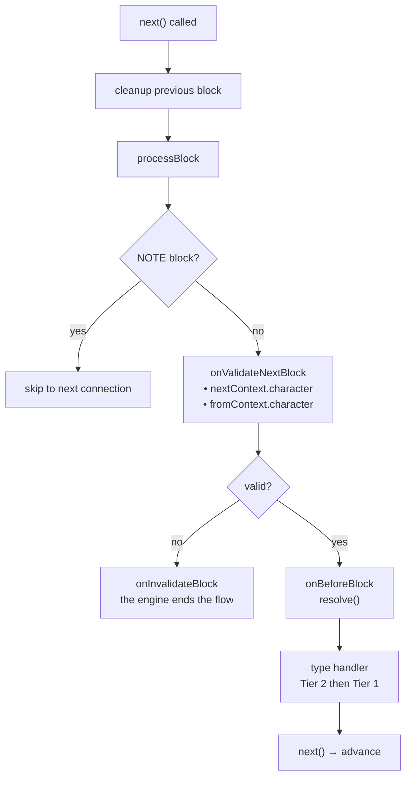
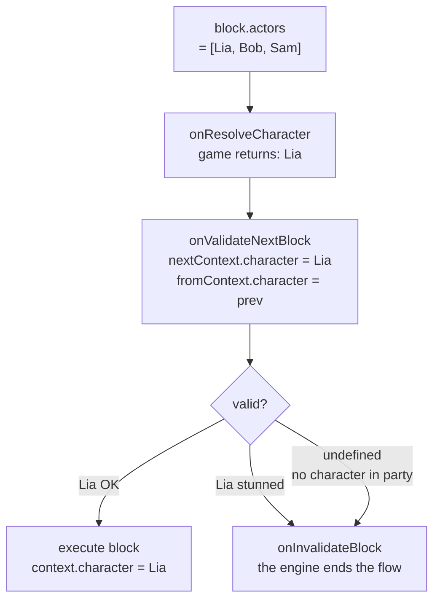

# Lifecycle & Validation

## Execution Order for Each Block

1. **Previous block cleanup** — The cleanup function returned by the *previous* block's handler runs at transition time (when `next()` is called)
2. `onValidateNextBlock` — Validation before execution
3. `onBeforeBlock` — Pre-processing (must call `resolve()` to continue)
4. Type handler (Tier 2 then Tier 1)

## Scene Events

<!--@include: ../_shared/lifecycle-scene-events.md-->

## onValidateNextBlock

Intercepts each block transition for validation. The handler receives the **resolved character** for both the upcoming block (`nextContext`) and the previously executed block (`fromContext`):

<!--@include: ../_shared/lifecycle-validate.md-->

### Character Gating

Use `nextContext.character` to control which blocks are allowed to execute based on game state:

<!--@include: ../_shared/lifecycle-validate-stunned.md-->

Use `fromContext.character` to validate transitions between characters (e.g. relationship checks, cooldowns). `fromContext` is `null` for the first block of a scene.

## onBeforeBlock

Called before each block. **Must call `resolve()`** to continue:

<!--@include: ../_shared/lifecycle-before-block.md-->

## Cleanup Functions

A handler can return a cleanup function, called when leaving the block:

<!--@include: ../_shared/lifecycle-cleanup.md-->

## Error Boundaries

**Nothing is swallowed.** If a handler throws, the engine shuts the scene down first and then
re-throws the error to whoever called `start()` or `next()`.

The order is what makes this usable. By the time the error reaches your code:

- the cleanup functions have run
- the async tracks are cancelled
- `onSceneExit` has fired

The dialogue stopped **properly**, and you decide what happens next — carry on without it, show a
screen, or let it crash. Put your own `try/catch` around `start()` or `next()`.

An exception thrown by a **cleanup function** reaches you the same way.

::: tip Why this changed
v1 swallowed a handler exception silently — not even logged — while an exception from the cleanup
that same handler returned reached the caller. One fault, two opposite behaviours, and the quiet
one hid real bugs for as long as a project ran.

GDScript, having no `try/catch` in the language, was already doing the right thing. Nobody had
noticed.
:::

## cancel()

Calling `scene.cancel()` triggers this sequence:

1. All **async tracks** are cancelled
2. The **cleanup function** of the current block is executed
3. The `onSceneExit` handler is called
4. The scene is marked as finished

<!--@include: ../_shared/lifecycle-invalidate.md-->

## NativeProperties

Execution properties that control how a block is dispatched by the engine:

| Field | Type | Description |
|-------|------|-------------|
| `isAsync` | `boolean?` | Execute on a parallel async track |
| `delay` | `number?` | Delay before execution (consumed by `onBeforeBlock`) |
| `timeout` | `number?` | Execution timeout |
| `portPerCharacter` | `boolean?` | One output port per character in metadata |
| `skipIfMissingActor` | `boolean?` | Skip block if referenced actor is absent |
| `debug` | `boolean?` | Debug flag for editor use |
| `waitForBlocks` | `string[]?` | Block UUIDs that must be visited before this block can progress |
| `waitInput` | `boolean?` | Passive flag for explicit player input control |

## Visual Reference

### Block Execution Flow

### Character Gating Flow

