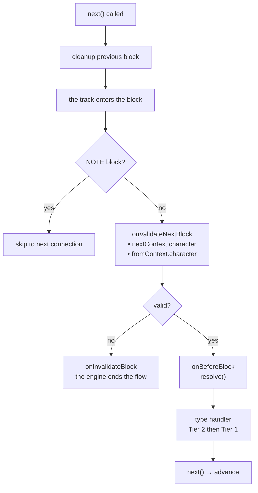
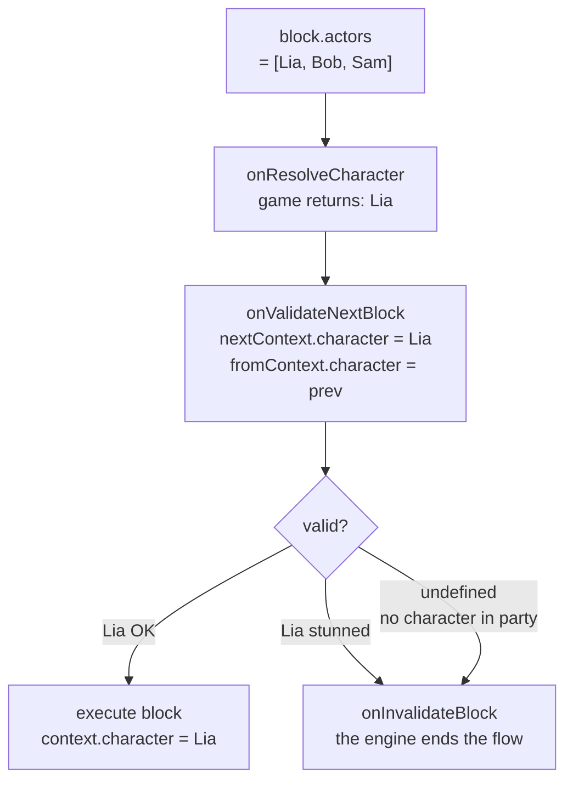

# Lifecycle & Validation

## Execution Order for Each Block

1. **Previous block cleanup** — The cleanup function returned by the *previous* block's handler runs at transition time (when `next()` is called)
2. `onValidateNextBlock` — Validation before execution
3. `onBeforeBlock` — Pre-processing (must call `resolve()` to continue)
4. Type handler (Tier 2 then Tier 1)

## Scene Events

<!--@include: ../_shared/lifecycle-scene-events.md-->

## onValidateNextBlock

Intercepts each block transition for validation. The handler receives the **resolved character** for both the upcoming block (`nextContext`) and the previously executed block (`fromContext`):

<!--@include: ../_shared/lifecycle-validate.md-->

### Character Gating

Use `nextContext.character` to control which blocks are allowed to execute based on game state:

<!--@include: ../_shared/lifecycle-validate-stunned.md-->

Use `fromContext.character` to validate transitions between characters (e.g. relationship checks, cooldowns). `fromContext` is `null` for the first block of a scene.

## onBeforeBlock

Called before each block. **Must call `resolve()`** to continue:

<!--@include: ../_shared/lifecycle-before-block.md-->

A `resolve()` called **while `onBeforeBlock` is still running** takes effect when it returns — exactly
like `next()` called inside a handler. The type handler is dispatched after your callback has
finished, so any line you write after `resolve()` runs **before** the block, not after it.

## Cleanup Functions

A handler can return a cleanup function, called when leaving the block:

<!--@include: ../_shared/lifecycle-cleanup.md-->

## Error Boundaries

**Nothing is swallowed.** If any of your code throws while the engine walks the graph — a type
handler, a cleanup function, `onValidateNextBlock`, `onInvalidateBlock`, `onBeforeBlock`,
`onResolveCondition`, `onResolveCharacter` or `onSceneEnter` — the engine closes the **whole scene**
first, and then re-throws the error to whoever called `start()`, `next()` or `resolve()`.

It holds on **every track**. A handler that throws on an `isAsync` branch closes the scene, not only
its branch.

The order is what makes this usable. By the time the error reaches your code:

- the cleanup functions have run
- the async tracks are cancelled
- `onSceneExit` has fired, with `reason: 'faulted'` and the error itself in `context.error`

The dialogue stopped **properly**, and you decide what happens next — carry on without it, show a
screen, or let it crash. Put your own `try/catch` around `start()`, `next()` or `resolve()`.

The error arrives in **two** places, on purpose. It is thrown to whoever called `next()` — in a game,
usually a click or a timer — and it is handed to `onSceneExit` in `context.error`, which is where the
code awaiting the end of the dialogue is listening. Log it in one of the two, not both.

An exception thrown by `onSceneExit` itself reaches you the same way, and the scene is released all
the same: `engine.isRunning()` no longer counts it. Unless the scene was already closing on a fault:
you then receive that fault, the one that explains the rest.

::: warning GDScript
GDScript has no exceptions. A script error inside a handler is pushed to the Godot log and the call
returns `null`: the block simply waits for a `next()` that will never come. Nothing closes the scene
for you.
:::

::: tip Why this changed
v1 swallowed a handler exception silently — not even logged — while an exception from the cleanup
that same handler returned reached the caller. One fault, two opposite behaviours, and the quiet
one hid real bugs for as long as a project ran.

2.0.0 fixed that for the type handler only. A throwing validation, `onBeforeBlock` or resolver — or a
handler on a parallel track — still left the scene open with nothing able to move it, and a game
awaiting the end of the dialogue waited forever.
:::

## Why a Scene Ended

`onSceneExit` is told why, in `context.reason`:

| `reason` | When |
|---|---|
| `completed` | The flow ran out of graph |
| `cancelled` | `scene.cancel()` or `engine.stop()` |
| `invalidated` | `onValidateNextBlock` refused the block the last running track was entering |
| `faulted` | Your code threw during the walk. `context.error` holds what was thrown — see [Error Boundaries](#error-boundaries) |
| `deadlocked` | Every track left is parked on a `waitForBlocks` nothing can finish. `context.waitingFor` names those blocks |

`onSceneEnter` receives no reason.

`scene.getSceneId()` says **which** scene ended, and `scene.getScenePath()` gives its path. A global
`onSceneExit` needs it as soon as two scenes play at once. Store the id, not the path: the path
changes the day someone renames the scene.

**A deadlock closes the scene.** A block waiting on a block no track will ever finish — one on a
branch the flow did not take, for instance — used to hold the scene open for good, with no
`onSceneExit`. The scene now closes as `deadlocked` the moment the last track able to move stops,
and `waitingFor` tells you which join was miswired.

## One Thread

The engine is not thread-safe. Call `next()`, `resolve()` and `cancel()` from the thread that
**started** the scene — in Unity, the main thread; in Unreal, the game thread.

In C# and C++ a call from another thread is **refused** with an exception that names both threads,
and it changes nothing: the same `next()` still works once it is called from the right thread. In
Unity, switch back before calling into the engine (`await UniTask.SwitchToMainThread()`, or queue the
call for the main thread).

## cancel()

Calling `scene.cancel()` triggers this sequence:

1. All **async tracks** are cancelled
2. The **cleanup function** of the current block is executed
3. The `onSceneExit` handler is called, with `reason: 'cancelled'`
4. The scene is marked as finished

A cleanup that calls `scene.cancel()` or `engine.stop()` while the scene is already closing is
ignored: `onSceneExit` fires once.

<!--@include: ../_shared/lifecycle-invalidate.md-->

## NativeProperties

Execution properties that control how a block is dispatched by the engine:

| Field | Type | Description |
|-------|------|-------------|
| `isAsync` | `boolean?` | Execute on a parallel async track |
| `delay` | `number?` | **MILLISECONDS** before the block plays. Applied by `onBeforeBlock`, never by the engine |
| `timeout` | `number?` | **MILLISECONDS** the block STAYS after its line has been said, then it leaves on its own — an auto-advance for blocks. **Outranks `waitInput`**. Passed through; the engine enforces nothing |
| `portPerCharacter` | `boolean?` | One output port per character in metadata |
| `skipIfMissingActor` | `boolean?` | Skip block if referenced actor is absent |
| `debug` | `boolean?` | Debug flag for editor use |
| `waitForBlocks` | `string[]?` | Block ids **of this scene**. The block is held **before it is dispatched** until every one of them has **finished**. If nothing can ever finish them, the scene closes as `deadlocked` |
| `waitInput` | `boolean?` | Passive flag for explicit player input control |

## Visual Reference

### Block Execution Flow

### Character Gating Flow

