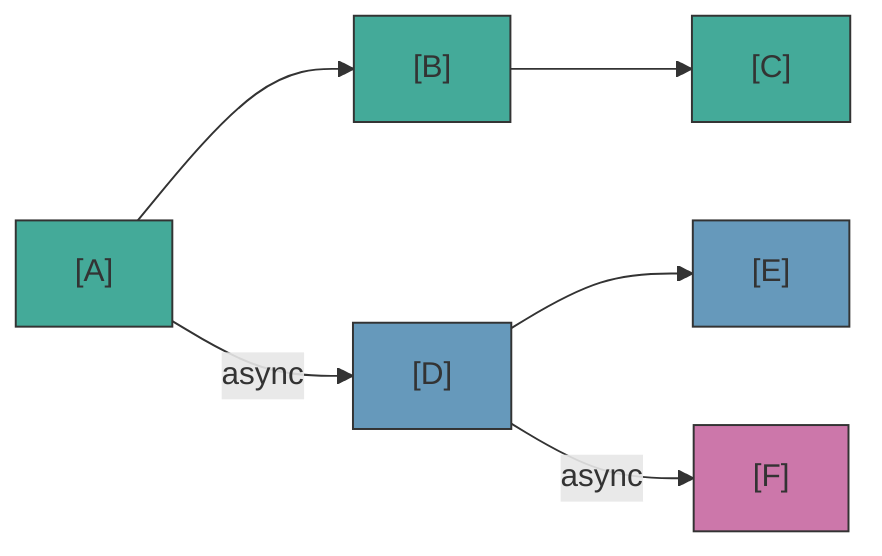

# 非同期トラック

block に `props.isAsync = true` が設定されている場合、engine はメインフローとは独立して動作する**並列トラック**を作成します。

## トラックの作成方法

port 解決中に複数の送出 connection が存在する場合：
- **最初の非 async connection** が現在のフローの継続となります
- **その他の connection**（`isAsync` を持つ block へ）が新しい並列トラックになります

これはメイントラック**と** async トラックの両方に適用されます — async トラックは独自の async connection からサブトラックを spawn でき、並列実行の階層を作成できます。

## トラックのライフサイクル

- `onBeforeBlock` は**すべての block** で呼び出されます（メインおよび async トラック） — `resolve()` の詳細は [Lifecycle](./lifecycle) を参照
- async トラックはメイントラックと同様に、送出 connection をメイン vs async に分離します
- トラックは scene 終了時または `cancel()` 呼び出し時に自動的にキャンセルされます
- トラックが自然に終了した場合（connection がなくなった）、サブトラックは**独立して存続**します
- トラックが明示的にキャンセルされた場合（`cancel()`）、キャンセルはすべての子トラックに**カスケード**します

## waitForBlocks — 他のトラックを待つ

`props.waitForBlocks` は、指定された block が訪問されるまでその block を保留します。`isAsync` が開く分岐の「合流」側です：ブランチが並列で走り、下流の block はそれがどこかに到達するまで待ってから再生されます。

**block は dispatch される前に保留されます。** handler は呼び出されないため、待機が解除されるまでゲーム側は block の存在すら知りません — その内容が早すぎるタイミングで画面に出ることはありません。これは描画の選択ではなくエンジンの決定です：`waitForBlocks` は **native** プロパティであり、デザイナーが LSDE でチェックした以上、エンジンがその動作を保証します。

このルールはプレイヤーが見ているトラックを含め、**すべて**のトラックで同じです。

- id は**このシーンの** block を指します。ワイヤーがシーンをまたいだことは一度もありません。
- 1 つではなく、**すべて**が訪問済みである必要があります。
- block を訪問すると、それを待っていたものが連鎖的に解放されます。
- 決して訪問されない block はトラックを永久に停留させます。id がシーンの block でない場合、`init()` は `UNKNOWN_WAIT_BLOCK` を報告します。

`waitForBlocks` と `delay` の両方を持つ block のシーケンス：

```
waitForBlocks ゲート → onBeforeBlock (delay) → handler → next()
```

## waitInput — プレイヤー入力フラグ

`props.waitInput` は**パッシブフラグ**です — engine はそれを公開しますが解釈しません。ゲーム handler がそれを読み取り、明示的なプレイヤー入力を待つかどうかを決定します。

## TrackInfo API — 可観測性

`scene.getTrackInfos()` を使用して実行中の async トラックを検査します。各トラックの状態の読み取り専用スナップショットを返します：

::: code-group
```ts [TypeScript]
const tracks = scene.getTrackInfos();
for (const track of tracks) {
  console.log(`Track ${track.id} (parent: ${track.parentTrackId}) at block ${track.currentBlockUuid}`);
}
```
```csharp [C#]
var tracks = scene.GetTrackInfos();
foreach (var track in tracks)
{
    Console.WriteLine($"Track {track.Id} (parent: {track.ParentTrackId}) at block {track.CurrentBlockUuid}");
}
```
```cpp [C++]
auto tracks = scene->getTrackInfos();
for (const auto& track : tracks) {
    std::cout << "Track " << track.id
              << " (parent: " << track.parentTrackId << ")"
              << " at block " << track.currentBlockUuid << "\n";
}
```
```gdscript [GDScript]
var tracks = scene.get_track_infos()
for track in tracks:
    print("Track %d (parent: %s) at block %s" % [
        track["id"], str(track["parentTrackId"]), track["currentBlockUuid"]])
```
:::

各 `TrackInfo` には `id`、`parentTrackId`、`startBlockUuid`、`currentBlockUuid`、`running` が含まれます。デバッグオーバーレイ、プレイモードレンダラー、検証に使用します。

## Async トラックで動作するもの（と動作しないもの）

async トラックは、メインの会話と*並行して*起こること — 環境エフェクト、並列アニメーション、仲間の反応 — に最適です。ただし制限があります。

**推奨 — 並列コンテンツ：**
| ユースケース | 動作する理由 |
|---|---|
| NPC の環境セリフ（「バーク」） | async トラック上の dialog block — NPC がメインの会話の進行中にコメント、反応、掛け合いを行います |
| イベントに同期したキャラクター反応 | `waitForBlocks` を使用して特定の block に到達したときに反応をトリガー |
| 環境音やBGMの再生 | action block、プレイヤーのインタラクション不要 |
| カメラ移動のトリガー | action block、並列実行 |
| 精密なタイミングのエフェクト | `waitForBlocks` + `delay` を組み合わせて精密なタイミングを実現 |

**非推奨 — プレイヤーインタラクションやゲームロジック分岐：**
| ユースケース | 問題となる理由 |
|---|---|
| async トラック内の CHOICE block | プレイヤーは既にメイントラックとインタラクション中 — 誰が async の choice に応答するのか？ |
| 重要なゲームステート変更 | async トラックがキャンセルされた場合（scene 終了）、action は実行されません |

::: warning async トラック内の choice
async トラック内の CHOICE block は、プレイヤーがメインの対話に既に参加している間に選択を行うべきことを意味します。最も一般的なシナリオは AI 駆動の「choice」（例：仲間の NPC がパーソナリティに基づいて自動選択する）です。async トラックが自動選択する scene レベル handler なしで CHOICE block に到達した場合、フローは停止するか無言で終了します。
:::

## 複数の Scene の並列実行

engine は複数の scene の同時実行をサポートしています。各 `SceneHandle` は独自のステート、訪問済み block、async トラックを持ちます。グローバル handler（Tier 1）は共有されます — どの scene が呼び出しているかは `scene` 引数で判別できます：

<!--@include: ../../_shared/async-dialog-track.md-->

::: tip Scene ごとのルーティング
並行する scene が多い場合は、グローバル handler 内でルーティングする代わりに、各ハンドルに scene レベル（Tier 2）の handler を登録することを検討してください。よりクリーンな分離が実現でき、`if/else` チェーンが不要になります。
:::

## Visual Reference



- Main track: A &rarr; B &rarr; C
- Track 1 (parallel): D &rarr; E
- Track 2 (sub-track of D): F
- Scene cancel &rarr; all tracks cancelled
- Track D ends naturally &rarr; F continues
