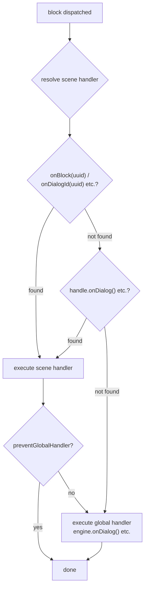

# ハンドラー

## Handler

handler は engine とゲームを繋ぐ橋です。オブザーバーのように機能します — 関数を登録すると、対応するイベントが発生した時に engine がそれを呼び出します。テキストの表示、アニメーションの再生、状態の評価など、ゲームエンジンで適切な動作をトリガーするのは handler を通じて行います。

engine は以下の handler を公開しています：

| Handler | レベル | 説明 |
|---------|--------|------|
| [`onDialog`](/api-ref/classes/DialogueEngine#ondialog) | global / scene | dialog block — テキスト表示 |
| [`onChoice`](/api-ref/classes/DialogueEngine#onchoice) | global / scene | choice block — 選択肢の提示 |
| [`onCondition`](/api-ref/classes/DialogueEngine#oncondition) | global / scene | condition block — 評価と分岐 |
| [`onAction`](/api-ref/classes/DialogueEngine#onaction) | global / scene | action block — 副作用のトリガー |
| [`onResolveCharacter`](/api-ref/classes/DialogueEngine#onresolvecharacter) | global / scene | どのキャラクターが話しているかを解決 |
| [`onBeforeBlock`](/api-ref/classes/DialogueEngine#onbeforeblock) | global | 各 block の前（delay、開始アニメーション…） |
| [`onValidateNextBlock`](/api-ref/classes/DialogueEngine#onvalidatenextblock) | global | block に進む前のバリデーション |
| [`onInvalidateBlock`](/api-ref/classes/DialogueEngine#oninvalidateblock) | global | バリデーション失敗時の処理 |
| [`onSceneEnter`](/api-ref/classes/DialogueEngine#onsceneenter) | global / scene | scene の開始 |
| [`onSceneExit`](/api-ref/classes/DialogueEngine#onsceneexit) | global / scene | scene の終了 |
| [`onBlock`](/api-ref/interfaces/SceneHandle#onblock) | scene | UUID で特定の block をオーバーライド |
| [`onDialogId`](/api-ref/interfaces/SceneHandle#ondialogid) | scene | UUID で特定の DIALOG block をオーバーライド（型安全） |
| [`onChoiceId`](/api-ref/interfaces/SceneHandle#onchoiceid) | scene | UUID で特定の CHOICE block をオーバーライド（型安全） |
| [`onConditionId`](/api-ref/interfaces/SceneHandle#onconditionid) | scene | UUID で特定の CONDITION block をオーバーライド（型安全） |
| [`onActionId`](/api-ref/interfaces/SceneHandle#onactionid) | scene | UUID で特定の ACTION block をオーバーライド（型安全） |
| [`onResolveCondition`](/api-ref/classes/DialogueEngine#onresolvecondition) | global | 統合 condition リゾルバー（choice の可視性 + condition の事前評価） |
| ~~[`setChoiceFilter`](/api-ref/classes/DialogueEngine#setchoicefilter)~~ | global | _非推奨 — 代わりに `onResolveCondition` を使用してください_ |

`onDialog`、`onChoice`、`onAction` は**必須**です — `start()` 呼び出し時に engine がその存在を検証し、欠けている場合は記述的なエラーをスローします。`onCondition` は `onResolveCondition` がインストールされている場合は**オプション**です — engine が事前評価された condition グループから自動ルーティングします。

<!--@include: ../../_shared/handler-basic.md-->

## Two-Tier Handler System

engine は handler を2つの階層で解決します：

- **Global handler** — engine に登録され、すべての scene のデフォルト動作を定義します。ほとんどの場合これだけで十分です。
- **Scene handler** — 特定の [`SceneHandle`](/api-ref/interfaces/SceneHandle) に登録され、scene が異なるレンダリングや制御フローを必要とする場合にデフォルト動作をオーバーライドまたは拡張できます。まれですが、利用可能です。

block がディスパッチされると、engine は以下の順序で handler を解決します：
1. `handle.onBlock(uuid)` または `handle.onDialogId(uuid)` / `handle.onActionId(uuid)` / ... — block 固有のオーバーライド
2. `handle.onDialog()` / `handle.onChoice()` / ... — scene レベルのタイプ handler
3. `engine.onDialog()` / `engine.onChoice()` / ... — global handler

両方の階層が存在する場合、両方が順番に実行されます — scene が先、次に global — ただし scene handler が `context.preventGlobalHandler()` を呼び出して global パスを抑制した場合を除きます。

<!--@include: ../../_shared/handler-tier1.md-->

## Character Resolution

キャラクター解決はオプションです。`onResolveCharacter` callback を登録すると、engine は `metadata.characters` にキャラクターを持つすべての block の前にそれを呼び出します。callback は block に割り当てられたキャラクターのリストを受け取り、アクティブにすべきキャラクターを返します — 利用可能なキャラクターがいない場合は `undefined` を返します。解決されたキャラクターは、すべての handler で `context.character` としてアクセスできます。

これはゲーム状態を照会するための理想的な統合ポイントです：キャラクターがシーンに存在するか、生存しているか、カメラ範囲内にいるかなどを確認できます。`undefined` を返すことで、[`skipIfMissingActor`](/api-ref/interfaces/NativeProperties#skipifmissingactor) による block スキップ、`handle.cancel()` による scene キャンセル、handler 内での直接処理など、複数の戦略が可能になります。

<!--@include: ../../_shared/handler-character.md-->

## Scene Lifecycle

`onSceneEnter` と `onSceneExit` callback で、scene の開始と終了に反応できます — シネマモードの有効化、NPC の停止、UI の準備、リソースのクリーンアップなど。global レベル（engine 上）と scene レベル（`handle.onEnter()` / `handle.onExit()` 経由）の両方で利用可能です。scene handler が定義されている場合、global を置き換えます。

<!--@include: ../../_shared/handler-lifecycle.md-->

## Block Override

`onBlock(uuid)` で特定の block をその識別子で指定し、専用の handler を割り当てることができます。これはまれなユースケースです — ジェネリック handler が大半のニーズをカバーします — ただし、個別の block が異なる動作を必要とする非常に特殊なシナリオでは利用可能です。

<!--@include: ../../_shared/handler-block-override.md-->

## Type-Safe Block Override

`onDialogId(uuid)`、`onChoiceId(uuid)`、`onConditionId(uuid)`、`onActionId(uuid)` は `onBlock(uuid)` の型安全な代替メソッドです。動作は全く同じ — 同じ優先度、同じ `preventGlobalHandler` サポート — ただし handler がジェネリックユニオンではなく、特殊化された block 型とコンテキストを受け取ります。

登録時に block タイプが分かっていて、`block` と `context` のオートコンプリートが必要な場合に使用してください。

<!--@include: ../../_shared/handler-block-override-typed.md-->

## Visual Reference

### Two-Tier Handler Dispatch

