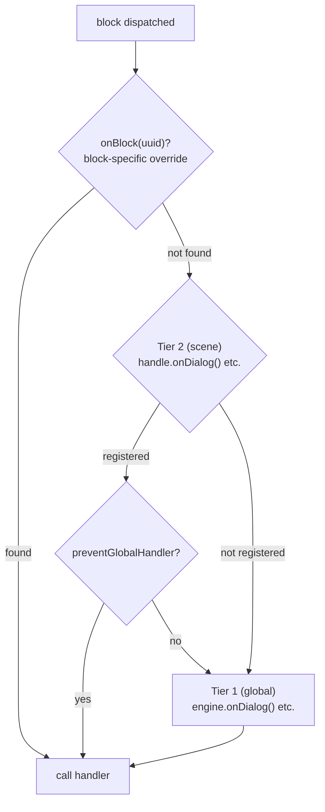

# ハンドラー

## 必須 Handler

engine はグラフ走査マシンです — ノードを辿り、登録されたコードにディスパッチします。4つのコンテンツ handler は、それなしでは engine が何も出力しないため、必須です：

- `onDialog` — 対話テキストに反応する
- `onChoice` — プレイヤーに選択肢を提示する
- `onCondition` — condition を評価してフローを分岐する
- `onAction` — ゲーム側のエフェクトを実行する

`handle.start()` を呼び出すと、engine は4つすべてが登録されているか（engine レベルまたは scene レベルで）検証します。いずれかが欠けている場合、欠けている handler の一覧を含む記述的なエラーがスローされます。

<!--@include: ../../_shared/handler-basic.md-->

## 2階層 Handler システム

engine は2レベルの handler システムを使用します：

1. **Tier 1 — グローバル（engine レベル）**: `DialogueEngine` に `onDialog()`、`onChoice()` などで登録。
2. **Tier 2 — Scene レベル**: `SceneHandle` に `handle.onDialog()` などで登録。

block がディスパッチされると：
1. scene handler（Tier 2）が存在すれば、最初に呼び出されます。
2. 次にグローバル handler（Tier 1）が呼び出されます。**ただし**、scene handler が `context.preventGlobalHandler()` を呼び出した場合を除きます。

<!--@include: ../../_shared/handler-tier1.md-->

::: info Handler の優先順位
block がディスパッチされると、engine は以下の優先順位で handler を解決します：
1. `handle.onBlock(uuid)` — UUID による block 固有のオーバーライド
2. `handle.onDialog()` / `handle.onChoice()` / ... — scene のタイプオーバーライド
3. `engine.onDialog()` / `engine.onChoice()` / ... — グローバル handler

scene handler（Tier 2）が存在する場合、`context.preventGlobalHandler()` が呼び出されない限り、グローバル handler（Tier 1）も**その後に**呼び出されます。
:::

## キャラクター解決

engine は `metadata.characters` を持つすべての block に対してキャラクターを解決します。デフォルトではリスト内の最初のキャラクターを返します。

<!--@include: ../../_shared/handler-character.md-->

解決されたキャラクターは、すべての block handler 内で `context.character` として、また [`onValidateNextBlock`](lifecycle#onvalidatenextblock) では `nextContext.character` / `fromContext.character` として利用できます。

## Choice 履歴

engine は scene 中のプレイヤーのすべての choice を追跡します。この履歴は `choice:` condition の評価に内部的に使用され、ホストアプリケーション側のコードからもアクセスできます：

<!--@include: ../../_shared/handler-on-exit.md-->

## Block オーバーライド

`SceneHandle` は UUID で特定の block をオーバーライドすることもできます：

<!--@include: ../../_shared/handler-block-override.md-->

## Visual Reference

### Two-Tier Handler Dispatch

