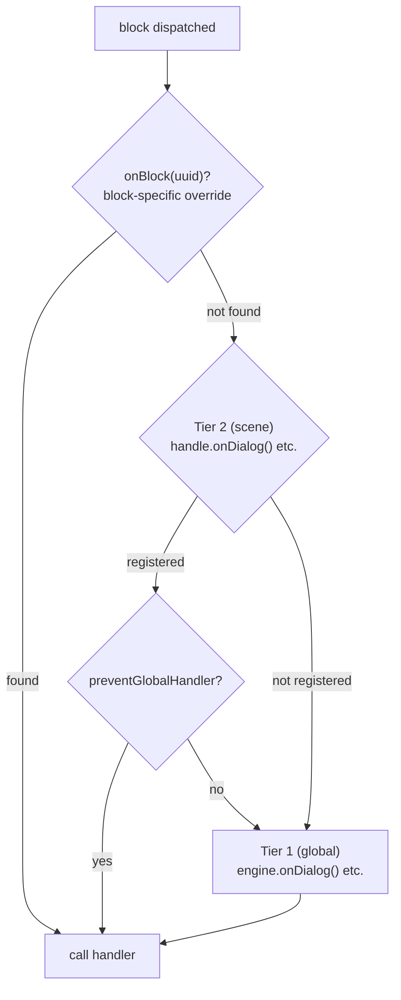

# ハンドラー

## 必須 Handler

engine はグラフ走査マシンです — ノードを辿り、登録されたコードにディスパッチします。4つのコンテンツ handler は、それなしでは engine が何も出力しないため、必須です：

- `onDialog` — 対話テキストに反応する
- `onChoice` — プレイヤーに選択肢を提示する
- `onCondition` — condition を評価してフローを分岐する
- `onAction` — ゲーム側のエフェクトを実行する

`handle.start()` を呼び出すと、engine は4つすべてが登録されているか（engine レベルまたは scene レベルで）検証します。いずれかが欠けている場合、欠けている handler の一覧を含む記述的なエラーがスローされます。

::: code-group
```ts [TypeScript]
engine.onDialog(handler);
engine.onChoice(handler);
engine.onCondition(handler);
engine.onAction(handler);

const handle = engine.scene(sceneId);
handle.start(); // ✓ All 4 registered — scene starts
```
```csharp [C#]
engine.OnDialog(handler);
engine.OnChoice(handler);
engine.OnCondition(handler);
engine.OnAction(handler);

var handle = engine.Scene(sceneId);
handle.Start(); // ✓ All 4 registered — scene starts
```
```cpp [C++]
engine.onDialog(handler);
engine.onChoice(handler);
engine.onCondition(handler);
engine.onAction(handler);

auto handle = engine.scene(sceneId);
handle->start(); // ✓ All 4 registered — scene starts
```
```gdscript [GDScript]
engine.on_dialog(handler)
engine.on_choice(handler)
engine.on_condition(handler)
engine.on_action(handler)

var handle = engine.scene(scene_id)
handle.start() # ✓ All 4 registered — scene starts
```
:::

## 2階層 Handler システム

engine は2レベルの handler システムを使用します：

1. **Tier 1 — グローバル（engine レベル）**: `DialogueEngine` に `onDialog()`、`onChoice()` などで登録。
2. **Tier 2 — Scene レベル**: `SceneHandle` に `handle.onDialog()` などで登録。

block がディスパッチされると：
1. scene handler（Tier 2）が存在すれば、最初に呼び出されます。
2. 次にグローバル handler（Tier 1）が呼び出されます。**ただし**、scene handler が `context.preventGlobalHandler()` を呼び出した場合を除きます。

::: code-group
```ts [TypeScript]
// Tier 1 — global
engine.onDialog(({ block, context, next }) => {
  console.log('Global dialog handler');
  next();
});

// Tier 2 — scene-specific
const handle = engine.scene(sceneId);
handle.onDialog(({ block, context, next }) => {
  console.log('Scene-specific dialog handler');
  context.preventGlobalHandler();
  next();
});
handle.start();
```
```csharp [C#]
// Tier 1 — global
engine.OnDialog(args => {
    Console.WriteLine("Global dialog handler");
    args.Next();
    return null;
});

// Tier 2 — scene-specific
var handle = engine.Scene(sceneId);
handle.OnDialog(args => {
    Console.WriteLine("Scene-specific dialog handler");
    args.Context.PreventGlobalHandler();
    args.Next();
    return null;
});
handle.Start();
```
```cpp [C++]
// Tier 1 — global
engine.onDialog([](auto*, auto* block, auto* ctx, auto next) -> CleanupFn {
    std::cout << "Global dialog handler\n";
    next();
    return {};
});

// Tier 2 — scene-specific
auto handle = engine.scene(sceneId);
handle->onDialog([](auto*, auto* block, auto* ctx, auto next) -> CleanupFn {
    std::cout << "Scene-specific dialog handler\n";
    ctx->preventGlobalHandler();
    next();
    return {};
});
handle->start();
```
```gdscript [GDScript]
# Tier 1 — global
engine.on_dialog(func(args):
    print("Global dialog handler")
    args["next"].call()
    return Callable()
)

# Tier 2 — scene-specific
var handle = engine.scene(scene_id)
handle.on_dialog(func(args):
    print("Scene-specific dialog handler")
    args["context"].prevent_global_handler()
    args["next"].call()
    return Callable()
)
handle.start()
```
:::

::: info Handler の優先順位
block がディスパッチされると、engine は以下の優先順位で handler を解決します：
1. `handle.onBlock(uuid)` — UUID による block 固有のオーバーライド
2. `handle.onDialog()` / `handle.onChoice()` / ... — scene のタイプオーバーライド
3. `engine.onDialog()` / `engine.onChoice()` / ... — グローバル handler

scene handler（Tier 2）が存在する場合、`context.preventGlobalHandler()` が呼び出されない限り、グローバル handler（Tier 1）も**その後に**呼び出されます。
:::

## キャラクター解決

engine は `metadata.characters` を持つすべての block に対してキャラクターを解決します。デフォルトではリスト内の最初のキャラクターを返します。

::: code-group
```ts [TypeScript]
// Engine-level — applies to all scenes
engine.onResolveCharacter((characters) => {
  return party.getActiveLeader(characters);
});

// Scene-level override
const handle = engine.scene(sceneId);
handle.onResolveCharacter((characters) => {
  return battle.getActiveUnit(characters);
});
```
```csharp [C#]
engine.OnResolveCharacter(chars => party.GetActiveLeader(chars));

var handle = engine.Scene(sceneId);
handle.OnResolveCharacter(chars => battle.GetActiveUnit(chars));
```
```cpp [C++]
engine.onResolveCharacter([](const auto& chars) {
    return party.getActiveLeader(chars);
});

auto handle = engine.scene(sceneId);
handle->onResolveCharacter([](const auto& chars) {
    return battle.getActiveUnit(chars);
});
```
```gdscript [GDScript]
engine.on_resolve_character(func(chars):
    return party.get_active_leader(chars)
)

var handle = engine.scene(scene_id)
handle.on_resolve_character(func(chars):
    return battle.get_active_unit(chars)
)
```
:::

解決されたキャラクターは、すべての block handler 内で `context.character` として、また [`onValidateNextBlock`](lifecycle#onvalidatenextblock) では `nextContext.character` / `fromContext.character` として利用できます。

## Choice 履歴

engine は scene 中のプレイヤーのすべての choice を追跡します。この履歴は `choice:` condition の評価に内部的に使用され、ホストアプリケーション側のコードからもアクセスできます：

::: code-group
```ts [TypeScript]
handle.onExit(({ scene }) => {
  const history = scene.getChoiceHistory();       // Map of blockUuid → [choiceUuid, ...]
  const picks = scene.getChoice('block-uuid-123'); // string[] | undefined
});
```
```csharp [C#]
handle.OnExit(args => {
    var history = args.Scene.GetChoiceHistory();
    var picks = args.Scene.GetChoice("block-uuid-123"); // List<string>?
});
```
```cpp [C++]
handle->onExit([](auto* scene, auto*) {
    auto history = scene->getChoiceHistory();
    auto picks = scene->getChoice("block-uuid-123"); // std::vector<std::string>*
});
```
```gdscript [GDScript]
handle.on_exit(func(args):
    var history = args["scene"].get_choice_history()
    var picks = args["scene"].get_choice("block-uuid-123") # Array or null
)
```
:::

## Block オーバーライド

`SceneHandle` は UUID で特定の block をオーバーライドすることもできます：

::: code-group
```ts [TypeScript]
const handle = engine.scene(sceneId);
handle.onBlock('block-uuid-123', ({ block, context, next }) => {
  next();
});
```
```csharp [C#]
var handle = engine.Scene(sceneId);
handle.OnBlock("block-uuid-123", args => {
    args.Next();
    return null;
});
```
```cpp [C++]
auto handle = engine.scene(sceneId);
handle->onBlock("block-uuid-123", [](auto*, auto*, auto*, auto next) -> CleanupFn {
    next();
    return {};
});
```
```gdscript [GDScript]
var handle = engine.scene(scene_id)
handle.on_block("block-uuid-123", func(args):
    args["next"].call()
    return Callable()
)
```
:::

## Visual Reference

### Two-Tier Handler Dispatch


