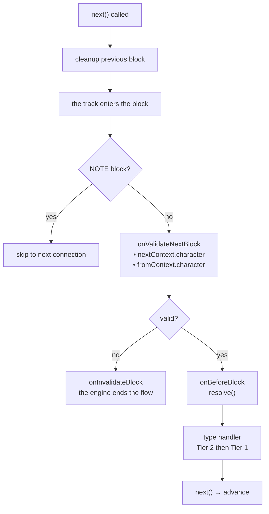
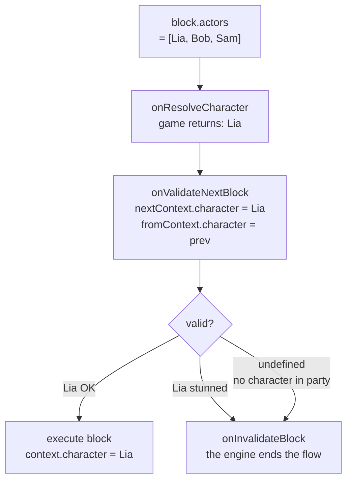

# ライフサイクルと検証

## 各 Block の実行順序

1. **前の block のクリーンアップ** — *前の* block の handler が返したクリーンアップ関数が遷移時に実行されます（`next()` が呼ばれた時点）
2. `onValidateNextBlock` — 実行前の検証
3. `onBeforeBlock` — 前処理（続行するには `resolve()` を呼び出す必要あり）
4. タイプ handler（Tier 2、次に Tier 1）

## Scene イベント

<!--@include: ../../_shared/lifecycle-scene-events.md-->

## onValidateNextBlock

各 block 遷移をインターセプトして検証します。handler は次の block (`nextContext`) と前の block (`fromContext`) の**解決されたキャラクター**を受け取ります：

<!--@include: ../../_shared/lifecycle-validate.md-->

### Character Gating

`nextContext.character` を使用して、ゲームの状態に基づいて block の実行を制御します：

<!--@include: ../../_shared/lifecycle-validate-stunned.md-->

`fromContext.character` を使用してキャラクター間の遷移を検証できます（例：関係チェック、クールダウン）。`fromContext` はシーンの最初の block では `null` です。

## onBeforeBlock

各 block の前に呼び出されます。続行するには**必ず `resolve()` を呼び出す**必要があります：

<!--@include: ../../_shared/lifecycle-before-block.md-->

**`onBeforeBlock` の実行中に**呼ばれた `resolve()` は、コールバックが戻った時点で効果を持ちます —
handler の中で呼ばれた `next()` とまったく同じです。タイプ handler はあなたのコールバックが終わってから
ディスパッチされるため、`resolve()` の後に書いた行は block の**前に**実行されます。

## クリーンアップ関数

handler はクリーンアップ関数を返すことができ、block から離れる際に呼び出されます：

<!--@include: ../../_shared/lifecycle-cleanup.md-->

## エラー境界

**何も飲み込まれません。** engine がグラフをたどっている間にあなたのコードがスローすると — タイプ
handler、クリーンアップ関数、`onValidateNextBlock`、`onInvalidateBlock`、`onBeforeBlock`、
`onResolveCondition`、`onResolveCharacter`、`onSceneEnter` のいずれでも — engine はまず **scene 全体**を
閉じ、その後 `start()`、`next()`、`resolve()` を呼び出した側へエラーを**再スロー**します。

これは**すべてのトラック**で成り立ちます。`isAsync` のブランチでスローした handler は、そのブランチだけで
なく scene を閉じます。

使いものになるのはこの順序のおかげです。エラーがあなたのコードに届く時点で：

- クリーンアップ関数は実行済み
- async トラックは取り消し済み
- `onSceneExit` は `reason: 'faulted'` で発火済みで、エラーそのものは `context.error` に入っています

対話は**正しく**停止しており、次に何をするかはあなたが決めます — それなしで続行する、画面を出す、
あるいはクラッシュさせる。`start()`、`next()`、`resolve()` の周りにご自身の `try/catch` を置いてください。

エラーは意図的に**二か所**に届きます。`next()` を呼び出した側 — ゲームでは多くの場合クリックやタイマー —
へスローされ、同時に `onSceneExit` の `context.error` にも渡されます。対話の終了を待つコードが聞いて
いるのはこちらです。ログはどちらか一方でのみ出してください。

`onSceneExit` 自体がスローした例外も同じ経路で届き、それでも scene は解放されます：
`engine.isRunning()` はもうそれを数えません。ただし scene がすでにエラーで閉じようとしていた場合は、
そのエラーの方が届きます — 残りを説明するのはそちらです。

::: warning GDScript
GDScript には例外がありません。handler 内のスクリプトエラーは Godot のログに出力され、呼び出しは `null`
を返します：block は来ることのない `next()` をただ待ち続けます。scene を代わりに閉じるものは何もありません。
:::

::: tip なぜ変わったのか
v1 は handler の例外を静かに飲み込んでいました — ログにも残さず — 一方で、その同じ handler が返した
クリーンアップからの例外は呼び出し側に届いていました。ひとつの障害に対して二つの正反対の挙動であり、
静かな方はプロジェクトが動き続ける限り本物のバグを隠していました。

2.0.0 はそれをタイプ handler についてだけ直していました。スローする検証、`onBeforeBlock`、リゾルバ —
あるいは並列トラック上の handler — は、進めるものが何もないまま scene を開いたままにし、対話の終了を
待つゲームは永遠に待ち続けていました。
:::

## Scene が終わった理由

`onSceneExit` は `context.reason` でその理由を受け取ります：

| `reason` | いつ |
|---|---|
| `completed` | フローがグラフの終わりに達した |
| `cancelled` | `scene.cancel()` または `engine.stop()` |
| `invalidated` | 最後に動いていたトラックが入ろうとした block を `onValidateNextBlock` が拒否した |
| `faulted` | 走査中にあなたのコードがスローした。`context.error` にスローされたものが入っている — [エラー境界](#エラー境界)を参照 |
| `deadlocked` | 残っているトラックがすべて、何も完了させられない `waitForBlocks` で待機している。`context.waitingFor` がそれらの block を示す |

`onSceneEnter` には理由が渡されません。

`scene.getSceneId()` は**どの** scene が終わったかを示し、`scene.getScenePath()` はそのパスを返します。
2 つの scene が同時に再生されると、グローバルな `onSceneExit` にはこれが必要になります。パスではなく id
を保存してください：scene の名前が変わった日にパスは変わります。

**デッドロックは scene を閉じます。** どのトラックも完了させない block を待つ block — たとえばフローが
通らなかったブランチの block — は、`onSceneExit` もなく scene を永久に開いたままにしていました。いまは
動けるトラックが最後に止まった瞬間に scene が `deadlocked` で閉じ、`waitingFor` がどの合流の配線が
誤っているかを教えてくれます。

## ひとつのスレッド

engine はスレッドセーフではありません。`next()`、`resolve()`、`cancel()` は scene を**開始した**スレッド
から呼び出してください — Unity ではメインスレッド、Unreal ではゲームスレッドです。

C# と C++ では、別のスレッドからの呼び出しは両方のスレッドを示す例外で**拒否され**、何も変わりません：
正しいスレッドから呼べば同じ `next()` がそのまま動きます。Unity では engine を呼ぶ前にメインスレッドへ
戻してください（`await UniTask.SwitchToMainThread()`、またはメインスレッド用のキューに入れる）。

## cancel()

`scene.cancel()` を呼び出すと、以下のシーケンスが実行されます：

1. すべての **async トラック** がキャンセルされます
2. 現在の block の**クリーンアップ関数**が実行されます
3. `onSceneExit` handler が `reason: 'cancelled'` で呼び出されます
4. scene が完了としてマークされます

scene がすでに閉じつつあるときにクリーンアップが `scene.cancel()` や `engine.stop()` を呼んでも無視され
ます：`onSceneExit` は一度だけ発火します。

<!--@include: ../../_shared/lifecycle-invalidate.md-->

## NativeProperties

engine が block をディスパッチする方法を制御する実行プロパティ：

| フィールド | 型 | 説明 |
|-------|------|-------------|
| `isAsync` | `boolean?` | 並列 async トラックで実行 |
| `delay` | `number?` | block が再生されるまでの**ミリ秒**。`onBeforeBlock` が適用し、engine は決して適用しません |
| `timeout` | `number?` | セリフを言い終えたあと block が画面に**残るミリ秒**。そのあと自分から離れます — block のオートアドバンス。**`waitInput` より優先**。そのまま渡され、engine は何も強制しません |
| `portPerCharacter` | `boolean?` | metadata 内のキャラクターごとに出力ポートを作成 |
| `skipIfMissingActor` | `boolean?` | 参照されたアクターが不在の場合、block をスキップ |
| `debug` | `boolean?` | エディタ用デバッグフラグ |
| `waitForBlocks` | `string[]?` | **この scene の** block id。それらがすべて**完了**するまで、block は**ディスパッチされる前に**保持されます。何もそれらを完了させられない場合、scene は `deadlocked` で閉じます |
| `waitInput` | `boolean?` | 明示的なプレイヤー入力制御用のパッシブフラグ — **`timeout` が優先します** |

## Visual Reference

### Block Execution Flow

### Character Gating Flow

