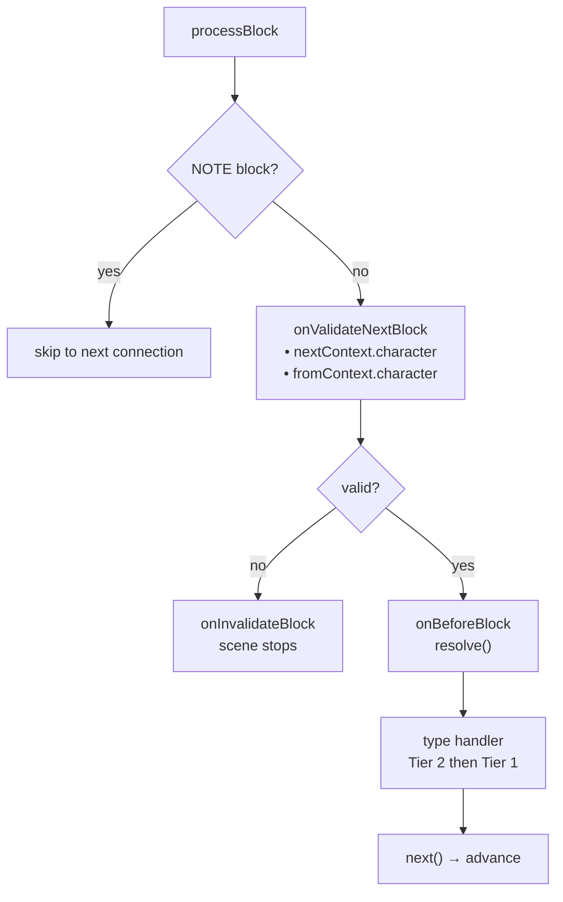
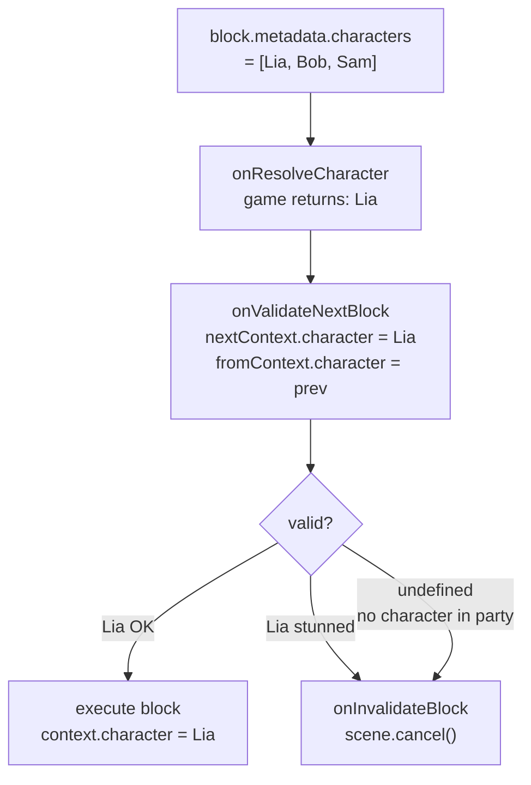

# ライフサイクルと検証

## 完全なライフサイクル

### 各 Block の実行順序

1. `onValidateNextBlock` — 実行前の検証
2. **前の block のクリーンアップ** — *前の* block の handler が返したクリーンアップ関数
3. `onBeforeBlock` — 前処理（続行するには `resolve()` を呼び出す必要あり）
4. タイプ handler（Tier 2、次に Tier 1）

### Scene イベント

::: code-group
```ts [TypeScript]
engine.onSceneEnter(({ scene, context }) => {
  // Called when handle.start() is executed
});

engine.onSceneExit(({ scene, context }) => {
  // Called when the scene ends (naturally or via cancel)
});
```
```csharp [C#]
engine.OnSceneEnter(args => {
    // Called when handle.Start() is executed
});

engine.OnSceneExit(args => {
    // Called when the scene ends (naturally or via cancel)
});
```
```cpp [C++]
engine.onSceneEnter([](auto* scene, auto*) {
    // Called when handle->start() is executed
});

engine.onSceneExit([](auto* scene, auto*) {
    // Called when the scene ends (naturally or via cancel)
});
```
```gdscript [GDScript]
engine.on_scene_enter(func(args):
    pass # Called when handle.start() is executed
)

engine.on_scene_exit(func(args):
    pass # Called when the scene ends (naturally or via cancel)
)
```
:::

## onValidateNextBlock

各 block 遷移をインターセプトして検証します。handler は次の block (`nextContext`) と前の block (`fromContext`) の**解決されたキャラクター**を受け取ります：

::: code-group
```ts [TypeScript]
engine.onValidateNextBlock(({ nextBlock, fromBlock, nextContext, fromContext }) => {
  return { valid: true };
});

engine.onInvalidateBlock(({ scene, reason }) => {
  console.error('Invalid block:', reason);
  scene.cancel();
});
```
```csharp [C#]
engine.OnValidateNextBlock(args => {
    // args.NextContext.Character, args.FromContext?.Character
    return new ValidationResult { Valid = true };
});

engine.OnInvalidateBlock(args => {
    Console.Error.WriteLine($"Invalid block: {args.Reason}");
    args.Scene.Cancel();
});
```
```cpp [C++]
engine.onValidateNextBlock([](const auto& args) {
    // args.nextContext.character, args.fromContext.character (check args.hasFromContext)
    return ValidationResult{true};
});

engine.onInvalidateBlock([](auto* scene, const auto& reason) {
    std::cerr << "Invalid block: " << reason << "\n";
    scene->cancel();
});
```
```gdscript [GDScript]
engine.on_validate_next_block(func(args):
    # args["nextContext"]["character"], args["fromContext"]["character"]
    return {"valid": true}
)

engine.on_invalidate_block(func(args):
    printerr("Invalid block: %s" % args["reason"])
    args["scene"].cancel()
)
```
:::

### Character Gating

`nextContext.character` を使用して、ゲームの状態に基づいて block の実行を制御します：

::: code-group
```ts [TypeScript]
// Block if the character is stunned
engine.onValidateNextBlock(({ nextContext }) => {
  const { character } = nextContext;
  if (!character) return { valid: false, reason: 'no_character' };
  if (game.characterHasStatus(character, 'stunned'))
    return { valid: false, reason: 'character_stunned' };
  return { valid: true };
});
```
```csharp [C#]
engine.OnValidateNextBlock(args => {
    var character = args.NextContext.Character;
    if (character == null)
        return ValidationResult.Fail("no_character");
    if (game.CharacterHasStatus(character, "stunned"))
        return ValidationResult.Fail("character_stunned");
    return ValidationResult.Ok();
});
```
```cpp [C++]
engine.onValidateNextBlock([&game](const auto& args) {
    auto* character = args.nextContext.character;
    if (!character) return ValidationResult{false, "no_character"};
    if (game.characterHasStatus(character, "stunned"))
        return ValidationResult{false, "character_stunned"};
    return ValidationResult{true};
});
```
```gdscript [GDScript]
engine.on_validate_next_block(func(args):
    var character = args["nextContext"]["character"]
    if character == null:
        return {"valid": false, "reason": "no_character"}
    if game.character_has_status(character, "stunned"):
        return {"valid": false, "reason": "character_stunned"}
    return {"valid": true}
)
```
:::

`fromContext.character` を使用してキャラクター間の遷移を検証できます（例：関係チェック、クールダウン）。`fromContext` はシーンの最初の block では `null` です。

## onBeforeBlock

各 block の前に呼び出されます。続行するには**必ず `resolve()` を呼び出す**必要があります：

::: code-group
```ts [TypeScript]
engine.onBeforeBlock(({ block, resolve }) => {
  const delay = block.nativeProperties?.delay;
  if (delay) {
    setTimeout(resolve, delay * 1000);
  } else {
    resolve();
  }
});
```
```csharp [C#]
engine.OnBeforeBlock(args => {
    var delay = args.Block.NativeProperties?.Delay;
    if (delay.HasValue)
        Task.Delay((int)(delay.Value * 1000)).ContinueWith(_ => args.Resolve());
    else
        args.Resolve();
    return null;
});
```
```cpp [C++]
engine.onBeforeBlock([](auto* block, auto resolve) {
    auto delay = block->nativeProperties ? block->nativeProperties->delay : std::nullopt;
    if (delay.has_value()) {
        scheduleTimer(delay.value() * 1000, [resolve]() { resolve(); });
    } else {
        resolve();
    }
});
```
```gdscript [GDScript]
engine.on_before_block(func(args):
    var delay = args["block"].get("nativeProperties", {}).get("delay", 0)
    if delay > 0:
        await get_tree().create_timer(delay).timeout
    args["resolve"].call()
)
```
:::

## クリーンアップ関数

handler はクリーンアップ関数を返すことができ、block から離れる際に呼び出されます：

::: code-group
```ts [TypeScript]
engine.onDialog(({ block, next }) => {
  const element = showDialogUI(block);
  next();

  return () => {
    element.remove(); // Called when the next block takes over
  };
});
```
```csharp [C#]
engine.OnDialog(args => {
    var element = ShowDialogUI(args.Block);
    args.Next();

    return () => element.SetActive(false);
});
```
```cpp [C++]
engine.onDialog([](auto*, auto* block, auto* ctx, auto next) -> CleanupFn {
    auto* element = showDialogUI(block);
    next();

    return [element]() { element->remove(); };
});
```
```gdscript [GDScript]
engine.on_dialog(func(args):
    var element = show_dialog_ui(args["block"])
    args["next"].call()

    return func(): element.queue_free()
)
```
:::

## エラー境界

すべての handler 呼び出しは try/catch でラップされています。handler がスローした場合：

- エラーは engine のステートを破壊しません
- メイントラックの場合：scene はクリーンに終了します
- async トラックの場合：影響を受けたトラックのみが終了し、他のトラックとメインフローは継続します

これはクロス言語互換です（TS、C#、C++、GDScript の try/catch）。

## cancel()

`scene.cancel()` を呼び出すと、以下のシーケンスがトリガーされます：

1. すべての **async トラック** がキャンセルされます
2. 現在の block の**クリーンアップ関数**が実行されます
3. `onSceneExit` handler が呼び出されます
4. scene が完了としてマークされます

::: code-group
```ts [TypeScript]
engine.onInvalidateBlock(({ scene, reason }) => {
  console.error('Validation failed:', reason);
  scene.cancel();
});
```
```csharp [C#]
engine.OnInvalidateBlock(args => {
    Console.Error.WriteLine($"Validation failed: {args.Reason}");
    args.Scene.Cancel();
});
```
```cpp [C++]
engine.onInvalidateBlock([](auto* scene, const auto& reason) {
    std::cerr << "Validation failed: " << reason << "\n";
    scene->cancel();
});
```
```gdscript [GDScript]
engine.on_invalidate_block(func(args):
    printerr("Validation failed: %s" % args["reason"])
    args["scene"].cancel()
)
```
:::

## NativeProperties

Execution properties that control how a block is dispatched by the engine:

| Field | Type | Description |
|-------|------|-------------|
| `isAsync` | `boolean?` | Execute on a parallel async track |
| `delay` | `number?` | Delay before execution (consumed by `onBeforeBlock`) |
| `timeout` | `number?` | Execution timeout |
| `portPerCharacter` | `boolean?` | One output port per character in metadata |
| `skipIfMissingActor` | `boolean?` | Skip block if referenced actor is absent |
| `debug` | `boolean?` | Debug flag for editor use |
| `waitForBlocks` | `string[]?` | Block UUIDs that must be visited before this block can progress |
| `waitInput` | `boolean?` | Passive flag for explicit player input control |

## Visual Reference

### Block Execution Flow



### Character Gating Flow


