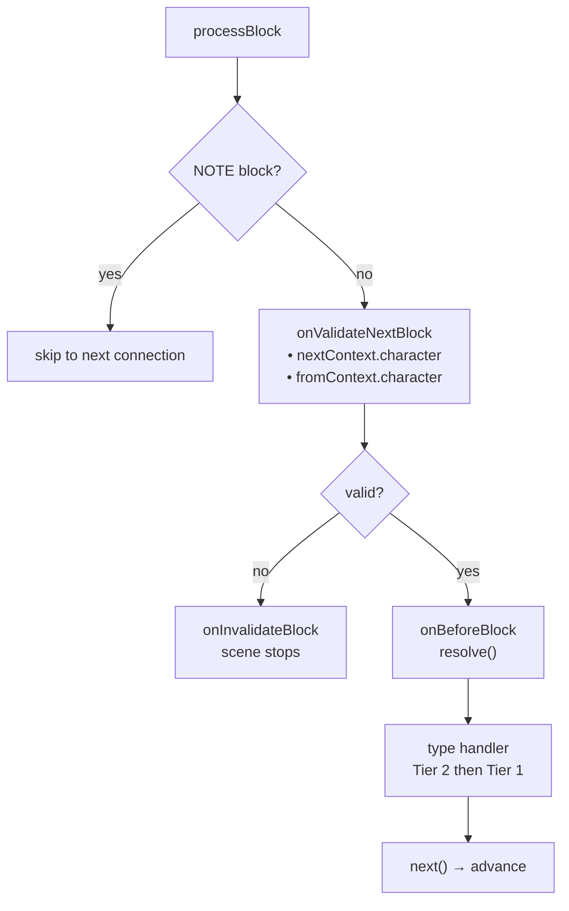
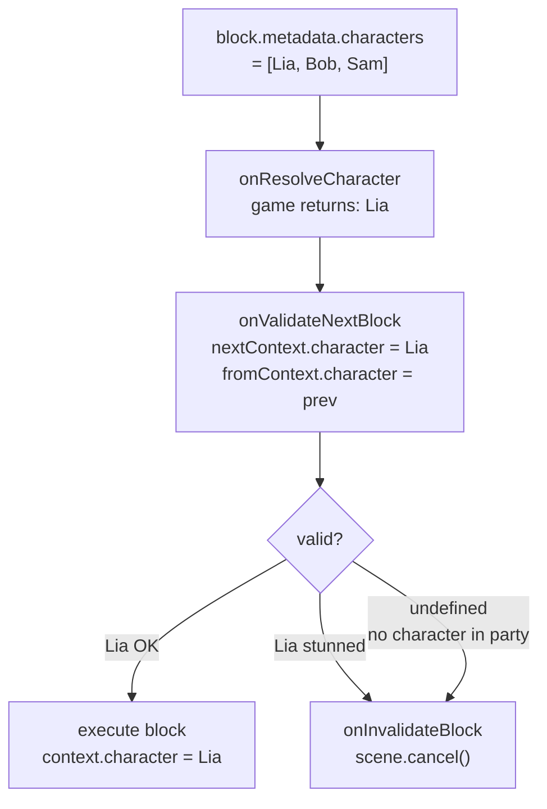

# ライフサイクルと検証

## 完全なライフサイクル

### 各 Block の実行順序

1. `onValidateNextBlock` — 実行前の検証
2. **前の block のクリーンアップ** — *前の* block の handler が返したクリーンアップ関数
3. `onBeforeBlock` — 前処理（続行するには `resolve()` を呼び出す必要あり）
4. タイプ handler（Tier 2、次に Tier 1）

### Scene イベント

<!--@include: ../../_shared/lifecycle-scene-events.md-->

## onValidateNextBlock

各 block 遷移をインターセプトして検証します。handler は次の block (`nextContext`) と前の block (`fromContext`) の**解決されたキャラクター**を受け取ります：

<!--@include: ../../_shared/lifecycle-validate.md-->

### Character Gating

`nextContext.character` を使用して、ゲームの状態に基づいて block の実行を制御します：

<!--@include: ../../_shared/lifecycle-validate-stunned.md-->

`fromContext.character` を使用してキャラクター間の遷移を検証できます（例：関係チェック、クールダウン）。`fromContext` はシーンの最初の block では `null` です。

## onBeforeBlock

各 block の前に呼び出されます。続行するには**必ず `resolve()` を呼び出す**必要があります：

<!--@include: ../../_shared/lifecycle-before-block.md-->

## クリーンアップ関数

handler はクリーンアップ関数を返すことができ、block から離れる際に呼び出されます：

<!--@include: ../../_shared/lifecycle-cleanup.md-->

## エラー境界

すべての handler 呼び出しは try/catch でラップされています。handler がスローした場合：

- エラーは engine のステートを破壊しません
- メイントラックの場合：scene はクリーンに終了します
- async トラックの場合：影響を受けたトラックのみが終了し、他のトラックとメインフローは継続します

これはクロス言語互換です（TS、C#、C++、GDScript の try/catch）。

## cancel()

`scene.cancel()` を呼び出すと、以下のシーケンスがトリガーされます：

1. すべての **async トラック** がキャンセルされます
2. 現在の block の**クリーンアップ関数**が実行されます
3. `onSceneExit` handler が呼び出されます
4. scene が完了としてマークされます

<!--@include: ../../_shared/lifecycle-invalidate.md-->

## NativeProperties

Execution properties that control how a block is dispatched by the engine:

| Field | Type | Description |
|-------|------|-------------|
| `isAsync` | `boolean?` | Execute on a parallel async track |
| `delay` | `number?` | Delay before execution (consumed by `onBeforeBlock`) |
| `timeout` | `number?` | Execution timeout |
| `portPerCharacter` | `boolean?` | One output port per character in metadata |
| `skipIfMissingActor` | `boolean?` | Skip block if referenced actor is absent |
| `debug` | `boolean?` | Debug flag for editor use |
| `waitForBlocks` | `string[]?` | Block UUIDs that must be visited before this block can progress |
| `waitInput` | `boolean?` | Passive flag for explicit player input control |

## Visual Reference

### Block Execution Flow

### Character Gating Flow

