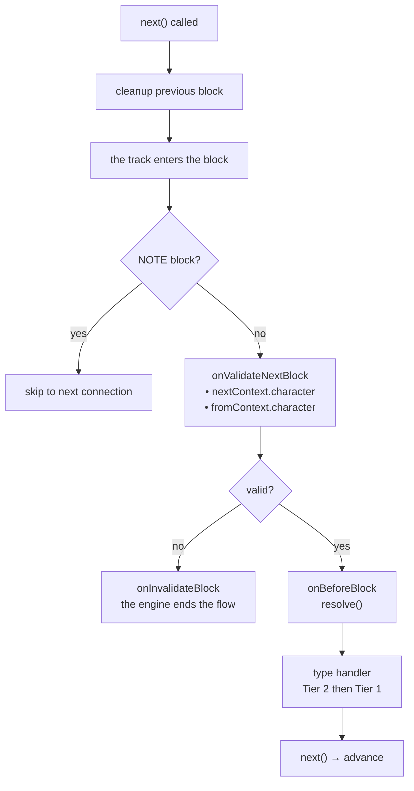
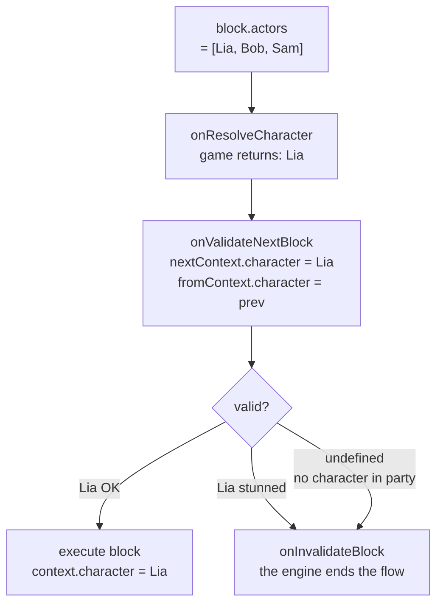

# ライフサイクルと検証

## 各 Block の実行順序

1. **前の block のクリーンアップ** — *前の* block の handler が返したクリーンアップ関数が遷移時に実行されます（`next()` が呼ばれた時点）
2. `onValidateNextBlock` — 実行前の検証
3. `onBeforeBlock` — 前処理（続行するには `resolve()` を呼び出す必要あり）
4. タイプ handler（Tier 2、次に Tier 1）

## Scene イベント

<!--@include: ../../_shared/lifecycle-scene-events.md-->

## onValidateNextBlock

各 block 遷移をインターセプトして検証します。handler は次の block (`nextContext`) と前の block (`fromContext`) の**解決されたキャラクター**を受け取ります：

<!--@include: ../../_shared/lifecycle-validate.md-->

### Character Gating

`nextContext.character` を使用して、ゲームの状態に基づいて block の実行を制御します：

<!--@include: ../../_shared/lifecycle-validate-stunned.md-->

`fromContext.character` を使用してキャラクター間の遷移を検証できます（例：関係チェック、クールダウン）。`fromContext` はシーンの最初の block では `null` です。

## onBeforeBlock

各 block の前に呼び出されます。続行するには**必ず `resolve()` を呼び出す**必要があります：

<!--@include: ../../_shared/lifecycle-before-block.md-->

## クリーンアップ関数

handler はクリーンアップ関数を返すことができ、block から離れる際に呼び出されます：

<!--@include: ../../_shared/lifecycle-cleanup.md-->

## エラー境界

**何も飲み込まれません。** handler がスローすると、engine はまず scene を閉じ、その後 `start()` または
`next()` を呼び出した側へエラーを**再スロー**します。

使いものになるのはこの順序のおかげです。エラーがあなたのコードに届く時点で：

- クリーンアップ関数は実行済み
- async トラックは取り消し済み
- `onSceneExit` は発火済み

対話は**正しく**停止しており、次に何をするかはあなたが決めます — それなしで続行する、画面を出す、
あるいはクラッシュさせる。`start()` や `next()` の周りにご自身の `try/catch` を置いてください。

**クリーンアップ関数**がスローした例外も、同じ経路で届きます。

::: tip なぜ変わったのか
v1 は handler の例外を静かに飲み込んでいました — ログにも残さず — 一方で、その同じ handler が返した
クリーンアップからの例外は呼び出し側に届いていました。ひとつの障害に対して二つの正反対の挙動であり、
静かな方はプロジェクトが動き続ける限り本物のバグを隠していました。

言語に `try/catch` を持たない GDScript は、すでに正しい振る舞いをしていました。誰も気づいて
いませんでした。
:::

## cancel()

`scene.cancel()` を呼び出すと、以下のシーケンスが実行されます：

1. すべての **async トラック** がキャンセルされます
2. 現在の block の**クリーンアップ関数**が実行されます
3. `onSceneExit` handler が呼び出されます
4. scene が完了としてマークされます

<!--@include: ../../_shared/lifecycle-invalidate.md-->

## NativeProperties

engine が block をディスパッチする方法を制御する実行プロパティ：

| フィールド | 型 | 説明 |
|-------|------|-------------|
| `isAsync` | `boolean?` | 並列 async トラックで実行 |
| `delay` | `number?` | block が再生されるまでの**ミリ秒**。`onBeforeBlock` が適用し、engine は決して適用しません |
| `timeout` | `number?` | **ミリ秒**。そのまま渡されます — engine は何も強制しません |
| `portPerCharacter` | `boolean?` | metadata 内のキャラクターごとに出力ポートを作成 |
| `skipIfMissingActor` | `boolean?` | 参照されたアクターが不在の場合、block をスキップ |
| `debug` | `boolean?` | エディタ用デバッグフラグ |
| `waitForBlocks` | `string[]?` | **この scene の** block id。それらがすべて訪問されるまで、block は**ディスパッチされる前に**保持されます |
| `waitInput` | `boolean?` | 明示的なプレイヤー入力制御用のパッシブフラグ |

## Visual Reference

### Block Execution Flow

### Character Gating Flow

