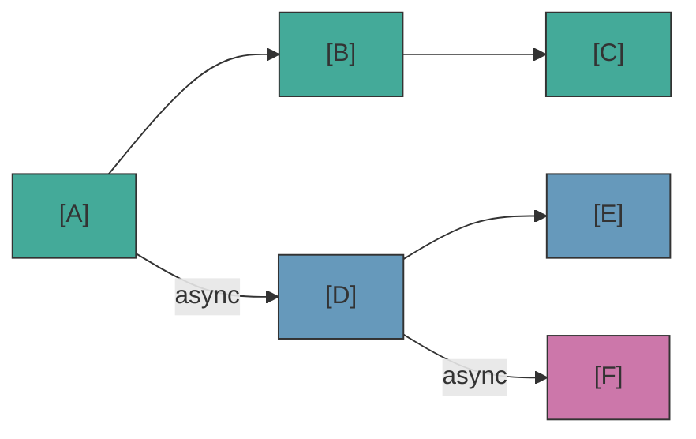

# 异步轨道

当 block 设置了 `nativeProperties.isAsync = true` 时，engine 会创建一个独立于主流程运行的**并行轨道**。

## 轨道的创建方式

在端口解析过程中，如果存在多个输出连接：
- **第一个非 async 连接**成为当前流程的延续
- **其他连接**（指向具有 `isAsync` 的 block）成为新的并行轨道

这适用于主轨道**和** async 轨道 — async 轨道可以从自己的 async 连接中创建子轨道，形成并行执行的层次结构。

## 轨道生命周期

- `onBeforeBlock` 会为**所有 block** 调用（主轨道和 async 轨道）
- async 轨道像主轨道一样将输出连接分为 main 和 async
- 轨道在 scene 结束或调用 `cancel()` 时自动取消
- 当轨道自然结束时（没有更多连接），其子轨道**继续独立存在**
- 当轨道被显式取消时（`cancel()`），取消会**级联**到所有子轨道

## waitForBlocks — 轨道同步

使用 `nativeProperties.waitForBlocks` 来同步并行轨道。它接受一个 block UUID 数组，这些 block 必须在当前 block 可以继续之前被访问：

- **在起始 block 上**：整个轨道在开始执行之前等待。在所有必需的 block 被访问之前，不会调用 `onBeforeBlock`。
- **在其他 block 上**：当 handler 调用 `next()` 时，推进会被延迟直到条件满足。

使用 `delay` 和 `waitForBlocks` 的完整执行序列：

```
spawn → waitForBlocks 门控 → onBeforeBlock (delay) → handler → next()
```

## waitInput — 玩家输入标志

`nativeProperties.waitInput` 是一个**被动标志** — engine 公开它但不解释它。您的游戏 handler 读取它来决定是否等待明确的玩家输入。

## TrackInfo API — 可观测性

使用 `scene.getTrackInfos()` 来检查运行中的 async 轨道。返回每个轨道状态的只读快照：

```ts
const tracks = scene.getTrackInfos();
for (const track of tracks) {
  console.log(`Track ${track.id} (parent: ${track.parentTrackId}) at block ${track.currentBlockUuid}`);
}
```

每个 `TrackInfo` 包含：`id`、`parentTrackId`、`startBlockUuid`、`currentBlockUuid`、`running`。用于调试覆盖层、播放模式渲染器或验证。

## async 轨道中的适用与不适用

async 轨道非常适合与主对话*并行*发生的事物 — 环境效果、并行动画、同伴反应。但有一些限制。

**推荐 — 并行内容：**
| 用例 | 适用原因 |
|---|---|
| NPC 环境对话（"barks"） | async 轨道上的 dialog block — NPC 在主对话进行时评论、反应或闲聊 |
| 与事件同步的角色反应 | 使用 `waitForBlocks` 在到达特定 block 时触发反应 |
| 播放环境音效或音乐 | action block，无需玩家交互 |
| 触发摄像机移动 | action block，并行运行 |
| 精确计时的效果 | 结合 `waitForBlocks` + `delay` 实现精确计时 |

**不推荐 — 玩家交互或游戏逻辑分支：**
| 用例 | 问题原因 |
|---|---|
| async 轨道中的 CHOICE block | 玩家已经在与主轨道交互 — 谁来响应 async 的 choice？ |
| 关键游戏状态变更 | 如果 async 轨道被取消（scene 结束），action 永远不会执行 |

::: warning async 轨道中的 choice
async 轨道中的 CHOICE block 意味着玩家应该在已经参与主对话的同时进行选择。唯一有效的场景是 AI 驱动的"choice"（例如：同伴 NPC 基于个性自动选择）。如果 async 轨道在没有自动选择的 scene 级 handler 的情况下到达 CHOICE block，流程将停滞或静默结束。
:::

## 多个 Scene 并行运行

engine 支持同时运行多个 scene。每个 `SceneHandle` 拥有自己的状态、已访问的 block 和异步轨道。全局 handler（第 1 层）是共享的 — 使用 `scene` 参数来判断是哪个 scene 在调用：

<!--@include: ../../_shared/async-dialog-track.md-->

::: tip 按 scene 路由
如果有多个并发 scene，建议在每个 handle 上注册 scene 级（第 2 层）handler，而不是在全局 handler 中进行路由。更清晰的分离，没有 `if/else` 链。
:::

## Visual Reference



- Main track: A &rarr; B &rarr; C
- Track 1 (parallel): D &rarr; E
- Track 2 (sub-track of D): F
- Scene cancel &rarr; all tracks cancelled
- Track D ends naturally &rarr; F continues
