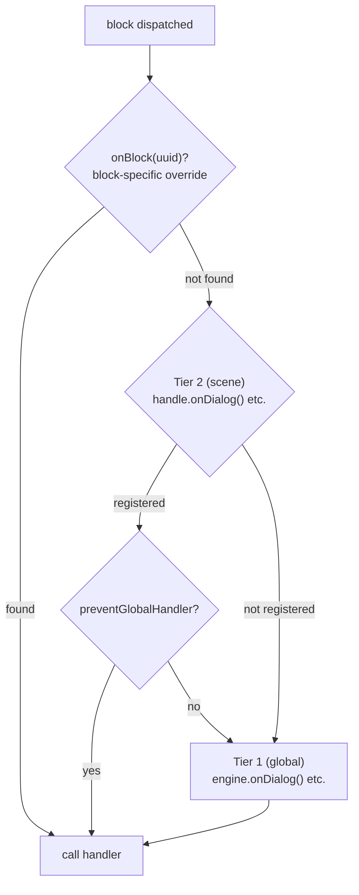

# 处理器

## 必需的 Handler

engine 是一个图遍历机器 — 它遍历节点并将其分发给已注册的 handler。4 个内容 handler 是必需的，因为没有它们 engine 就没有输出：

- `onDialog` — 响应对话文本
- `onChoice` — 向玩家呈现选项
- `onCondition` — 评估 condition 以分支流程
- `onAction` — 执行游戏副作用

调用 `handle.start()` 时，engine 会验证所有 4 个 handler 是否已注册（在 engine 级别或 scene 级别）。如果有缺失，会抛出一个描述性错误，列出缺失的 handler。

<!--@include: ../../_shared/handler-basic.md-->

## 双层 Handler 系统

engine 使用两级 handler 系统：

1. **第 1 层 — 全局（engine 级别）**：通过 `onDialog()`、`onChoice()` 等注册在 `DialogueEngine` 上。
2. **第 2 层 — Scene 级别**：通过 `handle.onDialog()` 等注册在 `SceneHandle` 上。

当一个 block 被分发时：
1. 如果存在 scene handler（第 2 层），则首先调用它。
2. 然后调用全局 handler（第 1 层），**除非** scene handler 调用了 `context.preventGlobalHandler()`。

<!--@include: ../../_shared/handler-tier1.md-->

::: info Handler 优先级
当一个 block 被分发时，engine 按以下优先级解析 handler：
1. `handle.onBlock(uuid)` — 按 UUID 指定的 block 级别覆盖
2. `handle.onDialog()` / `handle.onChoice()` / ... — scene 的类型覆盖
3. `engine.onDialog()` / `engine.onChoice()` / ... — 全局 handler

如果存在 scene handler（第 2 层），全局 handler（第 1 层）也会在**之后**被调用，除非调用了 `context.preventGlobalHandler()`。
:::

## 角色解析

engine 会为每个具有 `metadata.characters` 的 block 解析角色。默认返回列表中的第一个角色。

<!--@include: ../../_shared/handler-character.md-->

解析后的角色可通过所有 block handler 中的 `context.character` 获取，也可在 [`onValidateNextBlock`](lifecycle#onvalidatenextblock) 中通过 `nextContext.character` / `fromContext.character` 获取。

## 选择历史

engine 跟踪玩家在 scene 中做出的每个选择。此历史记录在内部用于 `choice:` condition 评估，同时也可供外部代码使用：

<!--@include: ../../_shared/handler-on-exit.md-->

## Block 覆盖

`SceneHandle` 还可以按 UUID 覆盖特定的 block：

<!--@include: ../../_shared/handler-block-override.md-->

## Visual Reference

### Two-Tier Handler Dispatch

