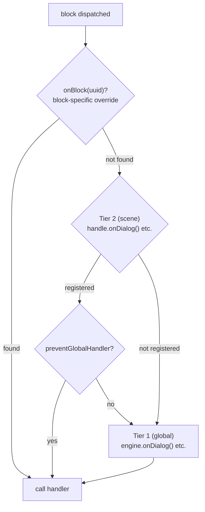

# 处理器

## Handler

handler 是 engine 与游戏之间的桥梁。它们像观察者一样工作 — 你注册一个函数，当对应事件发生时 engine 会调用它。显示文本、播放动画、评估状态等 — 都是通过 handler 在游戏引擎中触发相应行为。

engine 公开以下 handler：

| Handler | 级别 | 描述 |
|---------|------|------|
| [`onDialog`](/api-ref/classes/DialogueEngine#ondialog) | global / scene | dialog block — 显示文本 |
| [`onChoice`](/api-ref/classes/DialogueEngine#onchoice) | global / scene | choice block — 呈现选项 |
| [`onCondition`](/api-ref/classes/DialogueEngine#oncondition) | global / scene | condition block — 评估和分支 |
| [`onAction`](/api-ref/classes/DialogueEngine#onaction) | global / scene | action block — 触发副作用 |
| [`onResolveCharacter`](/api-ref/classes/DialogueEngine#onresolvecharacter) | global / scene | 解析哪个角色在说话 |
| [`onBeforeBlock`](/api-ref/classes/DialogueEngine#onbeforeblock) | global | 每个 block 之前（delay、入场动画…） |
| [`onValidateNextBlock`](/api-ref/classes/DialogueEngine#onvalidatenextblock) | global | 进入 block 前的验证 |
| [`onInvalidateBlock`](/api-ref/classes/DialogueEngine#oninvalidateblock) | global | 验证失败时的处理 |
| [`onSceneEnter`](/api-ref/classes/DialogueEngine#onsceneenter) | global / scene | scene 开始 |
| [`onSceneExit`](/api-ref/classes/DialogueEngine#onsceneexit) | global / scene | scene 结束 |
| [`onBlock`](/api-ref/interfaces/SceneHandle#onblock) | scene | 按 UUID 覆盖特定 block |
| [`setChoiceFilter`](/api-ref/classes/DialogueEngine#setchoicefilter) | global | choice 可见性评估器 |

前 4 个（`onDialog`、`onChoice`、`onCondition`、`onAction`）是**必需的** — `start()` 调用时 engine 验证它们是否存在，缺失时抛出描述性错误。

<!--@include: ../../_shared/handler-basic.md-->

## Two-Tier Handler System

engine 在两个层级上解析 handler：

- **Global handler** — 注册在 engine 上，定义每个 scene 的默认行为。大多数情况下这就够了。
- **Scene handler** — 注册在特定的 [`SceneHandle`](/api-ref/interfaces/SceneHandle) 上，当 scene 需要不同的渲染或控制流程时，可以覆盖或扩展默认行为。这种情况很少见，但可用。

当一个 block 被分发时，engine 按以下顺序解析 handler：
1. `handle.onBlock(uuid)` — block 级别的覆盖
2. `handle.onDialog()` / `handle.onChoice()` / ... — scene 级别的类型 handler
3. `engine.onDialog()` / `engine.onChoice()` / ... — global handler

当两个层级都存在时，两者按顺序执行 — 先 scene，再 global — 除非 scene handler 调用了 `context.preventGlobalHandler()` 来抑制 global 的执行。

<!--@include: ../../_shared/handler-tier1.md-->

## Character Resolution

角色解析是可选的。通过注册 `onResolveCharacter` callback，engine 会在每个 `metadata.characters` 中包含角色的 block 之前调用它。callback 接收分配给 block 的角色列表，返回应该激活的角色 — 如果没有可用角色则返回 `undefined`。解析后的角色可通过所有 handler 中的 `context.character` 访问。

这是查询游戏状态的理想集成点：检查角色是否在场景中、是否存活、是否在镜头范围内等。返回 `undefined` 可以触发多种策略：通过 [`skipIfMissingActor`](/api-ref/interfaces/NativeProperties#skipifmissingactor) 跳过 block、通过 `handle.cancel()` 取消 scene、或直接在 handler 中处理。

<!--@include: ../../_shared/handler-character.md-->

## 选择历史

engine 跟踪玩家在 scene 中做出的每个选择。此历史记录在内部用于 `choice:` condition 评估，同时也可供外部代码使用：

<!--@include: ../../_shared/handler-on-exit.md-->

## Block 覆盖

`SceneHandle` 还可以按 UUID 覆盖特定的 block：

<!--@include: ../../_shared/handler-block-override.md-->

## Visual Reference

### Two-Tier Handler Dispatch

