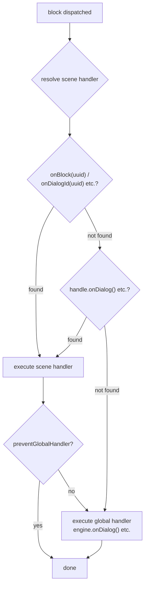

# 处理器

## Handler

handler 是 engine 与游戏之间的桥梁。它们像观察者一样工作 — 你注册一个函数，当对应事件发生时 engine 会调用它。显示文本、播放动画、评估状态等 — 都是通过 handler 在游戏引擎中触发相应行为。

engine 公开以下 handler：

| Handler | 级别 | 描述 |
|---------|------|------|
| [`onDialog`](/api-ref/classes/DialogueEngine#ondialog) | global / scene | dialog block — 显示文本 |
| [`onChoice`](/api-ref/classes/DialogueEngine#onchoice) | global / scene | choice block — 呈现选项 |
| [`onCondition`](/api-ref/classes/DialogueEngine#oncondition) | global / scene | condition block — 评估和分支 |
| [`onAction`](/api-ref/classes/DialogueEngine#onaction) | global / scene | action block — 触发副作用 |
| [`onResolveCharacter`](/api-ref/classes/DialogueEngine#onresolvecharacter) | global / scene | 解析哪个角色在说话 |
| [`onBeforeBlock`](/api-ref/classes/DialogueEngine#onbeforeblock) | global | 每个 block 之前（delay、入场动画…） |
| [`onValidateNextBlock`](/api-ref/classes/DialogueEngine#onvalidatenextblock) | global | 进入 block 前的验证 |
| [`onInvalidateBlock`](/api-ref/classes/DialogueEngine#oninvalidateblock) | global | 验证失败时的处理 |
| [`onSceneEnter`](/api-ref/classes/DialogueEngine#onsceneenter) | global / scene | scene 开始 |
| [`onSceneExit`](/api-ref/classes/DialogueEngine#onsceneexit) | global / scene | scene 结束 |
| [`onBlock`](/api-ref/interfaces/SceneHandle#onblock) | scene | 按 UUID 覆盖特定 block |
| [`onDialogId`](/api-ref/interfaces/SceneHandle#ondialogid) | scene | 按 UUID 覆盖特定 DIALOG block（类型安全） |
| [`onChoiceId`](/api-ref/interfaces/SceneHandle#onchoiceid) | scene | 按 UUID 覆盖特定 CHOICE block（类型安全） |
| [`onConditionId`](/api-ref/interfaces/SceneHandle#onconditionid) | scene | 按 UUID 覆盖特定 CONDITION block（类型安全） |
| [`onActionId`](/api-ref/interfaces/SceneHandle#onactionid) | scene | 按 UUID 覆盖特定 ACTION block（类型安全） |
| [`onResolveCondition`](/api-ref/classes/DialogueEngine#onresolvecondition) | global | 统一 condition 解析器（choice 可见性 + condition 预评估） |
| ~~[`setChoiceFilter`](/api-ref/classes/DialogueEngine#setchoicefilter)~~ | global | _已弃用 — 请使用 `onResolveCondition` 代替_ |

`onDialog`、`onChoice` 和 `onAction` 是**必需的** — `start()` 调用时 engine 验证它们是否存在，缺失时抛出描述性错误。当安装了 `onResolveCondition` 时，`onCondition` 是**可选的** — engine 从预评估的 condition 组中自动路由。

<!--@include: ../../_shared/handler-basic.md-->

## Two-Tier Handler System

engine 在两个层级上解析 handler：

- **Global handler** — 注册在 engine 上，定义每个 scene 的默认行为。大多数情况下这就够了。
- **Scene handler** — 注册在特定的 [`SceneHandle`](/api-ref/interfaces/SceneHandle) 上，当 scene 需要不同的渲染或控制流程时，可以覆盖或扩展默认行为。这种情况很少见，但可用。

当一个 block 被分发时，engine 按以下顺序解析 handler：
1. `handle.onBlock(uuid)` 或 `handle.onDialogId(uuid)` / `handle.onActionId(uuid)` / ... — block 级别的覆盖
2. `handle.onDialog()` / `handle.onChoice()` / ... — scene 级别的类型 handler
3. `engine.onDialog()` / `engine.onChoice()` / ... — global handler

当两个层级都存在时，两者按顺序执行 — 先 scene，再 global — 除非 scene handler 调用了 `context.preventGlobalHandler()` 来抑制 global 的执行。

<!--@include: ../../_shared/handler-tier1.md-->

## Character Resolution

角色解析是可选的。通过注册 `onResolveCharacter` callback，engine 会在每个 `metadata.characters` 中包含角色的 block 之前调用它。callback 接收分配给 block 的角色列表，返回应该激活的角色 — 如果没有可用角色则返回 `undefined`。解析后的角色可通过所有 handler 中的 `context.character` 访问。

这是查询游戏状态的理想集成点：检查角色是否在场景中、是否存活、是否在镜头范围内等。返回 `undefined` 可以触发多种策略：通过 [`skipIfMissingActor`](/api-ref/interfaces/NativeProperties#skipifmissingactor) 跳过 block、通过 `handle.cancel()` 取消 scene、或直接在 handler 中处理。

<!--@include: ../../_shared/handler-character.md-->

## Scene Lifecycle

`onSceneEnter` 和 `onSceneExit` callback 可以在 scene 开始和结束时做出反应 — 启用电影模式、冻结 NPC、准备 UI、清理资源等。它们在 global 级别（engine 上）和 scene 级别（通过 `handle.onEnter()` / `handle.onExit()`）都可用。如果定义了 scene handler，它会替代 global handler。

<!--@include: ../../_shared/handler-lifecycle.md-->

## Block Override

`onBlock(uuid)` 可以通过标识符定位特定 block 并为其分配专用 handler。这是一个罕见的用例 — 通用 handler 覆盖了绝大多数需求 — 但对于个别 block 需要不同行为的非常特殊的场景，它是可用的。

<!--@include: ../../_shared/handler-block-override.md-->

## Type-Safe Block Override

`onDialogId(uuid)`、`onChoiceId(uuid)`、`onConditionId(uuid)` 和 `onActionId(uuid)` 是 `onBlock(uuid)` 的类型安全替代方法。工作方式完全相同 — 相同的优先级、相同的 `preventGlobalHandler` 支持 — 但 handler 接收特殊化的 block 类型和 context，而不是通用联合类型。

当你在注册时已知 block 类型，并需要 `block` 和 `context` 的完整自动补全时使用这些方法。

<!--@include: ../../_shared/handler-block-override-typed.md-->

## Visual Reference

### Two-Tier Handler Dispatch

