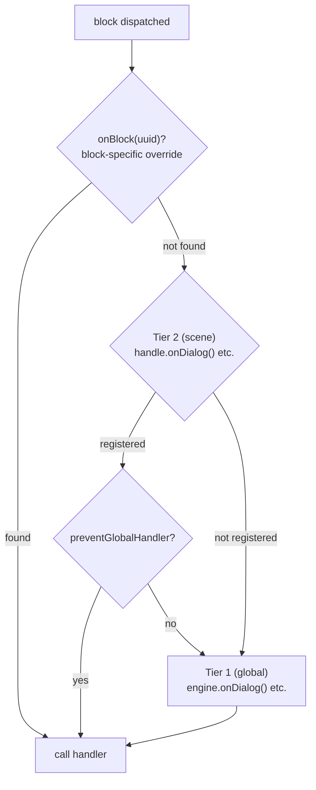

# 处理器

## 必需的 Handler

engine 是一个图遍历机器 — 它遍历节点并将其分发给已注册的 handler。4 个内容 handler 是必需的，因为没有它们 engine 就没有输出：

- `onDialog` — 响应对话文本
- `onChoice` — 向玩家呈现选项
- `onCondition` — 评估 condition 以分支流程
- `onAction` — 执行游戏副作用

调用 `handle.start()` 时，engine 会验证所有 4 个 handler 是否已注册（在 engine 级别或 scene 级别）。如果有缺失，会抛出一个描述性错误，列出缺失的 handler。

::: code-group
```ts [TypeScript]
engine.onDialog(handler);
engine.onChoice(handler);
engine.onCondition(handler);
engine.onAction(handler);

const handle = engine.scene(sceneId);
handle.start(); // ✓ All 4 registered — scene starts
```
```csharp [C#]
engine.OnDialog(handler);
engine.OnChoice(handler);
engine.OnCondition(handler);
engine.OnAction(handler);

var handle = engine.Scene(sceneId);
handle.Start(); // ✓ All 4 registered — scene starts
```
```cpp [C++]
engine.onDialog(handler);
engine.onChoice(handler);
engine.onCondition(handler);
engine.onAction(handler);

auto handle = engine.scene(sceneId);
handle->start(); // ✓ All 4 registered — scene starts
```
```gdscript [GDScript]
engine.on_dialog(handler)
engine.on_choice(handler)
engine.on_condition(handler)
engine.on_action(handler)

var handle = engine.scene(scene_id)
handle.start() # ✓ All 4 registered — scene starts
```
:::

## 双层 Handler 系统

engine 使用两级 handler 系统：

1. **第 1 层 — 全局（engine 级别）**：通过 `onDialog()`、`onChoice()` 等注册在 `DialogueEngine` 上。
2. **第 2 层 — Scene 级别**：通过 `handle.onDialog()` 等注册在 `SceneHandle` 上。

当一个 block 被分发时：
1. 如果存在 scene handler（第 2 层），则首先调用它。
2. 然后调用全局 handler（第 1 层），**除非** scene handler 调用了 `context.preventGlobalHandler()`。

::: code-group
```ts [TypeScript]
// Tier 1 — global
engine.onDialog(({ block, context, next }) => {
  console.log('Global dialog handler');
  next();
});

// Tier 2 — scene-specific
const handle = engine.scene(sceneId);
handle.onDialog(({ block, context, next }) => {
  console.log('Scene-specific dialog handler');
  context.preventGlobalHandler();
  next();
});
handle.start();
```
```csharp [C#]
// Tier 1 — global
engine.OnDialog(args => {
    Console.WriteLine("Global dialog handler");
    args.Next();
    return null;
});

// Tier 2 — scene-specific
var handle = engine.Scene(sceneId);
handle.OnDialog(args => {
    Console.WriteLine("Scene-specific dialog handler");
    args.Context.PreventGlobalHandler();
    args.Next();
    return null;
});
handle.Start();
```
```cpp [C++]
// Tier 1 — global
engine.onDialog([](auto*, auto* block, auto* ctx, auto next) -> CleanupFn {
    std::cout << "Global dialog handler\n";
    next();
    return {};
});

// Tier 2 — scene-specific
auto handle = engine.scene(sceneId);
handle->onDialog([](auto*, auto* block, auto* ctx, auto next) -> CleanupFn {
    std::cout << "Scene-specific dialog handler\n";
    ctx->preventGlobalHandler();
    next();
    return {};
});
handle->start();
```
```gdscript [GDScript]
# Tier 1 — global
engine.on_dialog(func(args):
    print("Global dialog handler")
    args["next"].call()
    return Callable()
)

# Tier 2 — scene-specific
var handle = engine.scene(scene_id)
handle.on_dialog(func(args):
    print("Scene-specific dialog handler")
    args["context"].prevent_global_handler()
    args["next"].call()
    return Callable()
)
handle.start()
```
:::

::: info Handler 优先级
当一个 block 被分发时，engine 按以下优先级解析 handler：
1. `handle.onBlock(uuid)` — 按 UUID 指定的 block 级别覆盖
2. `handle.onDialog()` / `handle.onChoice()` / ... — scene 的类型覆盖
3. `engine.onDialog()` / `engine.onChoice()` / ... — 全局 handler

如果存在 scene handler（第 2 层），全局 handler（第 1 层）也会在**之后**被调用，除非调用了 `context.preventGlobalHandler()`。
:::

## 角色解析

engine 会为每个具有 `metadata.characters` 的 block 解析角色。默认返回列表中的第一个角色。

::: code-group
```ts [TypeScript]
// Engine-level — applies to all scenes
engine.onResolveCharacter((characters) => {
  return party.getActiveLeader(characters);
});

// Scene-level override
const handle = engine.scene(sceneId);
handle.onResolveCharacter((characters) => {
  return battle.getActiveUnit(characters);
});
```
```csharp [C#]
engine.OnResolveCharacter(chars => party.GetActiveLeader(chars));

var handle = engine.Scene(sceneId);
handle.OnResolveCharacter(chars => battle.GetActiveUnit(chars));
```
```cpp [C++]
engine.onResolveCharacter([](const auto& chars) {
    return party.getActiveLeader(chars);
});

auto handle = engine.scene(sceneId);
handle->onResolveCharacter([](const auto& chars) {
    return battle.getActiveUnit(chars);
});
```
```gdscript [GDScript]
engine.on_resolve_character(func(chars):
    return party.get_active_leader(chars)
)

var handle = engine.scene(scene_id)
handle.on_resolve_character(func(chars):
    return battle.get_active_unit(chars)
)
```
:::

解析后的角色可通过所有 block handler 中的 `context.character` 获取，也可在 [`onValidateNextBlock`](lifecycle#onvalidatenextblock) 中通过 `nextContext.character` / `fromContext.character` 获取。

## 选择历史

engine 跟踪玩家在 scene 中做出的每个选择。此历史记录在内部用于 `choice:` condition 评估，同时也可供外部代码使用：

::: code-group
```ts [TypeScript]
handle.onExit(({ scene }) => {
  const history = scene.getChoiceHistory();       // Map of blockUuid → [choiceUuid, ...]
  const picks = scene.getChoice('block-uuid-123'); // string[] | undefined
});
```
```csharp [C#]
handle.OnExit(args => {
    var history = args.Scene.GetChoiceHistory();
    var picks = args.Scene.GetChoice("block-uuid-123"); // List<string>?
});
```
```cpp [C++]
handle->onExit([](auto* scene, auto*) {
    auto history = scene->getChoiceHistory();
    auto picks = scene->getChoice("block-uuid-123"); // std::vector<std::string>*
});
```
```gdscript [GDScript]
handle.on_exit(func(args):
    var history = args["scene"].get_choice_history()
    var picks = args["scene"].get_choice("block-uuid-123") # Array or null
)
```
:::

## Block 覆盖

`SceneHandle` 还可以按 UUID 覆盖特定的 block：

::: code-group
```ts [TypeScript]
const handle = engine.scene(sceneId);
handle.onBlock('block-uuid-123', ({ block, context, next }) => {
  next();
});
```
```csharp [C#]
var handle = engine.Scene(sceneId);
handle.OnBlock("block-uuid-123", args => {
    args.Next();
    return null;
});
```
```cpp [C++]
auto handle = engine.scene(sceneId);
handle->onBlock("block-uuid-123", [](auto*, auto*, auto*, auto next) -> CleanupFn {
    next();
    return {};
});
```
```gdscript [GDScript]
var handle = engine.scene(scene_id)
handle.on_block("block-uuid-123", func(args):
    args["next"].call()
    return Callable()
)
```
:::

## Visual Reference

### Two-Tier Handler Dispatch


