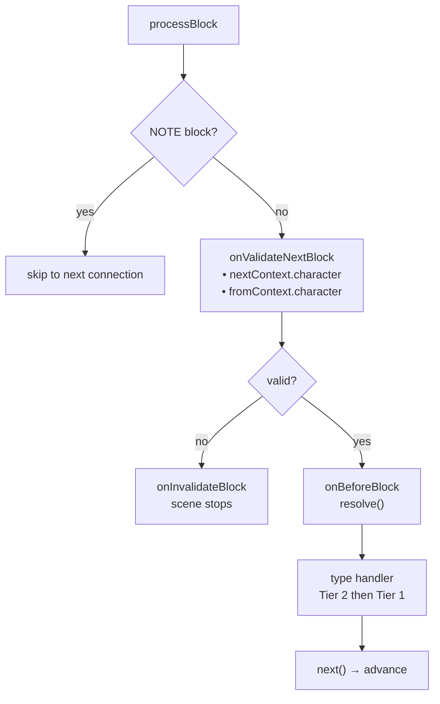
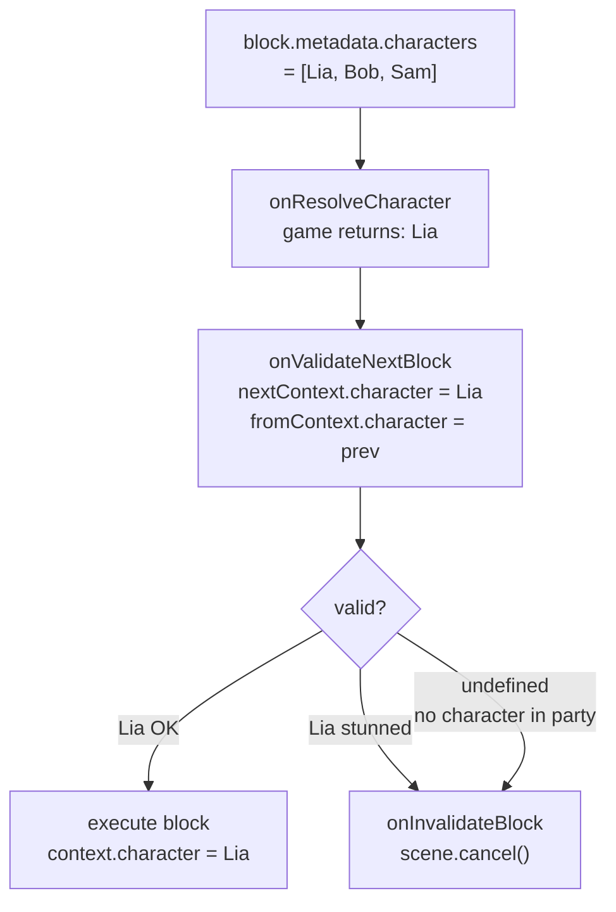

# 生命周期与验证

## 完整生命周期

### 每个 Block 的执行顺序

1. `onValidateNextBlock` — 执行前的验证
2. **上一个 block 的清理** — *上一个* block 的 handler 返回的清理函数
3. `onBeforeBlock` — 预处理（必须调用 `resolve()` 才能继续）
4. 类型 handler（先第 2 层，再第 1 层）

### Scene 事件

<!--@include: ../../_shared/lifecycle-scene-events.md-->

## onValidateNextBlock

拦截每次 block 转换进行验证。handler 接收下一个 block（`nextContext`）和上一个 block（`fromContext`）的**已解析角色**：

<!--@include: ../../_shared/lifecycle-validate.md-->

### Character Gating

使用 `nextContext.character` 根据游戏状态控制哪些 block 可以执行：

<!--@include: ../../_shared/lifecycle-validate-stunned.md-->

使用 `fromContext.character` 验证角色之间的转换（例如：关系检查、冷却时间）。`fromContext` 在场景的第一个 block 中为 `null`。

## onBeforeBlock

在每个 block 之前调用。**必须调用 `resolve()`** 才能继续：

<!--@include: ../../_shared/lifecycle-before-block.md-->

## 清理函数

handler 可以返回一个清理函数，在离开 block 时调用：

<!--@include: ../../_shared/lifecycle-cleanup.md-->

## 错误边界

每个 handler 调用都包裹在 try/catch 中。如果 handler 抛出异常：

- 错误不会破坏 engine 状态
- 对于主轨道：scene 会干净地结束
- 对于异步轨道：只有受影响的轨道被终止 — 其他轨道和主流程继续运行

这是跨语言兼容的（TS、C#、C++、GDScript 中的 try/catch）。

## cancel()

调用 `scene.cancel()` 会触发以下序列：

1. 所有**异步轨道**被取消
2. 当前 block 的**清理函数**被执行
3. `onSceneExit` handler 被调用
4. scene 被标记为已完成

<!--@include: ../../_shared/lifecycle-invalidate.md-->

## NativeProperties

Execution properties that control how a block is dispatched by the engine:

| Field | Type | Description |
|-------|------|-------------|
| `isAsync` | `boolean?` | Execute on a parallel async track |
| `delay` | `number?` | Delay before execution (consumed by `onBeforeBlock`) |
| `timeout` | `number?` | Execution timeout |
| `portPerCharacter` | `boolean?` | One output port per character in metadata |
| `skipIfMissingActor` | `boolean?` | Skip block if referenced actor is absent |
| `debug` | `boolean?` | Debug flag for editor use |
| `waitForBlocks` | `string[]?` | Block UUIDs that must be visited before this block can progress |
| `waitInput` | `boolean?` | Passive flag for explicit player input control |

## Visual Reference

### Block Execution Flow

### Character Gating Flow

