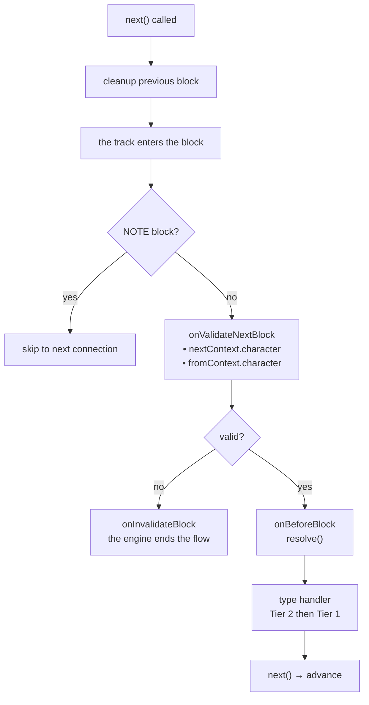
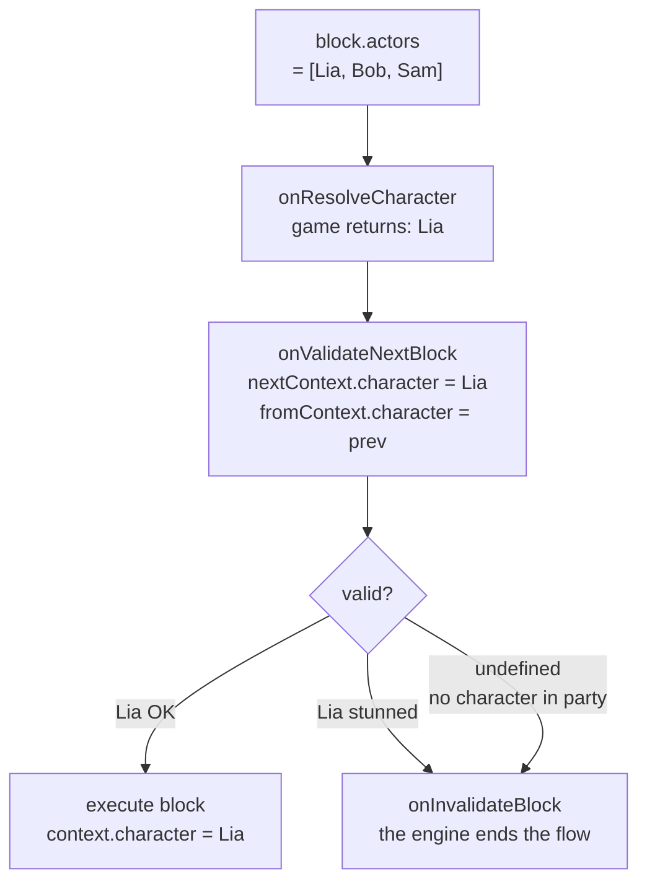

# 生命周期与验证

## 每个 Block 的执行顺序

1. **上一个 block 的清理** — *上一个* block 的 handler 返回的清理函数在转换时执行（`next()` 被调用时）
2. `onValidateNextBlock` — 执行前的验证
3. `onBeforeBlock` — 预处理（必须调用 `resolve()` 才能继续）
4. 类型 handler（先第 2 层，再第 1 层）

## Scene 事件

<!--@include: ../../_shared/lifecycle-scene-events.md-->

## onValidateNextBlock

拦截每次 block 转换进行验证。handler 接收下一个 block（`nextContext`）和上一个 block（`fromContext`）的**已解析角色**：

<!--@include: ../../_shared/lifecycle-validate.md-->

### Character Gating

使用 `nextContext.character` 根据游戏状态控制哪些 block 可以执行：

<!--@include: ../../_shared/lifecycle-validate-stunned.md-->

使用 `fromContext.character` 验证角色之间的转换（例如：关系检查、冷却时间）。`fromContext` 在场景的第一个 block 中为 `null`。

## onBeforeBlock

在每个 block 之前调用。**必须调用 `resolve()`** 才能继续：

<!--@include: ../../_shared/lifecycle-before-block.md-->

**在 `onBeforeBlock` 仍在执行时**调用的 `resolve()`，会在它返回时才生效 — 与在 handler 内调用 `next()`
完全一样。类型 handler 在你的回调结束之后才被分发，因此写在 `resolve()` 之后的代码会在 block **之前**运行。

## 清理函数

handler 可以返回一个清理函数，在离开 block 时调用：

<!--@include: ../../_shared/lifecycle-cleanup.md-->

## 错误边界

**没有任何异常被吞掉。** 当 engine 遍历图时，如果你的任何代码抛出异常 — 类型 handler、清理函数、
`onValidateNextBlock`、`onInvalidateBlock`、`onBeforeBlock`、`onResolveCondition`、`onResolveCharacter`
或 `onSceneEnter` — engine 会先关闭**整个 scene**，然后把错误**重新抛给**调用 `start()`、`next()` 或
`resolve()` 的一方。

这在**每一条轨道**上都成立。在 `isAsync` 分支上抛出异常的 handler 会关闭 scene，而不仅仅是它的分支。

正是这个顺序让它可用。当错误到达你的代码时：

- 清理函数已经执行
- async 轨道已经取消
- `onSceneExit` 已经以 `reason: 'faulted'` 触发

对话**干净地**停止了，接下来做什么由你决定 — 不带它继续、显示一个画面，或者让它崩溃。请在
`start()`、`next()` 或 `resolve()` 外面放上你自己的 `try/catch`。

由 `onSceneExit` 本身抛出的异常也以同样的方式到达你这里，而 scene 依然会被释放：`engine.isRunning()`
不再计入它。

::: warning GDScript
GDScript 没有异常。handler 中的脚本错误会输出到 Godot 日志，调用返回 `null`：block 只会一直等待一个
永远不会到来的 `next()`。没有任何东西会替你关闭 scene。
:::

::: tip 为什么改变
v1 会静默吞掉 handler 的异常 — 连日志都没有 — 而同一个 handler 返回的清理函数抛出的异常却会到达
调用方。同一种故障，两种相反的行为，而安静的那一种在项目运行的整个期间掩盖了真正的 bug。

2.0.0 只为类型 handler 修复了这一点。抛出异常的验证、`onBeforeBlock` 或解析器 — 或者并行轨道上的
handler — 仍会让 scene 保持打开，却没有任何东西能让它前进，等待对话结束的游戏会永远等下去。
:::

## Scene 结束的原因

`onSceneExit` 通过 `context.reason` 得知原因：

| `reason` | 何时 |
|---|---|
| `completed` | 流程走到了图的尽头 |
| `cancelled` | `scene.cancel()` 或 `engine.stop()` |
| `invalidated` | `onValidateNextBlock` 拒绝了最后一条运行中的轨道正要进入的 block |
| `faulted` | 遍历过程中你的代码抛出了异常 — 参见[错误边界](#错误边界) |
| `deadlocked` | 剩下的所有轨道都停在一个没有任何东西能完成的 `waitForBlocks` 上。`context.waitingFor` 列出这些 block |

`onSceneEnter` 不会收到原因。

**死锁会关闭 scene。** 一个等待永远不会有轨道完成的 block 的 block — 例如流程没有走的分支上的 block —
过去会让 scene 永久保持打开，也没有 `onSceneExit`。现在，只要最后一条能前进的轨道停下，scene 就会以
`deadlocked` 关闭，`waitingFor` 会告诉你哪一个汇合接错了。

## 单一线程

engine 不是线程安全的。请从**启动** scene 的线程调用 `next()`、`resolve()` 和 `cancel()` — 在 Unity 中是
主线程，在 Unreal 中是游戏线程。

在 C# 和 C++ 中，来自其他线程的调用会被一个指明两个线程的异常**拒绝**，并且不会改变任何东西：从正确的
线程调用时，同一个 `next()` 依然有效。在 Unity 中，调用 engine 之前请先切回主线程
（`await UniTask.SwitchToMainThread()`，或把调用排入主线程队列）。

## cancel()

调用 `scene.cancel()` 会触发以下序列：

1. 所有**异步轨道**被取消
2. 当前 block 的**清理函数**被执行
3. `onSceneExit` handler 以 `reason: 'cancelled'` 被调用
4. scene 被标记为已完成

当 scene 已经在关闭时，清理函数调用 `scene.cancel()` 或 `engine.stop()` 会被忽略：`onSceneExit` 只触发一次。

<!--@include: ../../_shared/lifecycle-invalidate.md-->

## NativeProperties

控制 engine 如何调度 block 的执行属性：

| 字段 | 类型 | 描述 |
|-------|------|-------------|
| `isAsync` | `boolean?` | 在并行异步轨道上执行 |
| `delay` | `number?` | block 播放前的**毫秒数**。由 `onBeforeBlock` 应用，engine 从不应用 |
| `timeout` | `number?` | 台词说完之后 block **留在屏幕上的毫秒数**，随后自己离开 — block 的自动推进。**优先于 `waitInput`**。原样传递，engine 不做任何强制 |
| `portPerCharacter` | `boolean?` | metadata 中每个角色一个输出端口 |
| `skipIfMissingActor` | `boolean?` | 如果引用的角色不存在则跳过 block |
| `debug` | `boolean?` | 编辑器调试标志 |
| `waitForBlocks` | `string[]?` | **本 scene 的** block id。在它们全部**完成**之前，block 会**在被分发之前**被扣住。如果没有任何东西能完成它们，scene 会以 `deadlocked` 关闭 |
| `waitInput` | `boolean?` | 用于显式玩家输入控制的被动标志 — **`timeout` 优先于它** |

## Visual Reference

### Block Execution Flow

### Character Gating Flow

