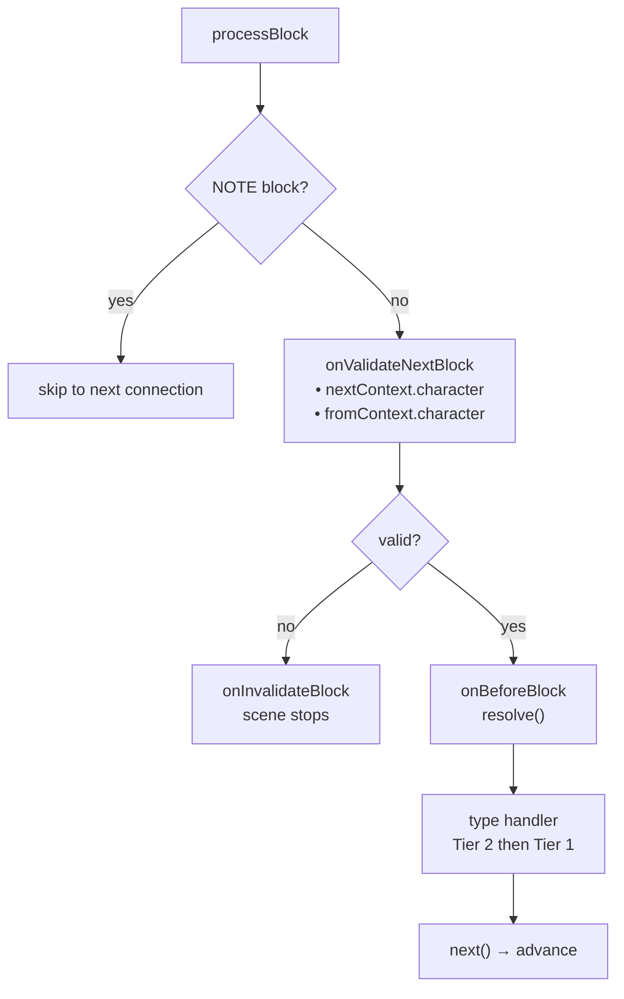
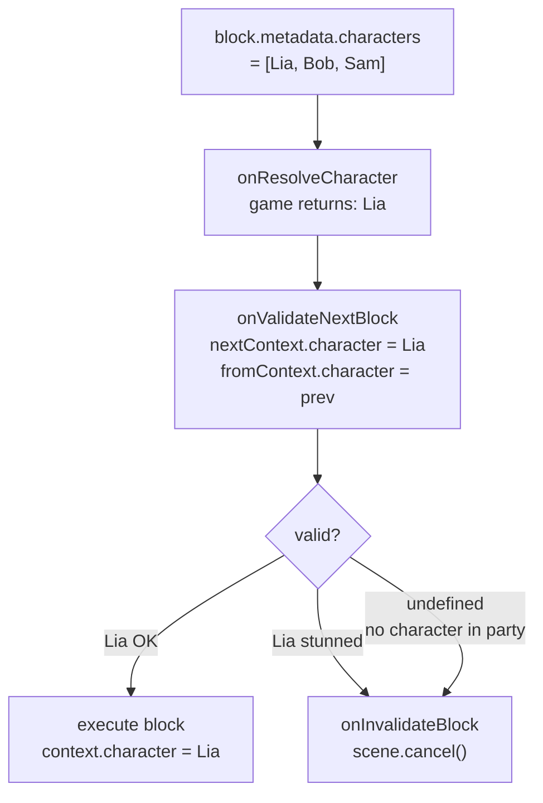

# 生命周期与验证

## 完整生命周期

### 每个 Block 的执行顺序

1. `onValidateNextBlock` — 执行前的验证
2. **上一个 block 的清理** — *上一个* block 的 handler 返回的清理函数
3. `onBeforeBlock` — 预处理（必须调用 `resolve()` 才能继续）
4. 类型 handler（先第 2 层，再第 1 层）

### Scene 事件

::: code-group
```ts [TypeScript]
engine.onSceneEnter(({ scene, context }) => {
  // Called when handle.start() is executed
});

engine.onSceneExit(({ scene, context }) => {
  // Called when the scene ends (naturally or via cancel)
});
```
```csharp [C#]
engine.OnSceneEnter(args => {
    // Called when handle.Start() is executed
});

engine.OnSceneExit(args => {
    // Called when the scene ends (naturally or via cancel)
});
```
```cpp [C++]
engine.onSceneEnter([](auto* scene, auto*) {
    // Called when handle->start() is executed
});

engine.onSceneExit([](auto* scene, auto*) {
    // Called when the scene ends (naturally or via cancel)
});
```
```gdscript [GDScript]
engine.on_scene_enter(func(args):
    pass # Called when handle.start() is executed
)

engine.on_scene_exit(func(args):
    pass # Called when the scene ends (naturally or via cancel)
)
```
:::

## onValidateNextBlock

拦截每次 block 转换进行验证。handler 接收下一个 block（`nextContext`）和上一个 block（`fromContext`）的**已解析角色**：

::: code-group
```ts [TypeScript]
engine.onValidateNextBlock(({ nextBlock, fromBlock, nextContext, fromContext }) => {
  return { valid: true };
});

engine.onInvalidateBlock(({ scene, reason }) => {
  console.error('Invalid block:', reason);
  scene.cancel();
});
```
```csharp [C#]
engine.OnValidateNextBlock(args => {
    // args.NextContext.Character, args.FromContext?.Character
    return new ValidationResult { Valid = true };
});

engine.OnInvalidateBlock(args => {
    Console.Error.WriteLine($"Invalid block: {args.Reason}");
    args.Scene.Cancel();
});
```
```cpp [C++]
engine.onValidateNextBlock([](const auto& args) {
    // args.nextContext.character, args.fromContext.character (check args.hasFromContext)
    return ValidationResult{true};
});

engine.onInvalidateBlock([](auto* scene, const auto& reason) {
    std::cerr << "Invalid block: " << reason << "\n";
    scene->cancel();
});
```
```gdscript [GDScript]
engine.on_validate_next_block(func(args):
    # args["nextContext"]["character"], args["fromContext"]["character"]
    return {"valid": true}
)

engine.on_invalidate_block(func(args):
    printerr("Invalid block: %s" % args["reason"])
    args["scene"].cancel()
)
```
:::

### Character Gating

使用 `nextContext.character` 根据游戏状态控制哪些 block 可以执行：

::: code-group
```ts [TypeScript]
// Block if the character is stunned
engine.onValidateNextBlock(({ nextContext }) => {
  const { character } = nextContext;
  if (!character) return { valid: false, reason: 'no_character' };
  if (game.characterHasStatus(character, 'stunned'))
    return { valid: false, reason: 'character_stunned' };
  return { valid: true };
});
```
```csharp [C#]
engine.OnValidateNextBlock(args => {
    var character = args.NextContext.Character;
    if (character == null)
        return ValidationResult.Fail("no_character");
    if (game.CharacterHasStatus(character, "stunned"))
        return ValidationResult.Fail("character_stunned");
    return ValidationResult.Ok();
});
```
```cpp [C++]
engine.onValidateNextBlock([&game](const auto& args) {
    auto* character = args.nextContext.character;
    if (!character) return ValidationResult{false, "no_character"};
    if (game.characterHasStatus(character, "stunned"))
        return ValidationResult{false, "character_stunned"};
    return ValidationResult{true};
});
```
```gdscript [GDScript]
engine.on_validate_next_block(func(args):
    var character = args["nextContext"]["character"]
    if character == null:
        return {"valid": false, "reason": "no_character"}
    if game.character_has_status(character, "stunned"):
        return {"valid": false, "reason": "character_stunned"}
    return {"valid": true}
)
```
:::

使用 `fromContext.character` 验证角色之间的转换（例如：关系检查、冷却时间）。`fromContext` 在场景的第一个 block 中为 `null`。

## onBeforeBlock

在每个 block 之前调用。**必须调用 `resolve()`** 才能继续：

::: code-group
```ts [TypeScript]
engine.onBeforeBlock(({ block, resolve }) => {
  const delay = block.nativeProperties?.delay;
  if (delay) {
    setTimeout(resolve, delay * 1000);
  } else {
    resolve();
  }
});
```
```csharp [C#]
engine.OnBeforeBlock(args => {
    var delay = args.Block.NativeProperties?.Delay;
    if (delay.HasValue)
        Task.Delay((int)(delay.Value * 1000)).ContinueWith(_ => args.Resolve());
    else
        args.Resolve();
    return null;
});
```
```cpp [C++]
engine.onBeforeBlock([](auto* block, auto resolve) {
    auto delay = block->nativeProperties ? block->nativeProperties->delay : std::nullopt;
    if (delay.has_value()) {
        scheduleTimer(delay.value() * 1000, [resolve]() { resolve(); });
    } else {
        resolve();
    }
});
```
```gdscript [GDScript]
engine.on_before_block(func(args):
    var delay = args["block"].get("nativeProperties", {}).get("delay", 0)
    if delay > 0:
        await get_tree().create_timer(delay).timeout
    args["resolve"].call()
)
```
:::

## 清理函数

handler 可以返回一个清理函数，在离开 block 时调用：

::: code-group
```ts [TypeScript]
engine.onDialog(({ block, next }) => {
  const element = showDialogUI(block);
  next();

  return () => {
    element.remove(); // Called when the next block takes over
  };
});
```
```csharp [C#]
engine.OnDialog(args => {
    var element = ShowDialogUI(args.Block);
    args.Next();

    return () => element.SetActive(false);
});
```
```cpp [C++]
engine.onDialog([](auto*, auto* block, auto* ctx, auto next) -> CleanupFn {
    auto* element = showDialogUI(block);
    next();

    return [element]() { element->remove(); };
});
```
```gdscript [GDScript]
engine.on_dialog(func(args):
    var element = show_dialog_ui(args["block"])
    args["next"].call()

    return func(): element.queue_free()
)
```
:::

## 错误边界

每个 handler 调用都包裹在 try/catch 中。如果 handler 抛出异常：

- 错误不会破坏 engine 状态
- 对于主轨道：scene 会干净地结束
- 对于异步轨道：只有受影响的轨道被终止 — 其他轨道和主流程继续运行

这是跨语言兼容的（TS、C#、C++、GDScript 中的 try/catch）。

## cancel()

调用 `scene.cancel()` 会触发以下序列：

1. 所有**异步轨道**被取消
2. 当前 block 的**清理函数**被执行
3. `onSceneExit` handler 被调用
4. scene 被标记为已完成

::: code-group
```ts [TypeScript]
engine.onInvalidateBlock(({ scene, reason }) => {
  console.error('Validation failed:', reason);
  scene.cancel();
});
```
```csharp [C#]
engine.OnInvalidateBlock(args => {
    Console.Error.WriteLine($"Validation failed: {args.Reason}");
    args.Scene.Cancel();
});
```
```cpp [C++]
engine.onInvalidateBlock([](auto* scene, const auto& reason) {
    std::cerr << "Validation failed: " << reason << "\n";
    scene->cancel();
});
```
```gdscript [GDScript]
engine.on_invalidate_block(func(args):
    printerr("Validation failed: %s" % args["reason"])
    args["scene"].cancel()
)
```
:::

## NativeProperties

Execution properties that control how a block is dispatched by the engine:

| Field | Type | Description |
|-------|------|-------------|
| `isAsync` | `boolean?` | Execute on a parallel async track |
| `delay` | `number?` | Delay before execution (consumed by `onBeforeBlock`) |
| `timeout` | `number?` | Execution timeout |
| `portPerCharacter` | `boolean?` | One output port per character in metadata |
| `skipIfMissingActor` | `boolean?` | Skip block if referenced actor is absent |
| `debug` | `boolean?` | Debug flag for editor use |
| `waitForBlocks` | `string[]?` | Block UUIDs that must be visited before this block can progress |
| `waitInput` | `boolean?` | Passive flag for explicit player input control |

## Visual Reference

### Block Execution Flow



### Character Gating Flow


