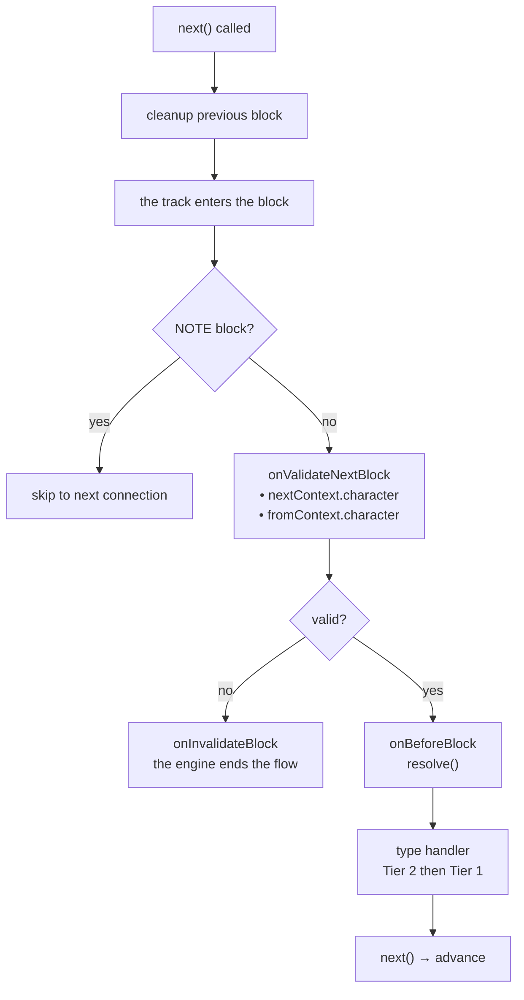
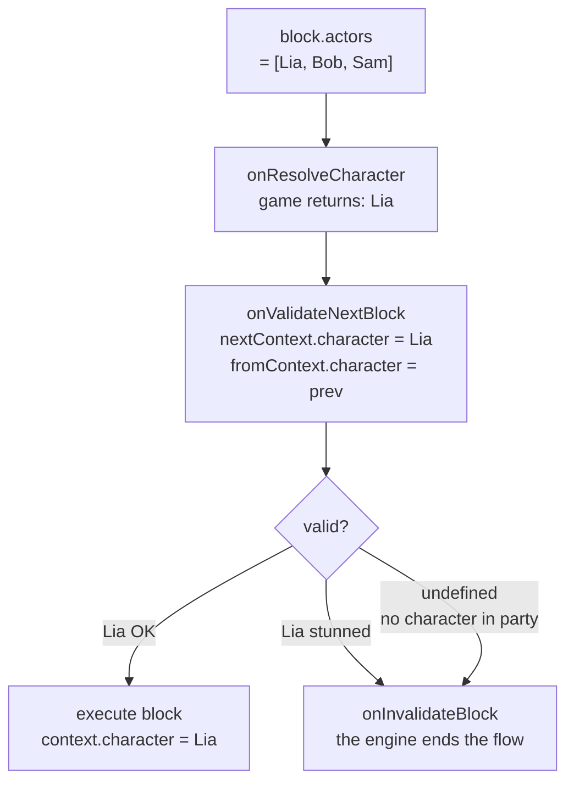

# 生命周期与验证

## 每个 Block 的执行顺序

1. **上一个 block 的清理** — *上一个* block 的 handler 返回的清理函数在转换时执行（`next()` 被调用时）
2. `onValidateNextBlock` — 执行前的验证
3. `onBeforeBlock` — 预处理（必须调用 `resolve()` 才能继续）
4. 类型 handler（先第 2 层，再第 1 层）

## Scene 事件

<!--@include: ../../_shared/lifecycle-scene-events.md-->

## onValidateNextBlock

拦截每次 block 转换进行验证。handler 接收下一个 block（`nextContext`）和上一个 block（`fromContext`）的**已解析角色**：

<!--@include: ../../_shared/lifecycle-validate.md-->

### Character Gating

使用 `nextContext.character` 根据游戏状态控制哪些 block 可以执行：

<!--@include: ../../_shared/lifecycle-validate-stunned.md-->

使用 `fromContext.character` 验证角色之间的转换（例如：关系检查、冷却时间）。`fromContext` 在场景的第一个 block 中为 `null`。

## onBeforeBlock

在每个 block 之前调用。**必须调用 `resolve()`** 才能继续：

<!--@include: ../../_shared/lifecycle-before-block.md-->

## 清理函数

handler 可以返回一个清理函数，在离开 block 时调用：

<!--@include: ../../_shared/lifecycle-cleanup.md-->

## 错误边界

**没有任何异常被吞掉。** 如果 handler 抛出异常，engine 会先关闭 scene，然后把错误**重新抛给**调用
`start()` 或 `next()` 的一方。

正是这个顺序让它可用。当错误到达你的代码时：

- 清理函数已经执行
- async 轨道已经取消
- `onSceneExit` 已经触发

对话**干净地**停止了，接下来做什么由你决定 — 不带它继续、显示一个画面，或者让它崩溃。请在
`start()` 或 `next()` 外面放上你自己的 `try/catch`。

由**清理函数**抛出的异常，也以同样的方式到达你这里。

::: tip 为什么改变
v1 会静默吞掉 handler 的异常 — 连日志都没有 — 而同一个 handler 返回的清理函数抛出的异常却会到达
调用方。同一种故障，两种相反的行为，而安静的那一种在项目运行的整个期间掩盖了真正的 bug。

语言中没有 `try/catch` 的 GDScript，本来就在做正确的事。没有人注意到。
:::

## cancel()

调用 `scene.cancel()` 会触发以下序列：

1. 所有**异步轨道**被取消
2. 当前 block 的**清理函数**被执行
3. `onSceneExit` handler 被调用
4. scene 被标记为已完成

<!--@include: ../../_shared/lifecycle-invalidate.md-->

## NativeProperties

控制 engine 如何调度 block 的执行属性：

| 字段 | 类型 | 描述 |
|-------|------|-------------|
| `isAsync` | `boolean?` | 在并行异步轨道上执行 |
| `delay` | `number?` | block 播放前的**毫秒数**。由 `onBeforeBlock` 应用，engine 从不应用 |
| `timeout` | `number?` | **毫秒**。原样传递 — engine 不做任何强制 |
| `portPerCharacter` | `boolean?` | metadata 中每个角色一个输出端口 |
| `skipIfMissingActor` | `boolean?` | 如果引用的角色不存在则跳过 block |
| `debug` | `boolean?` | 编辑器调试标志 |
| `waitForBlocks` | `string[]?` | **本 scene 的** block id。在它们全部被访问之前，block 会**在被分发之前**被扣住 |
| `waitInput` | `boolean?` | 用于显式玩家输入控制的被动标志 |

## Visual Reference

### Block Execution Flow

### Character Gating Flow

